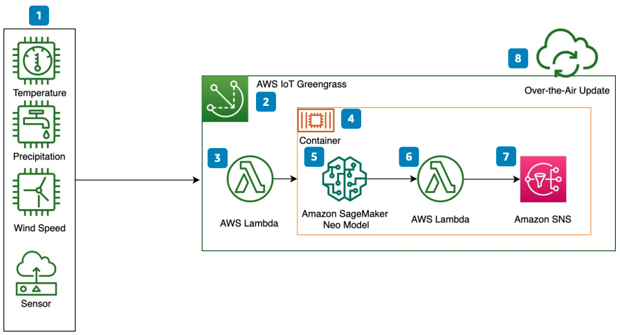

# Edge Inference for Agriculture

Publication date: **August 31, 2020 ([Diagram history](#edge-ag-history "#edge-ag-history"))**

With this architecture, you can enable edge inference in rural and remote agricultural
environments by using [AWS Internet of Things (IoT) Greengrass](../../../greengrass/v2/developerguide.md "../../../greengrass/v2/developerguide.md") and
[Amazon SageMaker AI Neo](../../../sagemaker/latest/dg/neo.md "../../../sagemaker/latest/dg/neo.md"). The solution
handles intermittent connectivity and low-latency inference at the edge.

## Edge inference for agriculture diagram

The following steps describe the architecture:

1. Collect sensor data and send it to the device running AWS IoT Greengrass.
2. Use AWS IoT Greengrass and [AWS Snowball Edge](../../../snowball/latest/developer-guide.md "../../../snowball/latest/developer-guide.md") devices to handle
   intermittent
   connectivity and low-latency inference.
3. Collect sensor data with a [AWS Lambda](../../../lambda/latest/dg.md "../../../lambda/latest/dg.md") producer function.
4. Use container images from a public registry, a private registry, [Amazon Elastic Container Registry](../../../AmazonECR/latest/userguide.md "../../../AmazonECR/latest/userguide.md"), or
   Docker Hub.
5. Use SageMaker AI Neo to compile machine learning models to run on the device with a compact
   runtime.
6. Run action model inference on the device by using a Lambda function to coordinate and
   trigger inference responses.
7. Deploy AWS IoT Greengrass connectors to use [Amazon Simple Notification Service](../../../sns/latest/dg.md "../../../sns/latest/dg.md").
8. Deploy models optimized with SageMaker AI Neo directly to the edge with over-the-air (OTA)
   updates through AWS IoT Greengrass. OTA updates deliver software wirelessly without
   physical access to the device.

## Further reading

For additional information, see the following resources:

- [AWS Architecture Icons](https://aws.amazon.com/architecture/icons "https://aws.amazon.com/architecture/icons")
- [AWS Architecture Center](https://aws.amazon.com/architecture/ "https://aws.amazon.com/architecture/")
- [AWS
  Well-Architected](https://aws.amazon.com/architecture/well-architected "https://aws.amazon.com/architecture/well-architected")

## Diagram history

To receive updates about this reference architecture diagram, subscribe to the RSS
feed.

| Change              | Description                                     | Date            |
| ------------------- | ----------------------------------------------- | --------------- |
| Initial publication | Reference architecture diagram first published. | August 31, 2020 |

###### RSS subscription requirement

To subscribe to RSS updates, you must have an RSS plugin enabled for the browser you are
using.
