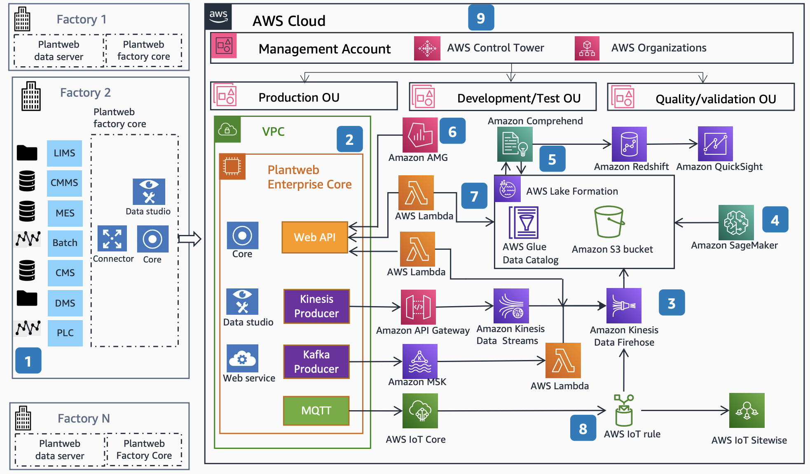

# Emerson Plantweb Optics Data Lake for Health Care and Life Sciences

Publication date: **February 21, 2022 ([Diagram history](#emerson-history "#emerson-history"))**

With this architecture, you can ingest data from multiple disparate sources into a unified
data lake by using Emerson Plantweb Optics Data Lake (PWODL). Use cases include
end-to-end batch reporting, real-time exception handling, real-time batch review and release,
continuous process verification (CPV), manufacturing quality modeling, and digital technology
transfer.

## Emerson Plantweb Optics data lake diagram

The following steps describe the data flow and ingestion pipeline for this
architecture:

1. Ingest data from several disparate sources and data types by using
   Emerson Plantweb Optics. Sources can be located on the plant or shop
   floor, or on manufacturing systems. Available data sources include:

   - Laboratory Information Management System (LIMS)
   - Computerized Maintenance Management System (CMMS)
   - Manufacturing Execution System (MES)
   - Batch Processing System
   - Configuration Management System (CMS)
   - Documents Management System (DMS)
   - Programmable Logic Controllers (PLC)

2. Send data to [Amazon Kinesis Data
   Streams](../../../streams/latest/dev.md "../../../streams/latest/dev.md"), [Amazon
   Managed Streaming for Apache Kafka (Amazon MSK)](../../../msk/latest/developerguide.md "../../../msk/latest/developerguide.md"), and [AWS IoT Core](../../../iot/latest/developerguide.md "../../../iot/latest/developerguide.md") by using PWODL producer
   connectors. The PWODL Kinesis producer uses the AWS SDK to call the
   Kinesis PutRecords API. The Kafka producer connects to Amazon MSK, and the
   MQTT producer publishes to AWS IoT Core topics.
3. Load data reliably into [Amazon Simple Storage Service](../../../AmazonS3/latest/userguide.md "../../../AmazonS3/latest/userguide.md") by using Amazon Data Firehose as part
   of the AWS data lake.
4. Use [Amazon Comprehend](../../../comprehend/latest/dg.md "../../../comprehend/latest/dg.md") to extract key phrases, entities,
   and sentiment from file-based data sources and log files.
5. Use Amazon Managed Grafana (AMG) for visualization through
   a plug-in for the PWODL API.
6. Use [AWS Lambda](../../../lambda/latest/dg.md "../../../lambda/latest/dg.md") for
   serverless compute to provide read and write services to the PWODL REST API. Write the
   results of artificial intelligence (AI) and ML calculations from [Amazon SageMaker AI](../../../sagemaker/latest/dg.md "../../../sagemaker/latest/dg.md") back to on-premises
   deployments of PWODL.
7. Develop, train, and deploy ML models with SageMaker AI.
8. Set up and govern a regulated landing zone by using [AWS Control Tower](../../../controltower/latest/userguide.md "../../../controltower/latest/userguide.md"). This supports Good
   Automated Manufacturing Practice (GAMP) guidance from the International Society for
   Pharmaceutical Engineering (ISPE).
9. Use [AWS Lake Formation](../../../lake-formation/latest/dg.md "../../../lake-formation/latest/dg.md") and the [AWS Glue](../../../glue/latest/dg.md "../../../glue/latest/dg.md") Data Catalog to govern and
   catalog data in the lake. Query data with [Amazon Redshift](../../../redshift/latest/dg.md "../../../redshift/latest/dg.md") and visualize insights with
   [Amazon Quick Sight](../../../quicksight/latest/developerguide/welcome.md "../../../quicksight/latest/developerguide/welcome.md").

## Further reading

For additional information, see the following resources:

- [AWS Architecture Icons](https://aws.amazon.com/architecture/icons "https://aws.amazon.com/architecture/icons")
- [AWS Architecture Center](https://aws.amazon.com/architecture/ "https://aws.amazon.com/architecture/")
- [AWS
  Well-Architected](https://aws.amazon.com/architecture/well-architected "https://aws.amazon.com/architecture/well-architected")

## Diagram history

To receive updates about this reference architecture diagram, subscribe to the RSS
feed.

| Change              | Description                                     | Date              |
| ------------------- | ----------------------------------------------- | ----------------- |
| Initial publication | Reference architecture diagram first published. | February 21, 2022 |

###### RSS subscription requirement

To subscribe to RSS updates, you must have an RSS plugin enabled for the browser you are
using.
