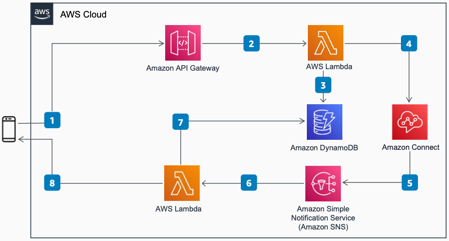

# Enable Digital Messaging Channels in Amazon Connect

Publication date: **November 23, 2021 ([Diagram history](#diagram-history "#diagram-history"))**

This reference architecture diagram shows how to add support for digital messaging channels (such as Facebook Messenger and Slack) to your contact center. It uses [Amazon Connect](../../../connect/latest/adminguide/what-is-amazon-connect.md "../../../connect/latest/adminguide/what-is-amazon-connect.md") Chat's Message Streaming APIs and serverless services on AWS.

## Enable Digital Messaging Channels in Amazon Connect

1. Customer sends a message from the digital messaging channel to the webhook hosted on [Amazon API Gateway](../../../apigateway/latest/developerguide/welcome.md "../../../apigateway/latest/developerguide/welcome.md").
2. API Gateway sends the message to [AWS Lambda](../../../lambda/latest/dg/welcome.md "../../../lambda/latest/dg/welcome.md").
3. Lambda writes the chat contact context to [Amazon DynamoDB](../../../amazondynamodb/latest/developerguide/Introduction.md "../../../amazondynamodb/latest/developerguide/Introduction.md").
4. If this is the first message for the contact, Lambda calls the StartChatContact, StartContactStreaming, and CreateParticipantConnection APIs. If there is an existing chat, Lambda sends the message to Amazon Connect.
5. Amazon Connect streams Agent and System messages to [Amazon Simple Notification Service](../../../sns/latest/dg/welcome.md "../../../sns/latest/dg/welcome.md") (Amazon SNS).
6. Amazon SNS invokes Lambda.
7. Lambda queries DynamoDB for chat contact context.
8. Lambda delivers the reply message to the customer through APIs from the source channel.

## Further reading

For additional information, refer to

- [AWS Architecture Icons](https://aws.amazon.com/architecture/icons "https://aws.amazon.com/architecture/icons")
- [AWS Architecture Center](https://aws.amazon.com/architecture "https://aws.amazon.com/architecture")
- [AWS Well-Architected](https://aws.amazon.com/architecture/well-architected "https://aws.amazon.com/architecture/well-architected")
- [Amazon Connect product page](https://aws.amazon.com/connect/ "https://aws.amazon.com/connect/")

## Diagram history

To be notified about updates to this reference architecture diagram, subscribe to the RSS feed.

| Change              | Description                                     | Date              |
| ------------------- | ----------------------------------------------- | ----------------- |
| Initial publication | Reference architecture diagram first published. | November 23, 2021 |

###### Note

To subscribe to RSS updates, you must have an RSS plugin enabled for the browser you are using.
