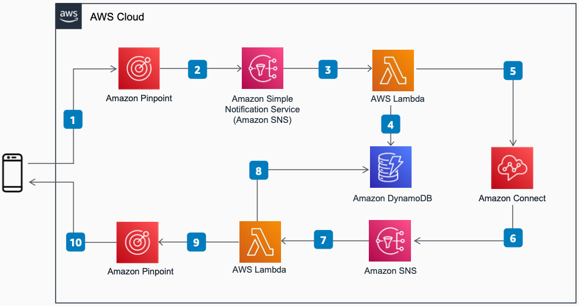

# Enable Two-Way SMS in Amazon Connect

Publication date: **November 23, 2021 ([Diagram history](#diagram-history "#diagram-history"))**

This reference architecture diagram shows how to add SMS support to your contact center. It uses [Amazon Connect](../../../connect/latest/adminguide/what-is-amazon-connect.md "../../../connect/latest/adminguide/what-is-amazon-connect.md") Chat's Message Streaming APIs and [Amazon Pinpoint](../../../pinpoint/latest/userguide/welcome.md "../../../pinpoint/latest/userguide/welcome.md") two-way SMS.

## Enable Two-Way SMS in Amazon Connect

1. Customer sends a text message to the Amazon Pinpoint phone number.
2. Amazon Pinpoint publishes the message to [Amazon Simple Notification Service](../../../sns/latest/dg/welcome.md "../../../sns/latest/dg/welcome.md") (Amazon SNS).
3. Amazon SNS invokes [AWS Lambda](../../../lambda/latest/dg/welcome.md "../../../lambda/latest/dg/welcome.md").
4. Lambda queries [Amazon DynamoDB](../../../amazondynamodb/latest/developerguide/Introduction.md "../../../amazondynamodb/latest/developerguide/Introduction.md") for the chat contact context.
5. If this is the first message for the contact, Lambda calls the StartChatContact, StartContactStreaming, and CreateParticipantConnection APIs. If there is an existing chat, Lambda sends the message to Amazon Connect.
6. Amazon Connect streams Agent and System messages to Amazon SNS.
7. Amazon SNS invokes Lambda.
8. Lambda queries DynamoDB for chat contact context.
9. Lambda invokes the Amazon Pinpoint SendMessage API to send the text message.
10. Amazon Pinpoint delivers the reply message to the customer through SMS.

## Further reading

For additional information, refer to

- [AWS Architecture Icons](https://aws.amazon.com/architecture/icons "https://aws.amazon.com/architecture/icons")
- [AWS Architecture Center](https://aws.amazon.com/architecture "https://aws.amazon.com/architecture")
- [AWS Well-Architected](https://aws.amazon.com/architecture/well-architected "https://aws.amazon.com/architecture/well-architected")
- [Amazon Connect product page](https://aws.amazon.com/connect/ "https://aws.amazon.com/connect/")

## Diagram history

To be notified about updates to this reference architecture diagram, subscribe to the RSS feed.

| Change              | Description                                     | Date              |
| ------------------- | ----------------------------------------------- | ----------------- |
| Initial publication | Reference architecture diagram first published. | November 23, 2021 |

###### Note

To subscribe to RSS updates, you must have an RSS plugin enabled for the browser you are using.
