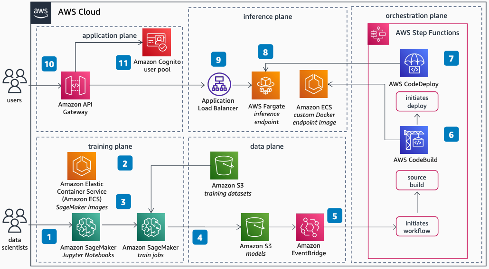

# Enhance Existing ML Lifecycles with Amazon SageMaker AI and AWS Fargate

Publication date: **March 28, 2022 ([Diagram history](#diagram-history "#diagram-history"))**

This architecture shows how to enhance your existing ML workflow. With [Amazon SageMaker AI](../../../sagemaker/latest/dg/whatis.md "../../../sagemaker/latest/dg/whatis.md") model training and AWS Fargate endpoints, you can preserve custom serverless inference while benefiting from managed training.

## Enhance Existing ML Lifecycles with Amazon SageMaker AI and AWS Fargate

The following steps describe the architecture:

1. SageMaker AI provides Jupyter Notebook instances for data scientists to prepare their data and launch SageMaker AI training jobs.
2. By selecting the desired algorithm, SageMaker AI image, and configuring the appropriate parameters, you can run multiple SageMaker AI training jobs. You can also benefit from features such as automated hyperparameter tuning.
3. If you need additional algorithms or have pre-existing code, you can build your own SageMaker AI Docker images.
4. A trained model artifact is generated and stored in a dedicated [Amazon Simple Storage Service](../../../AmazonS3/latest/userguide/Welcome.md "../../../AmazonS3/latest/userguide/Welcome.md") bucket. When the data scientist is satisfied with performance, the model is uploaded to a dedicated path in the bucket.
5. [Amazon EventBridge](../../../eventbridge/latest/userguide/eb-what-is.md "../../../eventbridge/latest/userguide/eb-what-is.md") connects to the rest of the ML lifecycle and initiates the remaining lifecycle tasks outside of SageMaker AI.
6. The [AWS Step Functions](../../../step-functions/latest/dg/welcome.md "../../../step-functions/latest/dg/welcome.md") workflow orchestrates all steps of the remaining ML pipeline by using [AWS Lambda](../../../lambda/latest/dg/welcome.md "../../../lambda/latest/dg/welcome.md") functions. [AWS CodeBuild](../../../codebuild/latest/userguide/welcome.md "../../../codebuild/latest/userguide/welcome.md") generates custom Docker images with the correct algorithm, framework, and model.
7. The new container image is tested and deployed into AWS Fargate through [AWS CodeDeploy](../../../codedeploy/latest/userguide/welcome.md "../../../codedeploy/latest/userguide/welcome.md") by using blue/green deployment.
8. The SageMaker AI-trained model can now run in your pre-existing compute environment. In this case, Docker containers are deployed in AWS Fargate with Amazon Elastic Container Service (Amazon ECS) automatic scaling.
9. An Application Load Balancer fronts Fargate to balance the incoming load with automatic horizontal scaling based on model endpoint latency.
10. You consume the model through [Amazon API Gateway](../../../apigateway/latest/developerguide/welcome.md "../../../apigateway/latest/developerguide/welcome.md") from your browser or mobile application.
11. [Amazon Cognito](../../../cognito/latest/developerguide/what-is-amazon-cognito.md "../../../cognito/latest/developerguide/what-is-amazon-cognito.md") user pool integrated with API Gateway manages authentication and authorization of the endpoint.

## Further reading

For additional information, refer to the following resources:

- [AWS Architecture Icons](https://aws.amazon.com/architecture/icons "https://aws.amazon.com/architecture/icons")
- [AWS Architecture Center](https://aws.amazon.com/architecture "https://aws.amazon.com/architecture")
- [AWS Well-Architected](https://aws.amazon.com/architecture/well-architected "https://aws.amazon.com/architecture/well-architected")
- [Amazon SageMaker AI product page](https://aws.amazon.com/sagemaker/ "https://aws.amazon.com/sagemaker/")
- [AWS Fargate product page](https://aws.amazon.com/fargate/ "https://aws.amazon.com/fargate/")

## Diagram history

To be notified about updates to this reference architecture diagram, subscribe to the RSS feed.

| Change              | Description                                     | Date           |
| ------------------- | ----------------------------------------------- | -------------- |
| Initial publication | Reference architecture diagram first published. | March 28, 2022 |

###### Note

To subscribe to RSS updates, you must have an RSS plugin enabled for the browser you are using.
