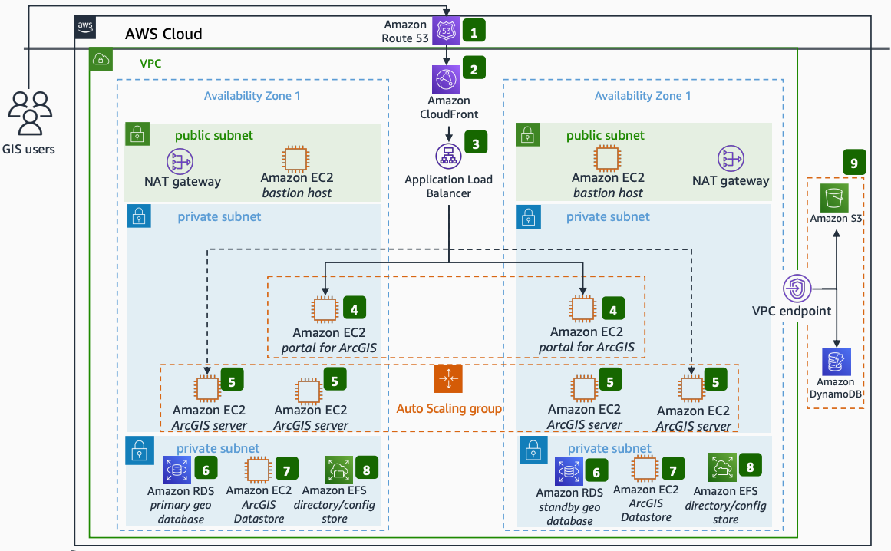

# Enterprise Esri ArcGIS Platform on AWS

Publication date: **April 20, 2022 ([Diagram history](#esri-history "#esri-history"))**

With this architecture, you can deploy a highly available Esri
ArcGIS platform on AWS. [ArcGIS
Enterprise](https://www.esri.com/en-us/arcgis/products/arcgis-enterprise/overview "https://www.esri.com/en-us/arcgis/products/arcgis-enterprise/overview") is the foundational software system for a geographic information system
(GIS). It powers mapping and visualization, analytics, and data management. It
is the backbone for running the Esri suite of applications and your own custom
applications.

This architecture uses [Amazon Route 53](../../../Route53/latest/DeveloperGuide.md "../../../Route53/latest/DeveloperGuide.md"), [Amazon CloudFront](../../../AmazonCloudFront/latest/DeveloperGuide.md "../../../AmazonCloudFront/latest/DeveloperGuide.md"), Application Load Balancer,
[Amazon EC2](../../../AWSEC2/latest/UserGuide.md "../../../AWSEC2/latest/UserGuide.md"), [Amazon RDS](../../../AmazonRDS/latest/UserGuide.md "../../../AmazonRDS/latest/UserGuide.md"), [Amazon Elastic File System](../../../efs/latest/ug.md "../../../efs/latest/ug.md"), [Amazon S3](../../../AmazonS3/latest/userguide.md "../../../AmazonS3/latest/userguide.md"), and [Amazon DynamoDB](../../../amazondynamodb/latest/developerguide.md "../../../amazondynamodb/latest/developerguide.md").

## Enterprise Esri ArcGIS Platform on AWS diagram

The following steps describe the architecture:

1. GIS users connect to the Esri ArcGIS Enterprise
   platform through Amazon Route 53. Route 53 offers a highly available, scalable Domain Name System
   (DNS) web service. Amazon CloudFront then fronts user traffic to securely deliver static and
   dynamic web content with low latency.
2. Application Load Balancer, in the public subnet, channels user requests to either
   Portal for ArcGIS or ArcGIS Server. The balancer routes
   requests based on the request type.
3. Highly available Portal for ArcGIS runs on Amazon EC2 instances across two
   Availability Zones. It controls access to ArcGIS Server services through
   portal groups. Portal for ArcGIS lets you publish data and maps as web
   services. As a portal administrator, you can assign a GIS server site to
   act as a hosting server.
4. Highly available ArcGIS Server runs on Amazon EC2 instances across two
   Availability Zones within an Auto Scaling group. ArcGIS Server is a
   central component of ArcGIS Enterprise. ArcGIS servers federate with an ArcGIS Enterprise
   portal. Your geographic data is available through layers and web maps.
5. The ArcGIS database runs on Amazon RDS across two Availability Zones. It provides a
   highly available relational geodatastore for your hosted feature layer data. This includes
   layers that feature analysis tools create in ArcGIS Enterprise Map Viewer Classic or
   ArcGIS Pro.
6. Highly available ArcGIS Data Store runs on Amazon EC2 instances across two Availability
   Zones. ArcGIS Data Store configures data storage for the hosting server used with ArcGIS
   Enterprise. It creates a relational data store, tile cache data store, spatiotemporal big
   data store, and graph store.
7. Amazon EFS provides directory and config stores. Both ArcGIS Server and
   Portal for ArcGIS share these stores.
8. Amazon S3 serves as the portal content store. It contains portal items, caching, and
   ArcGIS spatiotemporal data store backups.
9. Amazon DynamoDB tables store configuration and directories of the highly available
   ArcGIS Server sites. The VPC endpoint provides secure connections between
   the Enterprise ArcGIS platform, Amazon S3, and DynamoDB.

## Further reading

For additional information, see the following resources:

- [AWS Architecture Icons](https://aws.amazon.com/architecture/icons "https://aws.amazon.com/architecture/icons")
- [AWS Architecture Center](https://aws.amazon.com/architecture/ "https://aws.amazon.com/architecture/")
- [AWS
  Well-Architected](https://aws.amazon.com/architecture/well-architected "https://aws.amazon.com/architecture/well-architected")

## Diagram history

To receive updates about this reference architecture diagram, subscribe to the RSS
feed.

| Change              | Description                                     | Date           |
| ------------------- | ----------------------------------------------- | -------------- |
| Initial publication | Reference architecture diagram first published. | April 20, 2022 |

###### RSS subscription requirement

To subscribe to RSS updates, you must have an RSS plugin enabled for the browser you are
using.
