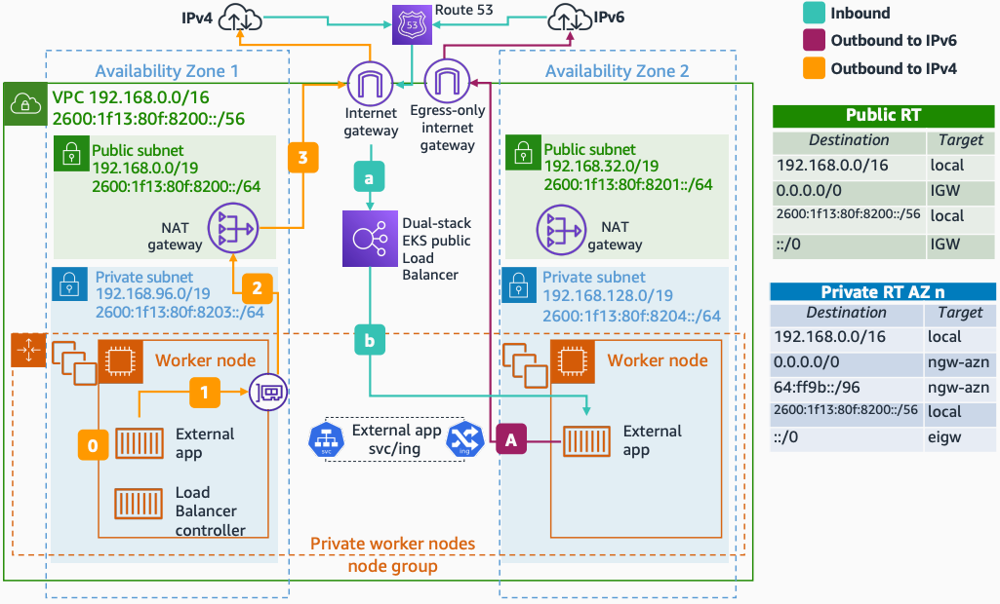

# Expose Amazon EKS Microservices in IPv6 Clusters

This architecture shows how to expose Amazon EKS microservices with IPv6 and connect to both IPv6 and IPv4 endpoints on the internet. Moving to IPv6 also solves pod IP exhaustion because you do not need to work around IPv4 limits.

## Expose Amazon EKS Microservices in IPv6 Clusters

The following steps describe the inbound flow:

1. Amazon Route 53 resolves incoming requests to the public ELBs in [dual-stack mode](https://kubernetes-sigs.github.io/aws-load-balancer-controller/v2.3/guide/service/annotations/ "https://kubernetes-sigs.github.io/aws-load-balancer-controller/v2.3/guide/service/annotations/") deployed by the AWS Load Balancer Controller.
2. The ELB forwards traffic to the IPv6 pods using IP mode.

The following steps describe the outbound IPv6 flow:

1. Any pod communication from within private subnets to IPv6 endpoints outside the cluster routes through an egress-only internet gateway (EIGW).

The following steps describe the outbound IPv4 flow:

1. A pod in a private subnet initiates an outbound request to an IPv4 address on the internet and performs a DNS lookup. Upon receiving an IPv4 "A" response, the pod establishes a connection using the IPv4 address from the [host-local](https://github.com/aws/amazon-vpc-cni-k8s/blob/master/misc/10-aws.conflist "https://github.com/aws/amazon-vpc-cni-k8s/blob/master/misc/10-aws.conflist") 169.254.172.0/22 IP range.
2. The pod's node-only unique IPv4 address is translated through NAT to the IPv4 (VPC) address of the primary network interface attached to the node.
3. The private route table forwards traffic to the NAT gateway, and the private IPv4 address of a node is translated to the public IPv4 address of the gateway.

###### Note

At the time of this writing, ALB and NLB support dual-stack for only internet-facing endpoints. Amazon EKS implements a host-local CNI plugin chained along with VPC CNI to allocate and configure an IPv4 address for a pod from the 169.254.172.0/22 range.

## Further reading

For additional information, refer to the following resources:

- [AWS Architecture Icons](https://aws.amazon.com/architecture/icons "https://aws.amazon.com/architecture/icons")
- [AWS Architecture Center](https://aws.amazon.com/architecture "https://aws.amazon.com/architecture")
- [AWS Well-Architected](https://aws.amazon.com/architecture/well-architected "https://aws.amazon.com/architecture/well-architected")

## Diagram history

To be notified about updates to this reference architecture diagram, subscribe to the RSS feed.

| Change                                                                                                                                                   | Description                                     | Date              |
| -------------------------------------------------------------------------------------------------------------------------------------------------------- | ----------------------------------------------- | ----------------- |
| [Initial publication](expose-microservices-eks-ipv4.md#diagram-history "expose-microservices-eks-ipv4.md#diagram-history")                               | Reference architecture diagram first published. | February 22, 2022 |
| [Initial publication](expose-microservices-eks-custom-networking.md#diagram-history-2 "expose-microservices-eks-custom-networking.md#diagram-history-2") | Reference architecture diagram first published. | February 22, 2022 |
| Initial publication                                                                                                                                      | Reference architecture diagram first published. | February 22, 2022 |

###### Note

To subscribe to RSS updates, you must have an RSS plugin enabled for the browser you are using.
