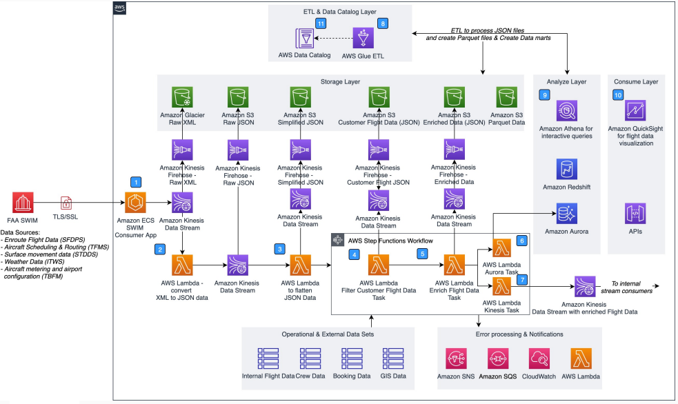

# Using the Federal Aviation Administration SWIM Data Lake

Publication date: **March 10, 2021 ([Diagram history](#faa-swim-history "#faa-swim-history"))**

The Federal Aviation Administration (FAA) System Wide Information Management (SWIM) Data
Lake provides real-time delivery of aeronautical flight and weather information. This
helps airline companies optimize their operations.

This architecture processes SWIM data through a series of [AWS Lambda](../../../lambda/latest/dg.md "../../../lambda/latest/dg.md") functions and [Amazon Kinesis](../../../kinesis/latest/dev.md "../../../kinesis/latest/dev.md") Data Streams. It transforms, enriches, and
analyzes flight data. You can then visualize the results with Amazon Quick Sight or consume them
through custom applications.

## FAA SWIM data lake diagram

The following steps describe the architecture:

1. The SWIM Consumer App consumes SWIM data. It sends the data to an [Kinesis](../../../kinesis/latest/dev.md "../../../kinesis/latest/dev.md") Data Stream.
2. [Lambda](../../../lambda/latest/dg.md "../../../lambda/latest/dg.md") converts
   the XML data to JSON format.
3. Lambda simplifies the JSON data for downstream processing.
4. Lambda filters customer flight data. It writes one copy to Kinesis Data Stream
   and a second to the subsequent Lambda function.
5. Lambda enriches customer flight messages with operational or external
   datasets.
6. Lambda writes enriched flight data to [Amazon Aurora](../../../AmazonRDS/latest/AuroraUserGuide.md "../../../AmazonRDS/latest/AuroraUserGuide.md").
7. Lambda writes enriched flight data to Kinesis Data Stream.
8. [AWS Glue](../../../glue/latest/dg.md "../../../glue/latest/dg.md") extract,
   transform, and load (ETL) jobs transform enriched flight data from JSON to Parquet
   with appropriate partitions. The jobs register Parquet files as external tables in
   AWS Glue Data Catalog.
9. Services such as [Athena](../../../athena/latest/ug.md "../../../athena/latest/ug.md"), [Amazon Redshift](../../../redshift/latest/dg.md "../../../redshift/latest/dg.md"), and Amazon Aurora analyze the transformed
   and enriched flight data.
10. Services such as [Quick](../../../quicksight/latest/user/welcome.md "../../../quicksight/latest/user/welcome.md"), custom applications,
    and APIs consume the analyzed data.
11. AWS Glue Data Catalog stores databases and tables. These represent raw,
    transformed, enriched, and analyzed datasets in [Amazon S3](../../../AmazonS3/latest/userguide.md "../../../AmazonS3/latest/userguide.md"), Amazon Aurora, and Amazon Redshift.

## Further reading

For additional information, see the following resources:

- [AWS Architecture Icons](https://aws.amazon.com/architecture/icons "https://aws.amazon.com/architecture/icons")
- [AWS Architecture Center](https://aws.amazon.com/architecture/ "https://aws.amazon.com/architecture/")
- [AWS Well-Architected](https://aws.amazon.com/architecture/well-architected "https://aws.amazon.com/architecture/well-architected")

## Diagram history

To receive updates about this reference architecture diagram, subscribe to the RSS
feed.

| Change              | Description                                     | Date           |
| ------------------- | ----------------------------------------------- | -------------- |
| Initial publication | Reference architecture diagram first published. | March 10, 2021 |

###### RSS subscription requirement

To subscribe to RSS updates, you must have an RSS plugin enabled for the browser you
are using.
