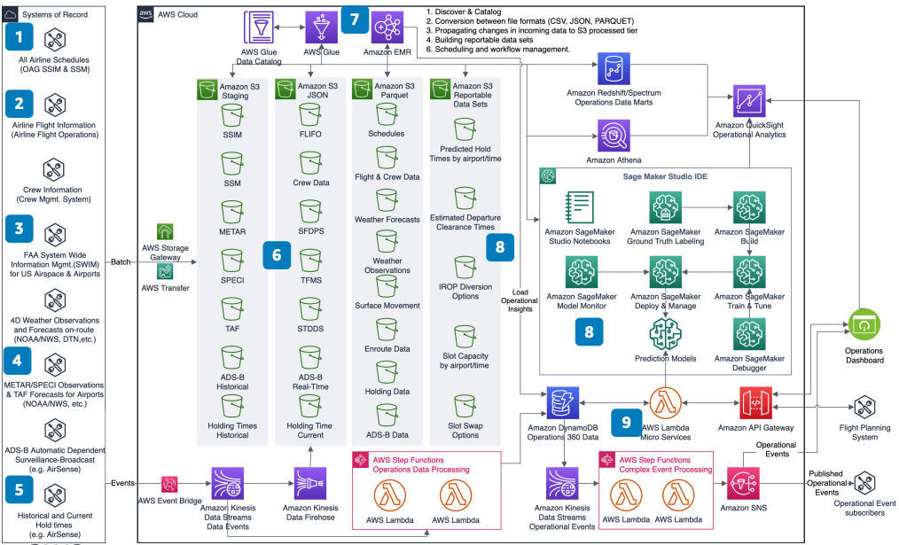

# Flight Planning Using Data Lakes and AI/ML

Publication date: **July 16, 2020 ([Diagram history](#flight-planning-history "#flight-planning-history"))**

With this architecture, you can improve hold time prediction and departure clearance time
estimation. Use published schedules, flight information, airport weather, historical hold times,
and aircraft data. You combine batch and real-time feeds in a tiered data lake for predictive
modeling.

## Flight planning data lakes diagram

The following steps describe the architecture:

1. Use published schedules from OAG for a full picture of arriving
   flights by time of day.
2. Augment with actual flight data through real-time flight information feeds.
3. Use flight plans, surface movement, and on-route information from FAA
   System Wide Information Management (SWIM). This provides an airspace and taxiway
   picture.
4. Use Meteorological Aerodrome Report (METAR) weather observations and Terminal
   Aerodrome Forecast (TAF) data. Correlate hold time to weather conditions.
5. Use historical hold times to build predictive models. Train models by airport,
   time of day, and weather conditions.
6. Build a tiered data lake on [Amazon S3](../../../AmazonS3/latest/userguide.md "../../../AmazonS3/latest/userguide.md"). Ingest and process both batch and
   real-time feeds.
7. Use [AWS Glue](../../../glue/latest/dg.md "../../../glue/latest/dg.md") and [Amazon EMR](../../../emr/latest/ManagementGuide.md "../../../emr/latest/ManagementGuide.md") to discover,
   catalog, and process data into Apache Parquet format.
8. Use [Amazon SageMaker AI](../../../sagemaker/latest/dg.md "../../../sagemaker/latest/dg.md") to
   build, train, tune, and deploy predictive models. Use Debugger and Model Monitor for
   model quality.
9. Build an operational data store for real-time predictions. Integrate predictions
   into flight planning systems.

## Further reading

For additional information, see the following resources:

- [AWS Architecture Icons](https://aws.amazon.com/architecture/icons "https://aws.amazon.com/architecture/icons")
- [AWS Architecture Center](https://aws.amazon.com/architecture/ "https://aws.amazon.com/architecture/")
- [AWS Well-Architected](https://aws.amazon.com/architecture/well-architected "https://aws.amazon.com/architecture/well-architected")

## Diagram history

To receive updates about this reference architecture diagram, subscribe to the RSS
feed.

| Change              | Description                                     | Date          |
| ------------------- | ----------------------------------------------- | ------------- |
| Initial publication | Reference architecture diagram first published. | July 16, 2020 |

###### RSS subscription requirement

To subscribe to RSS updates, you must have an RSS plugin enabled for the browser you
are using.
