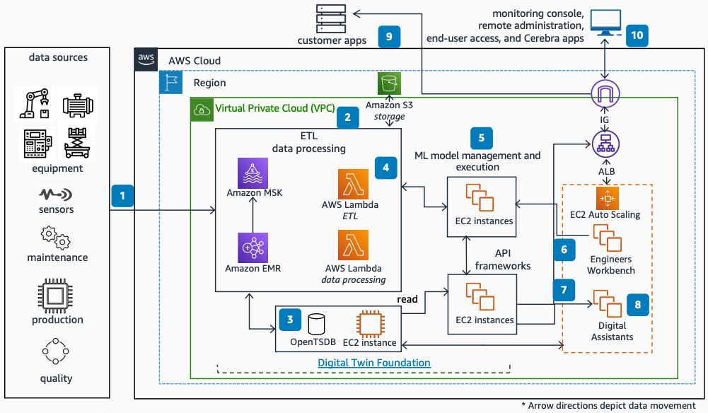

# Flutura Cerebra Asset Performance Management on AWS

Publication date: **November 21, 2022 ([Diagram history](#fca-diagram-history "#fca-diagram-history"))**

With this architecture, you can ingest data from industrial equipment and build
physics-based machine learning (ML) models for predictive maintenance, asset performance
analysis, and process optimization. Flutura Cerebra APM uses
[Amazon EMR](../../../emr/latest/ManagementGuide.md "../../../emr/latest/ManagementGuide.md") (Amazon EMR),
[Amazon Managed Streaming for Apache Kafka](../../../msk/latest/developerguide.md "../../../msk/latest/developerguide.md"),
[Amazon Simple Storage Service](../../../AmazonS3/latest/userguide.md "../../../AmazonS3/latest/userguide.md"),
[AWS Lambda](../../../lambda/latest/dg.md "../../../lambda/latest/dg.md"), and
[Amazon Elastic Compute Cloud](../../../AWSEC2/latest/UserGuide.md "../../../AWSEC2/latest/UserGuide.md").

## Flutura Cerebra APM architecture diagram

The following steps describe the architecture:

1. Cerebra ingests data directly from sensors, historians, and local
   databases as streams or batch.
2. The extract, transform, and load (ETL) component handles large volumes with Amazon EMR
   running Spark jobs. Raw data splits into Kafka streams in
   Amazon MSK for processing.
3. Data streams from the ETL component pass through Spark jobs on Amazon EMR
   before storage in Amazon S3 or an [OpenTSDB](http://opentsdb.net/ "http://opentsdb.net/")
   time series database.
4. Lambda synchronizes different data streams with metadata stored in Amazon S3.
5. Cerebra model management facilitates registration of containerized
   models, version management, and retraining. It consumes Kafka streams
   from Amazon MSK.
6. Data streams pass through models from Cerebra Engineer's Workbench.
   Amazon EC2 and [Amazon EC2 Auto Scaling](../../../autoscaling/ec2/userguide.md "../../../autoscaling/ec2/userguide.md") provide
   additional compute capacity.
7. Cerebra API frameworks run on Amazon EC2 with prebuilt asset-centric and
   process-centric use case frameworks.
8. Cerebra Digital Assistants run as browser-based applications on Amazon EC2
   for operational decision-making.
9. You access data stored in OpenTSDB through secured API
   frameworks.
10. Cerebra provides browser-based console access through an internet
    gateway and Application Load Balancer.

For more information about Flutura digital twins, see [Flutura
delivers scalable digital twins](https://www.flutura.com/resources/articles/flutura-delivers-scalable-digital-twins-for-industrial-oil-and-gas-use-cases "https://www.flutura.com/resources/articles/flutura-delivers-scalable-digital-twins-for-industrial-oil-and-gas-use-cases") on the Flutura website.

## Further reading

For additional information, see the following resources:

- [AWS Architecture Icons](https://aws.amazon.com/architecture/icons "https://aws.amazon.com/architecture/icons")
- [AWS Architecture Center](https://aws.amazon.com/architecture "https://aws.amazon.com/architecture")
- [AWS Well-Architected](https://aws.amazon.com/architecture/well-architected "https://aws.amazon.com/architecture/well-architected")

## Diagram history

To be notified about updates to this reference architecture diagram, subscribe to the RSS feed.

| Change              | Description                                     | Date              |
| ------------------- | ----------------------------------------------- | ----------------- |
| Initial publication | Reference architecture diagram first published. | November 21, 2022 |

###### RSS subscription

To subscribe to RSS updates, you must have an RSS plugin enabled for the browser that you are using.
