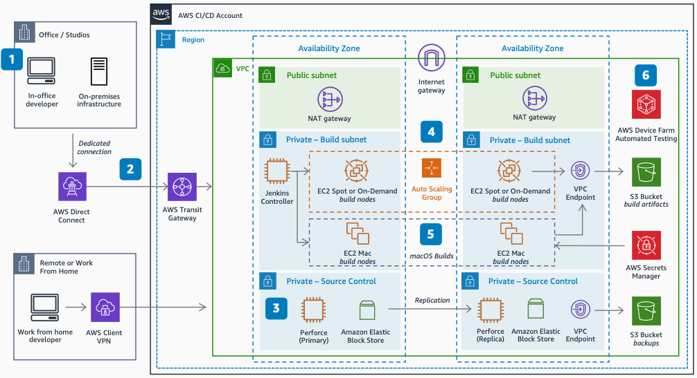

# Game Production in the Cloud: CI/CD

Publication date: **November 10, 2021 ([Diagram history](#cicd-history "#cicd-history"))**

This architecture provides an engine-agnostic, high-level approach for offloading game
builds from remote or on-premises game development environments to the AWS Cloud. This
architecture helps developers migrate or build new build farms on AWS.

## Game Production in the Cloud: CI/CD diagram

The following steps describe the architecture:

1. AWS Direct Connect provides a low-latency, private, dedicated connection to AWS for
   in-office developers. Remote developers use AWS Client VPN.
2. AWS Transit Gateway simplifies network management for connectivity between VPCs and
   from on-premises networks.
3. Perforce manages source and version control (CI) backed by [Amazon Elastic Block Store](../../../ebs/latest/userguide.md "../../../ebs/latest/userguide.md")
   storage for quickly accessed, persistent data. Perforce Helix Core (P4D) is
   available on AWS Marketplace.
4. Commits start a build (CD) in Jenkins when developers push changes to
   Perforce tied to a branch. The Jenkins controller calls
   engine headless CLI commands to run and parallelize the build process across ephemeral,
   Docker nodes such as [Amazon EC2](../../../AWSEC2/latest/UserGuide.md "../../../AWSEC2/latest/UserGuide.md") Spot Instances (one hour or less build
   time), or Amazon EC2 On-Demand instances.
5. The Xcode portion of iOS builds is offloaded to [Amazon EC2 Mac
   instances](../../../AWSEC2/latest/UserGuide/ec2-mac-instances.md "../../../AWSEC2/latest/UserGuide/ec2-mac-instances.md") to
   sign, build, and export the .ipa file. This approach splits the process and reduces build
   times. [AWS Secrets Manager](../../../secretsmanager/latest/userguide.md "../../../secretsmanager/latest/userguide.md") holds provisioning
   profiles, private keys, and certificates.
6. Build artifacts delivered to [Amazon Simple Storage Service](../../../AmazonS3/latest/userguide.md "../../../AmazonS3/latest/userguide.md") trigger third-party notification flows
   of success or failures. [AWS Device Farm](../../../devicefarm/latest/developerguide.md "../../../devicefarm/latest/developerguide.md") provides automated
   testing.

## Further reading

For additional information, see the following resources:

- [AWS Architecture Icons](https://aws.amazon.com/architecture/icons "https://aws.amazon.com/architecture/icons")
- [AWS Architecture Center](https://aws.amazon.com/architecture/ "https://aws.amazon.com/architecture/")
- [AWS
  Well-Architected](https://aws.amazon.com/architecture/well-architected "https://aws.amazon.com/architecture/well-architected")

## Diagram history

To be notified about updates to this reference architecture diagram, subscribe to the RSS
feed.

| Change              | Description                                     | Date              |
| ------------------- | ----------------------------------------------- | ----------------- |
| Initial publication | Reference architecture diagram first published. | November 10, 2021 |

###### Note

To subscribe to RSS updates, you must have an RSS plugin enabled for the browser you are
using.
