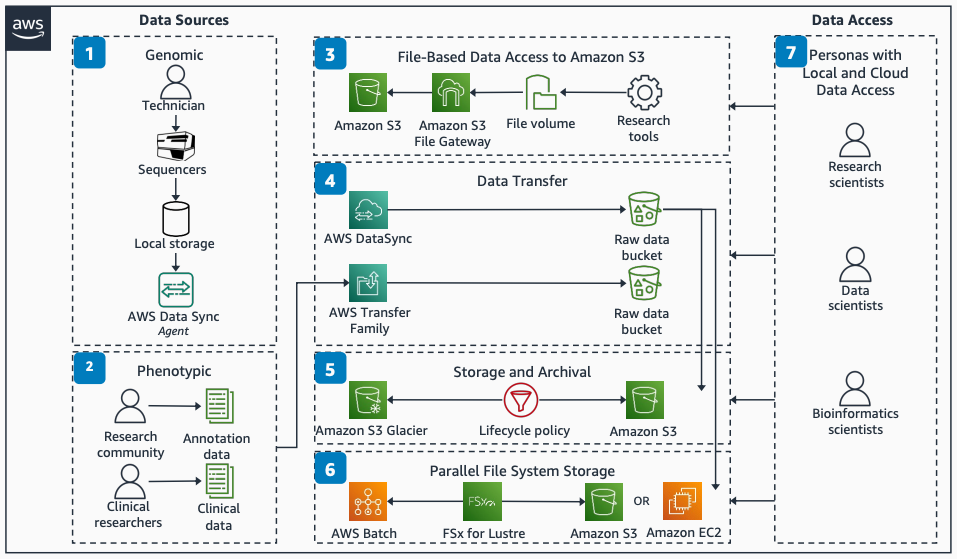

# Genomics Data Transfer, Data Access Patterns, Storage, and Archival

Publication date: **December 7, 2021 ([Diagram history](#genomics-history "#genomics-history"))**

This architecture shows how to transfer genomics data to the cloud and provide data access
by using AWS services. The solution uses [AWS DataSync](../../../datasync/latest/userguide.md "../../../datasync/latest/userguide.md") for raw data transfer and AWS Transfer Family
for clinical and annotation data uploads. [Amazon FSx for Lustre](../../../fsx/latest/LustreGuide.md "../../../fsx/latest/LustreGuide.md") provides
high-throughput parallel file system access.

## Genomics data transfer, storage, and archival diagram

The following steps describe the architecture:

1. Load a sample on the sequencer. The sequencer writes the sample to a folder on local
   storage on-premises. An DataSync task syncs the data from local storage to a bucket in [Amazon Simple Storage Service](../../../AmazonS3/latest/userguide.md "../../../AmazonS3/latest/userguide.md").
2. Upload annotation and clinical data files to Amazon S3 with [AWS Transfer Family](../../../transfer/latest/userguide.md "../../../transfer/latest/userguide.md") by using FTP, SFTP, or
   FTPS.
3. Use DataSync to transfer raw genomics data from on-premises sequencers. Use
   Transfer Family to transfer clinical or annotation data to Amazon S3 buckets.
4. Use existing bioinformatics tools with data in Amazon S3 through NFS or SMB by using Amazon
   S3 File Gateway.
5. Burst to the cloud from on-premises, or use data already in Amazon S3, with Amazon FSx
   for Lustre. This configuration gives you a high-throughput shared file
   system across compute clusters. The clusters can run on-premises or on [Amazon Elastic Compute Cloud](../../../AWSEC2/latest/UserGuide.md "../../../AWSEC2/latest/UserGuide.md") instances by using
   AWS Batch.
6. Optimize storage by writing instrument run data to an Amazon S3 bucket configured
   for infrequent access. Identify your Amazon S3 storage access patterns to configure your Amazon S3
   bucket lifecycle policy and transfer data to Amazon S3 Glacier.
7. Access your data in Amazon S3 from on-premises or from within your AWS
   account.

## Further reading

For additional information, see the following resources:

- [AWS Architecture Icons](https://aws.amazon.com/architecture/icons "https://aws.amazon.com/architecture/icons")
- [AWS Architecture Center](https://aws.amazon.com/architecture/ "https://aws.amazon.com/architecture/")
- [AWS
  Well-Architected](https://aws.amazon.com/architecture/well-architected "https://aws.amazon.com/architecture/well-architected")

## Diagram history

To receive updates about this reference architecture diagram, subscribe to the RSS
feed.

| Change              | Description                                     | Date             |
| ------------------- | ----------------------------------------------- | ---------------- |
| Initial publication | Reference architecture diagram first published. | December 7, 2021 |

###### RSS subscription requirement

To subscribe to RSS updates, you must have an RSS plugin enabled for the browser you are
using.
