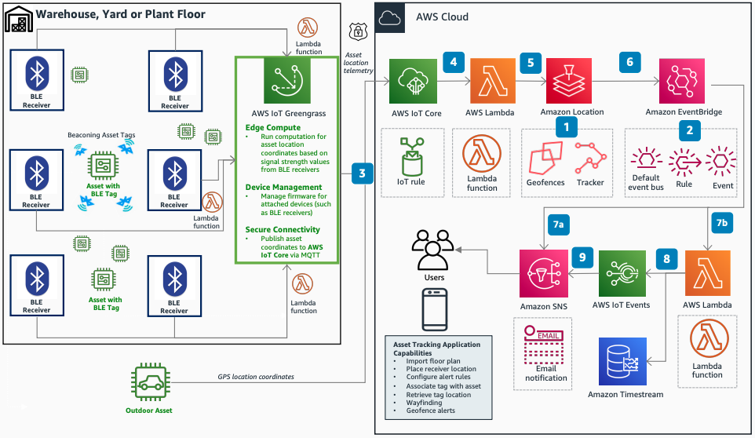

# Geofencing with Amazon Location Service and AWS IoT

Publication date: **December 21, 2020 ([Diagram history](#geofence-history "#geofence-history"))**

With this architecture, you can track high-value equipment leaving or entering premises and
generate alert notifications. The solution integrates [Amazon Location Service](../../../location/latest/developerguide.md "../../../location/latest/developerguide.md") with [AWS IoT Core](../../../iot/latest/developerguide.md "../../../iot/latest/developerguide.md") to send asset
coordinates to Location Service Trackers. The trackers generate and act on geofence enter and
exit events through [Amazon EventBridge](../../../eventbridge/latest/userguide.md "../../../eventbridge/latest/userguide.md").

This scenario uses Bluetooth Low Energy (BLE) tagged asset locations in a warehouse with an
arbitrary x, y coordinate system. You can also use GPS coordinates outdoors.

## Geofencing with Amazon Location Service diagram

The following steps describe the architecture:

1. Create a Geofence Collection resource in Amazon Location Service and add one or more
   geofences. Create a Location Tracker resource and associate it with the geofence
   collection. This configures the service to send geofence events to EventBridge.
2. Publish asset position to AWS IoT Core directly or through [AWS IoT
   Greengrass](../../../greengrass/v2/developerguide.md "../../../greengrass/v2/developerguide.md"). With AWS IoT Core in the path, you can manage asset metadata
   through IoT Thing models.
3. Configure an IoT rule in AWS IoT Core to invoke a [AWS Lambda](../../../lambda/latest/dg.md "../../../lambda/latest/dg.md") function.
4. Write a Lambda function to send the location (DeviceID, x, y) to the Location
   Tracker.
5. The Location Tracker maintains device position history, and the associated geofence
   collection publishes enter and exit events to the default event bus in EventBridge.
6. Configure EventBridge to invoke a Lambda function for the event received from the
   service.
7. (Optional) Configure an EventBridge rule to invoke a Lambda function for further processing
   of raw geofence events.
8. (Optional) Add a Lambda function to forward events to AWS IoT Events for complex
   event detection. Store event history as a time series in Amazon Timestream.
9. Publish the event to an [Amazon Simple Notification Service](../../../sns/latest/dg.md "../../../sns/latest/dg.md") topic directly from EventBridge to notify the end
   user.
10. Publish complex events detected by AWS IoT Events to an Amazon SNS topic to notify the
    end user.

## Further reading

For additional information, see the following resources:

- [AWS Architecture Icons](https://aws.amazon.com/architecture/icons "https://aws.amazon.com/architecture/icons")
- [AWS Architecture Center](https://aws.amazon.com/architecture/ "https://aws.amazon.com/architecture/")
- [AWS
  Well-Architected](https://aws.amazon.com/architecture/well-architected "https://aws.amazon.com/architecture/well-architected")

## Diagram history

To receive updates about this reference architecture diagram, subscribe to the RSS
feed.

| Change              | Description                                     | Date              |
| ------------------- | ----------------------------------------------- | ----------------- |
| Initial publication | Reference architecture diagram first published. | December 21, 2020 |

###### RSS subscription requirement

To subscribe to RSS updates, you must have an RSS plugin enabled for the browser you are
using.
