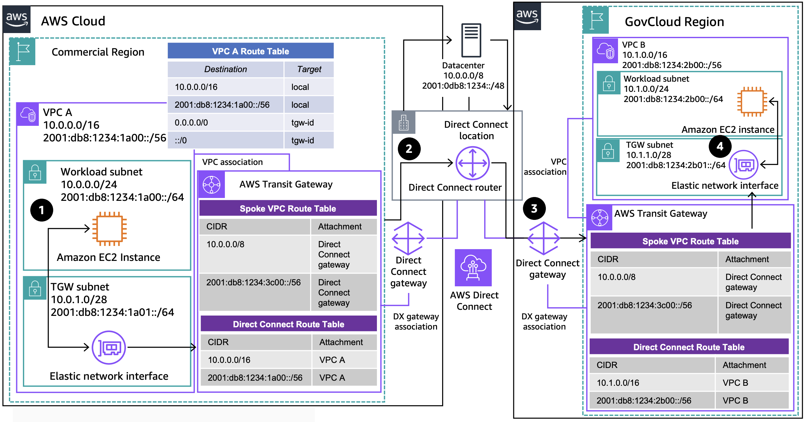

# Using AWS Direct Connect

Publication date: **November 22, 2024 ([Diagram history](#gdx-diagram-history "#gdx-diagram-history"))**

This architecture connects AWS GovCloud (US) and commercial Regions using [AWS Direct Connect](../../../directconnect/latest/UserGuide/Welcome.md "../../../directconnect/latest/UserGuide/Welcome.md"). You can use transit VIFs or private VIFs, depending on whether you connect Transit Gateways or VPCs, and hairpin traffic through your termination device in the datacenter.

## GovCloud hybrid connectivity with AWS Direct Connect architecture

The following steps describe the data flow in this architecture:

1. Traffic from an Amazon EC2 instance in **VPC A** flows to AWS Transit Gateway following the VPC route tables.
2. The **Transit Gateway spoke VPC route table** forwards the traffic through AWS Direct Connect to the datacenter. The datacenter advertises a supernet, while the Direct Connect gateways advertise the Region VPC CIDRs using the allowed prefixes feature.
3. The datacenter routes the traffic back to the more specific Direct Connect route, and it arrives at the GovCloud Transit Gateway.
4. The **Transit Gateway spoke VPC route table** forwards traffic to **VPC B**, and to the destination using the VPC route table. Return traffic follows the same path in reverse order.

For more information about associating the Direct Connect gateway, see [Hybrid connectivity to AWS GovCloud (US) and commercial Regions using AWS Direct Connect](https://aws.amazon.com/blogs/publicsector/aws-hybrid-connectivity-sharing-aws-direct-connect-aws-govcloud-us-commercial-regions/ "https://aws.amazon.com/blogs/publicsector/aws-hybrid-connectivity-sharing-aws-direct-connect-aws-govcloud-us-commercial-regions/").

For more information about how AWS Direct Connect differs for AWS GovCloud (US), see [How AWS Direct Connect differs for AWS GovCloud (US)](../../../govcloud-us/latest/UserGuide/govcloud-dc.md "../../../govcloud-us/latest/UserGuide/govcloud-dc.md").

## Further reading

For additional information, see the following resources:

- [AWS Architecture Icons](https://aws.amazon.com/architecture/icons "https://aws.amazon.com/architecture/icons")
- [AWS Architecture Center](https://aws.amazon.com/architecture "https://aws.amazon.com/architecture")
- [AWS Well-Architected](https://aws.amazon.com/architecture/well-architected "https://aws.amazon.com/architecture/well-architected")

## Diagram history

To be notified about updates to this reference architecture diagram, subscribe to the RSS feed.

| Change                                                                                                                       | Description                                     | Date              |
| ---------------------------------------------------------------------------------------------------------------------------- | ----------------------------------------------- | ----------------- |
| [Initial publication](govcloud-public-ip.md#gpub-diagram-history "govcloud-public-ip.md#gpub-diagram-history")               | Reference architecture diagram first published. | November 22, 2024 |
| [Initial publication](govcloud-site-to-site-vpn.md#gvpn-diagram-history "govcloud-site-to-site-vpn.md#gvpn-diagram-history") | Reference architecture diagram first published. | November 22, 2024 |
| Initial publication                                                                                                          | Reference architecture diagram first published. | November 22, 2024 |
| [Initial publication](govcloud-tgw-connect.md#gtgw-diagram-history "govcloud-tgw-connect.md#gtgw-diagram-history")           | Reference architecture diagram first published. | November 22, 2024 |

###### Note

To subscribe to RSS updates, you must have an RSS plugin enabled for the browser you are using.
