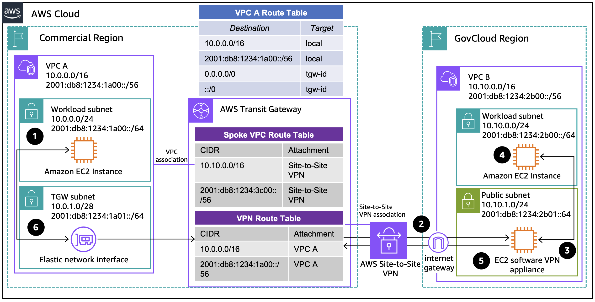

# Using AWS Site-to-Site VPN

Publication date: **November 22, 2024 ([Diagram history](#gvpn-diagram-history "#gvpn-diagram-history"))**

This architecture connects AWS GovCloud (US) and commercial Regions using [AWS Site-to-Site VPN](../../../vpn/latest/s2svpn/VPC_VPN.md "../../../vpn/latest/s2svpn/VPC_VPN.md"). The connection initiator can be [AWS Transit Gateway](../../../vpc/latest/tgw/what-is-transit-gateway.md "../../../vpc/latest/tgw/what-is-transit-gateway.md"), a virtual private gateway, or AWS Cloud WAN. The other side terminates in a redundant VPN concentrator for high availability.

## GovCloud hybrid connectivity with AWS Site-to-Site VPN architecture

The following steps describe the data flow in this architecture:

1. Traffic from an Amazon EC2 instance in **VPC A** flows to AWS Transit Gateway following the VPC route tables.
2. The **Transit Gateway spoke VPC route table** forwards the traffic through AWS Site-to-Site VPN to the **VPC B** VPN appliance. Using a VPN concentrator enables high availability through redundancy. The traffic does not leave the AWS network.
3. The traffic forwards to the destination Amazon EC2 instance in **VPC B** following the **VPC B** route table.
4. Return traffic sends to the software VPN appliance.
5. The Amazon EC2 VPN appliance forwards the traffic back through the Site-to-Site VPN.
6. The **VPN route table** routes traffic to **VPC A**, and it reaches the Amazon EC2 instance as per the **VPC A** route table.

For more information about Site-to-Site VPN connections, see [AWS Site-to-Site VPN, choosing the right options to optimize performance](https://aws.amazon.com/blogs/networking-and-content-delivery/aws-site-to-site-vpn-choosing-the-right-options-to-optimize-performance/ "https://aws.amazon.com/blogs/networking-and-content-delivery/aws-site-to-site-vpn-choosing-the-right-options-to-optimize-performance/").

For more information about Transit Gateway design, see [Transit gateway design best practices](../../../vpc/latest/tgw/tgw-best-design-practices.md "../../../vpc/latest/tgw/tgw-best-design-practices.md").

## Further reading

For additional information, see the following resources:

- [AWS Architecture Icons](https://aws.amazon.com/architecture/icons "https://aws.amazon.com/architecture/icons")
- [AWS Architecture Center](https://aws.amazon.com/architecture "https://aws.amazon.com/architecture")
- [AWS Well-Architected](https://aws.amazon.com/architecture/well-architected "https://aws.amazon.com/architecture/well-architected")

## Diagram history

To be notified about updates to this reference architecture diagram, subscribe to the RSS feed.

| Change                                                                                                                 | Description                                     | Date              |
| ---------------------------------------------------------------------------------------------------------------------- | ----------------------------------------------- | ----------------- |
| [Initial publication](govcloud-public-ip.md#gpub-diagram-history "govcloud-public-ip.md#gpub-diagram-history")         | Reference architecture diagram first published. | November 22, 2024 |
| Initial publication                                                                                                    | Reference architecture diagram first published. | November 22, 2024 |
| [Initial publication](govcloud-direct-connect.md#gdx-diagram-history "govcloud-direct-connect.md#gdx-diagram-history") | Reference architecture diagram first published. | November 22, 2024 |
| [Initial publication](govcloud-tgw-connect.md#gtgw-diagram-history "govcloud-tgw-connect.md#gtgw-diagram-history")     | Reference architecture diagram first published. | November 22, 2024 |

###### Note

To subscribe to RSS updates, you must have an RSS plugin enabled for the browser you are using.
