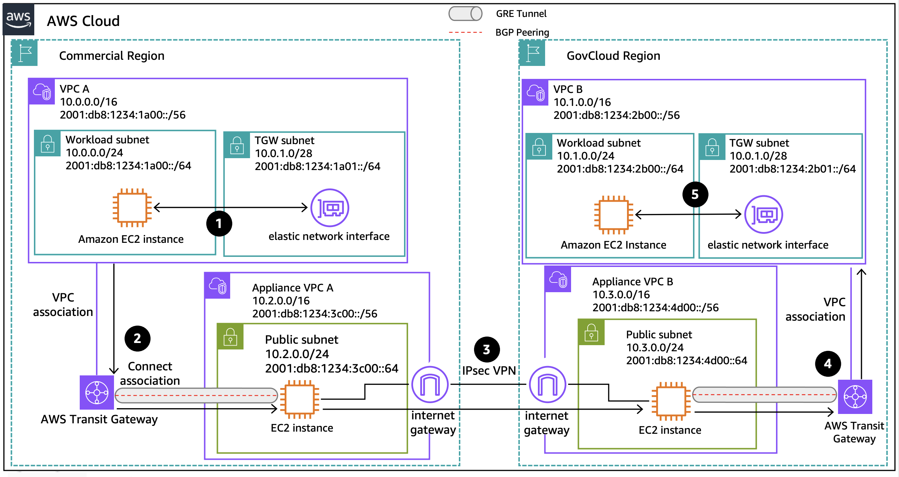

# Using AWS Transit Gateway Connect Attachment

Publication date: **November 22, 2024 ([Diagram history](#gtgw-diagram-history "#gtgw-diagram-history"))**

This architecture connects AWS GovCloud (US) and commercial Regions using [AWS Transit Gateway connect attachments](../../../vpc/latest/tgw/tgw-connect.md "../../../vpc/latest/tgw/tgw-connect.md"). Transit Gateway connect attachments connect your SD-WAN to Transit Gateway and simplify route management across hybrid cloud environments.

## GovCloud hybrid connectivity with Transit Gateway connect attachment architecture

The following steps describe the data flow in this architecture:

1. Traffic from an Amazon EC2 instance in **VPC A** destined for **VPC B** routes to the Transit Gateway elastic network interface (TGW ENI).
2. The TGW connect attachment uses the VPC attachment as transport. It connects the Transit Gateway to the third-party appliance in **appliance VPC A** using GRE tunneling and BGP.
3. The third-party virtual appliance encapsulates the traffic and uses an IPsec VPN to reach the GovCloud Region **appliance VPC B**.
4. The third-party virtual appliance decapsulates the traffic and sends it through the Transit Gateway connect attachment.
5. The Transit Gateway uses the VPC attachment to forward the traffic to the destination Amazon EC2 instance.

For more information about Transit Gateway connect attachments, see [Transit Gateway connect attachments and Transit Gateway Connect peers](../../../vpc/latest/tgw/tgw-connect.md "../../../vpc/latest/tgw/tgw-connect.md").

## Further reading

For additional information, see the following resources:

- [AWS Architecture Icons](https://aws.amazon.com/architecture/icons "https://aws.amazon.com/architecture/icons")
- [AWS Architecture Center](https://aws.amazon.com/architecture "https://aws.amazon.com/architecture")
- [AWS Well-Architected](https://aws.amazon.com/architecture/well-architected "https://aws.amazon.com/architecture/well-architected")

## Diagram history

To be notified about updates to this reference architecture diagram, subscribe to the RSS feed.

| Change                                                                                                                       | Description                                     | Date              |
| ---------------------------------------------------------------------------------------------------------------------------- | ----------------------------------------------- | ----------------- |
| [Initial publication](govcloud-public-ip.md#gpub-diagram-history "govcloud-public-ip.md#gpub-diagram-history")               | Reference architecture diagram first published. | November 22, 2024 |
| [Initial publication](govcloud-site-to-site-vpn.md#gvpn-diagram-history "govcloud-site-to-site-vpn.md#gvpn-diagram-history") | Reference architecture diagram first published. | November 22, 2024 |
| [Initial publication](govcloud-direct-connect.md#gdx-diagram-history "govcloud-direct-connect.md#gdx-diagram-history")       | Reference architecture diagram first published. | November 22, 2024 |
| Initial publication                                                                                                          | Reference architecture diagram first published. | November 22, 2024 |

###### Note

To subscribe to RSS updates, you must have an RSS plugin enabled for the browser you are using.
