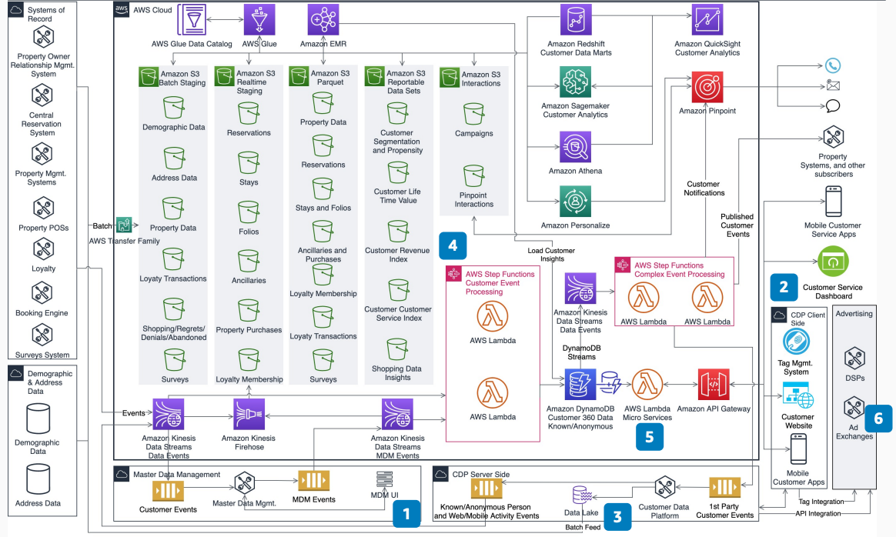

# Guest 360 Data Platform for Lodging

Publication date: **November 16, 2020 ([Diagram history](#g360-history "#g360-history"))**

With this architecture, you can build a guest 360-degree data platform for lodging
companies. Identify known and unknown guests across all channels. Use customer interaction
activity to present targeted offers and campaigns. The solution combines Master Data Management
(MDM) and Customer Data Platform (CDP) capabilities on [Amazon Simple Storage Service](../../../AmazonS3/latest/userguide.md "../../../AmazonS3/latest/userguide.md") with AWS analytics services for profile
enrichment.

## Guest 360 data platform diagram

The following steps describe the architecture:

1. Use MDM tools to create a unified guest profile. Identify loyalty and reward members
   and guests based on attributes provided during stays and at registration.
2. Use CDP client-side components with tag management and first-party cookies. Collect
   activity on web and mobile channels. (Optional) Use third-party cookies and mobile device
   IDs to augment activity data.
3. CDP server-side components collect activity and identify anonymous users. Augment
   identity by adding first-party loyalty and unified guest data to identify known and
   unknown guests.
4. Process and curate all guest activity in a data lake. This includes loyalty,
   reservations, stays, purchases, marketing interactions, and web and mobile
   interactions.

Derive insights from the data lake to create outbound campaigns, inbound campaigns on
web and mobile, and acquisition campaigns. 5. Use guest 360-degree microservices and business events to personalize guest offers and
experience. 6. (Optional) Use CDP platforms to share anonymous guest and prospect attributes with
select partners. This provides a full view of the guest across the partner
network.

## Further reading

For additional information, see the following resources:

- [AWS Architecture Icons](https://aws.amazon.com/architecture/icons "https://aws.amazon.com/architecture/icons")
- [AWS Architecture Center](https://aws.amazon.com/architecture/ "https://aws.amazon.com/architecture/")
- [AWS
  Well-Architected](https://aws.amazon.com/architecture/well-architected "https://aws.amazon.com/architecture/well-architected")

## Diagram history

To receive updates about this reference architecture diagram, subscribe to the RSS
feed.

| Change              | Description                                     | Date              |
| ------------------- | ----------------------------------------------- | ----------------- |
| Initial publication | Reference architecture diagram first published. | November 16, 2020 |

###### RSS subscription requirement

To subscribe to RSS updates, you must have an RSS plugin enabled for the browser you are
using.
