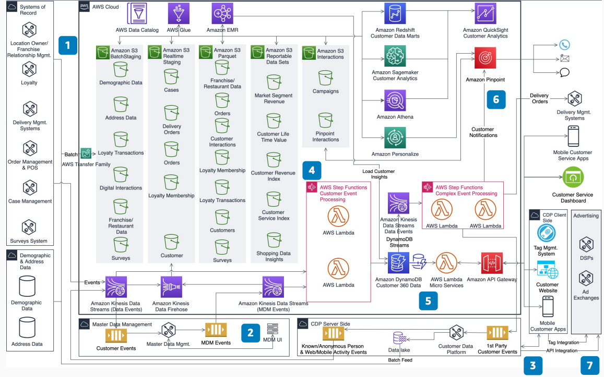

# Guest 360 Data Platform for Restaurants

Publication date: **November 17, 2020 ([Diagram history](#g360rest-history "#g360rest-history"))**

With this architecture, you can build a guest 360-degree data platform for restaurant
companies. Identify known and unknown guests across all channels. Use guest interaction activity
to create personalized offers, campaigns, and acquisition strategies. The solution combines
Master Data Management (MDM) and Customer Data Platform (CDP) capabilities with [Amazon Simple Storage Service](../../../AmazonS3/latest/userguide.md "../../../AmazonS3/latest/userguide.md"), [AWS Glue](../../../glue/latest/dg.md "../../../glue/latest/dg.md"), and [Amazon Personalize](../../../personalize/latest/dg.md "../../../personalize/latest/dg.md").

## Guest 360 restaurants diagram

The following steps describe the architecture:

1. Build the restaurant data platform with critical data domains such as orders,
   loyalty, and locations.
2. Use MDM tools to create a unified guest profile. Identify loyalty and reward members
   and guests based on attributes provided during purchases and registration.
3. Use CDP tag management and first-party cookies to collect activity on web and mobile
   channels. Identify anonymous users. (Optional) Use third-party cookies and mobile device
   IDs to augment activity data. Add first-party loyalty and unified guest data to identify
   known and anonymous guests.
4. Use open standards to build the data lake by using Amazon Simple Storage Service, AWS Glue, and [Amazon EMR](../../../emr/latest/ManagementGuide.md "../../../emr/latest/ManagementGuide.md"). Process and
   curate all guest activity in the data lake, including loyalty, purchases, marketing
   interactions, and web and mobile interactions.
5. Use [Amazon DynamoDB](../../../amazondynamodb/latest/developerguide.md "../../../amazondynamodb/latest/developerguide.md") and serverless
   architecture to deliver microservices and events for an operational data store. Use guest
   360-degree microservices and business events to personalize guest offers.
6. Derive insights from the data lake to create outbound campaigns by using [Amazon Pinpoint](../../../pinpoint/latest/userguide.md "../../../pinpoint/latest/userguide.md") and Amazon Personalize.
   Create inbound campaigns on web and mobile by using Amazon Personalize.
7. Use CDP integrations with Demand Side Platforms (DSPs) and ad exchanges. Create and
   run customer acquisition campaigns and measure results.

## Further reading

For additional information, see the following resources:

- [AWS Architecture
  Icons](https://aws.amazon.com/architecture/icons "https://aws.amazon.com/architecture/icons")
- [AWS Architecture Center](https://aws.amazon.com/architecture/ "https://aws.amazon.com/architecture/")
- [AWS
  Well-Architected](https://aws.amazon.com/architecture/well-architected "https://aws.amazon.com/architecture/well-architected")

## Diagram history

To receive updates about this reference architecture diagram, subscribe to the RSS
feed.

| Change              | Description                                     | Date              |
| ------------------- | ----------------------------------------------- | ----------------- |
| Initial publication | Reference architecture diagram first published. | November 17, 2020 |

###### RSS subscription requirement

To subscribe to RSS updates, you must have an RSS plugin enabled for the browser you
are using.
