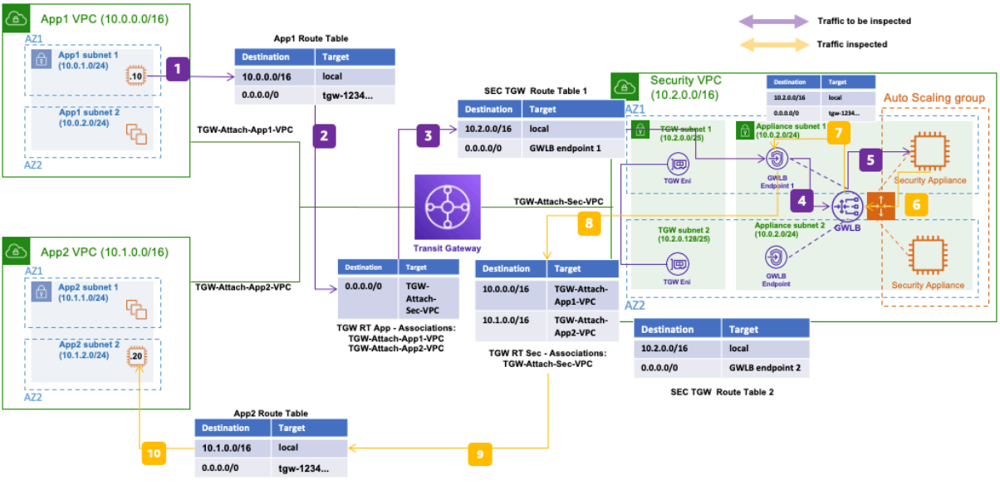

# Gateway Load Balancer East/West Inspection

Publication date: **April 8, 2021 ([Diagram history](#diagram-history "#diagram-history"))**

This architecture uses [Gateway Load Balancer](../../../elasticloadbalancing/latest/userguide/what-is-load-balancing.md "../../../elasticloadbalancing/latest/userguide/what-is-load-balancing.md") and [AWS Transit Gateway](../../../vpc/latest/tgw/what-is-transit-gateway.md "../../../vpc/latest/tgw/what-is-transit-gateway.md") to create a highly available and scalable bump-in-the-wire solution for East/West traffic inspection between [Amazon VPC](../../../vpc/latest/userguide/what-is-amazon-vpc.md "../../../vpc/latest/userguide/what-is-amazon-vpc.md") workloads.

## Gateway Load Balancer East/West Inspection architecture

The following steps describe the data flow in this architecture:

1. Traffic from IP **10.0.1.10** in **App1 VPC** targets IP **10.1.2.20** in **App2 VPC**. The subnet route table routes traffic to AWS Transit Gateway through the default route (**0.0.0.0/0**).
2. **App1 VPC** associates with the **TGW RT APP** route table in AWS Transit Gateway. This table forwards all traffic (**0.0.0.0/0**) through the **Security VPC** attachment.
3. The Transit Gateway ENI in the **Security VPC** uses its subnet route table to forward all traffic to **Gateway Load Balancer endpoint 1**.
4. The Gateway Load Balancer endpoint forwards the traffic to Gateway Load Balancer.
5. Gateway Load Balancer sends encapsulated traffic to a security appliance instance for inspection.
6. After inspection completes, the security appliance returns the traffic to Gateway Load Balancer.
7. Gateway Load Balancer forwards the inspected traffic back to the Gateway Load Balancer endpoint.
8. The Gateway Load Balancer endpoint uses its subnet route table to forward all non-local traffic to AWS Transit Gateway through the Transit Gateway attachment.
9. Traffic reaches AWS Transit Gateway and uses the **TGW RT Sec** route table associated with the **Security VPC** to find the destination through the **App2 VPC** attachment.
10. Traffic arrives at the **App2 VPC** route table. The destination (**10.1.2.20**) is a local address, so the traffic routes to the destination instance.

## Related reference architecture

For the complementary North/South inspection pattern, see [Gateway Load Balancer North/South Inspection](gwlb-north-south-inspection.md "gwlb-north-south-inspection.md").

## Further reading

For additional information, see the following resources:

- [AWS Architecture Icons](https://aws.amazon.com/architecture/icons "https://aws.amazon.com/architecture/icons")
- [AWS Architecture Center](https://aws.amazon.com/architecture "https://aws.amazon.com/architecture")
- [AWS Well-Architected](https://aws.amazon.com/architecture/well-architected "https://aws.amazon.com/architecture/well-architected")

## Diagram history

To be notified about updates to this reference architecture diagram, subscribe to the RSS feed.

| Change                                                                                                                       | Description                                     | Date          |
| ---------------------------------------------------------------------------------------------------------------------------- | ----------------------------------------------- | ------------- |
| Initial publication                                                                                                          | Reference architecture diagram first published. | April 8, 2021 |
| [Initial publication](gwlb-north-south-inspection.md#ns-diagram-history "gwlb-north-south-inspection.md#ns-diagram-history") | Reference architecture diagram first published. | April 8, 2021 |

###### Note

To subscribe to RSS updates, you must have an RSS plugin enabled for the browser you are using.
