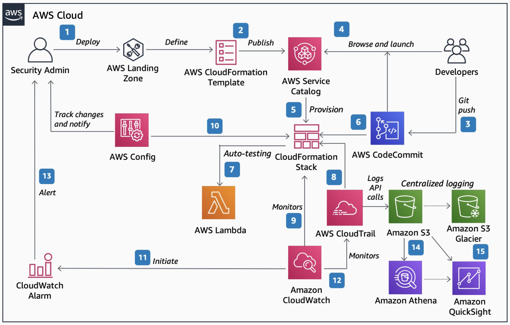

# GxP Compliance Automation

Publication date: **May 6, 2021 ([Diagram history](#gxp-history "#gxp-history"))**

With this architecture, you can build a secure and compliant Good Practice (GxP) workload
on AWS. The solution uses [Service Catalog](../../../servicecatalog/latest/adminguide.md "../../../servicecatalog/latest/adminguide.md") to publish approved
infrastructure templates, [AWS CloudFormation](../../../AWSCloudFormation/latest/UserGuide.md "../../../AWSCloudFormation/latest/UserGuide.md") to provision resources, and [AWS Config](../../../config/latest/developerguide.md "../../../config/latest/developerguide.md") to monitor compliance
continuously.

## GxP compliance automation diagram

The following steps describe the data flow and compliance automation for this
architecture:

1. Use AWS Landing Zone to automate the setup of a secure and scalable environment. The
   security administrator defines an Service Catalog product (for example, a GxP
   application) by using CloudFormation templates.
2. Publish the template for developers in Service Catalog. Developers use this
   framework to further enhance the template based on application requirements.
3. Modify applications under source control by using AWS CodeCommit to manage the private
   code repository.
4. Deploy the modified code from AWS CodeCommit to your GxP infrastructure. Use Service Catalog
   Catalog to launch the product as a CloudFormation stack.
5. The stack provisions the necessary AWS resources based on what you committed to the
   code repository.
6. With Service Catalog at the center of this architecture, you can release source
   code without needing access to underlying resources or going through security
   administrators.
7. Automate the testing and installation qualification process by using [AWS Lambda](../../../lambda/latest/dg.md "../../../lambda/latest/dg.md") or
   Python. Create a test summary and qualification report automatically in an
   Amazon S3 bucket.
8. Aggregate all individual AWS CloudTrail logs, Amazon VPC flow logs, and AWS Config changes
   into a centralized [Amazon Simple Storage Service](../../../AmazonS3/latest/userguide.md "../../../AmazonS3/latest/userguide.md") bucket in a separate AWS
   account.
9. Configure, monitor, and set up automated alerts on changes and on the health of the
   stack by using [Amazon CloudWatch](../../../AmazonCloudWatch/latest/monitoring.md "../../../AmazonCloudWatch/latest/monitoring.md").
10. Record and track change events through AWS Config when the stack changes. Display
    out-of-compliance events in a dashboard.
11. Initiate CloudWatch alarms based on rules you design to indicate when something might be
    out of compliance.
12. Use AWS CloudTrail to monitor API calls made against your AWS environment. CloudWatch
    Events alerts the administrator when something changes that could cause the system to be
    non-compliant.
13. Query log data and convert it into a human-readable format like CSV by using Amazon
    [Athena](../../../athena/latest/ug.md "../../../athena/latest/ug.md") for audit
    purposes.
14. Visualize AWS CloudTrail logs by using Amazon Quick Sight.

## Further reading

For additional information, see the following resources:

- [AWS Architecture Icons](https://aws.amazon.com/architecture/icons "https://aws.amazon.com/architecture/icons")
- [AWS Architecture Center](https://aws.amazon.com/architecture/ "https://aws.amazon.com/architecture/")
- [AWS
  Well-Architected](https://aws.amazon.com/architecture/well-architected "https://aws.amazon.com/architecture/well-architected")

## Diagram history

To receive updates about this reference architecture diagram, subscribe to the RSS
feed.

| Change              | Description                                     | Date        |
| ------------------- | ----------------------------------------------- | ----------- |
| Initial publication | Reference architecture diagram first published. | May 6, 2021 |

###### RSS subscription requirement

To subscribe to RSS updates, you must have an RSS plugin enabled for the browser you are
using.
