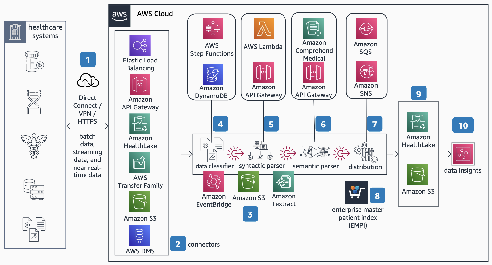

# Healthcare Interoperability Stack on AWS

Publication date: **January 31, 2023 ([Diagram history](#interop-history "#interop-history"))**

With this architecture, you can build a modular interoperability platform to ingest, parse,
and store healthcare data of any shape, size, and format. The solution uses connectors with
syntactic and semantic parsers to convert and standardize both standard and non-standard data
into Health Level Seven Fast Healthcare Interoperability Resources (HL7 FHIR) format.

## Healthcare interoperability stack diagram

The following steps describe the data flow and processing pipeline for this
architecture:

1. Establish on-premises connectivity for data ingestion. Use a private channel such as
   AWS Site-to-Site VPN, AWS Direct Connect, or HTTPS connectivity.
2. Use different connectors depending on the incoming message type. For public-facing
   [Amazon API Gateway](../../../apigateway/latest/developerguide.md "../../../apigateway/latest/developerguide.md") instances, configure [AWS WAF](../../../waf/latest/developerguide.md "../../../waf/latest/developerguide.md") as a web
   application firewall. Use [AWS Transfer Family](../../../transfer/latest/userguide.md "../../../transfer/latest/userguide.md"), [AWS Database Migration Service](../../../dms/latest/userguide.md "../../../dms/latest/userguide.md"), or Elastic Load
   Balancing depending on your data source.
3. Use [Amazon EventBridge](../../../eventbridge/latest/userguide.md "../../../eventbridge/latest/userguide.md") to handle data processing pipeline
   orchestration. Store intermediate data in [Amazon Simple Storage Service](../../../AmazonS3/latest/userguide.md "../../../AmazonS3/latest/userguide.md"). Use [Amazon Textract](../../../textract/latest/dg.md "../../../textract/latest/dg.md") to extract text from files where
   required, such as PDFs.
4. Use a data classifier to determine the incoming message type and route information to
   the appropriate parser by using event rules.
5. Use a set of configurable templates in the syntactic parser to transform incoming data
   formats into HL7 FHIR if required.
6. Use the semantic parser to standardize data values into common ontologies.
7. Use the distribution module to fan out converted messages to appropriate destinations
   by using [Amazon Simple Queue Service](../../../AWSSimpleQueueService/latest/SQSDeveloperGuide.md "../../../AWSSimpleQueueService/latest/SQSDeveloperGuide.md") and [Amazon Simple Notification Service](../../../sns/latest/dg.md "../../../sns/latest/dg.md").
8. Bring your own identity solutions to normalize resources such as patients and
   providers.
9. Use [Amazon
   HealthLake](../../../healthlake/latest/devguide.md "../../../healthlake/latest/devguide.md") as a durable storage destination for messages transformed into
   HL7 FHIR. Use Amazon S3 to store other resources.
10. Benefit from standardized data to gain insights and to improve care.

## Further reading

For additional information, see the following resources:

- [AWS Architecture Icons](https://aws.amazon.com/architecture/icons "https://aws.amazon.com/architecture/icons")
- [AWS Architecture Center](https://aws.amazon.com/architecture/ "https://aws.amazon.com/architecture/")
- [AWS
  Well-Architected](https://aws.amazon.com/architecture/well-architected "https://aws.amazon.com/architecture/well-architected")

## Diagram history

To receive updates about this reference architecture diagram, subscribe to the RSS
feed.

| Change              | Description                                     | Date             |
| ------------------- | ----------------------------------------------- | ---------------- |
| Initial publication | Reference architecture diagram first published. | January 31, 2023 |

###### RSS subscription requirement

To subscribe to RSS updates, you must have an RSS plugin enabled for the browser you are
using.
