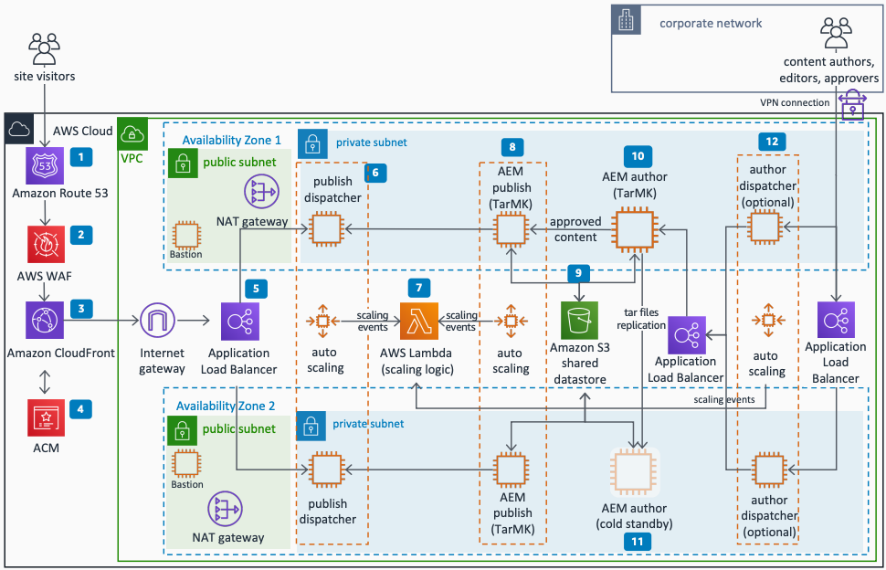

# Hosting Adobe Experience Manager on AWS

Publication date: **October 11, 2022 ([Diagram history](#aem-history "#aem-history"))**

With this architecture, you can deploy Adobe Experience Manager
(AEM) on AWS. The solution uses [Amazon Route 53](../../../Route53/latest/DeveloperGuide.md "../../../Route53/latest/DeveloperGuide.md") for DNS, [AWS WAF](../../../waf/latest/developerguide.md "../../../waf/latest/developerguide.md") for web application protection, [Amazon CloudFront](../../../AmazonCloudFront/latest/DeveloperGuide.md "../../../AmazonCloudFront/latest/DeveloperGuide.md") for
content delivery, and [Amazon Elastic Compute Cloud](../../../AWSEC2/latest/UserGuide.md "../../../AWSEC2/latest/UserGuide.md") for compute.

## Hosting Adobe Experience Manager on AWS diagram

The following steps describe the architecture:

1. Amazon Route 53 provides DNS configuration
   for the AEM deployment.
2. AWS WAF protects AEM against common web exploits.
3. Amazon CloudFront is a content delivery network (CDN) that speeds distribution of static
   and dynamic web content.
4. [AWS Certificate Manager](../../../acm/latest/userguide.md "../../../acm/latest/userguide.md") (ACM) provisions, manages, and
   deploys public and private SSL certificates for AEM.
5. An internet-facing Application Load Balancer distributes traffic to
   AEM dispatcher instances across multiple Availability Zones.
6. The AEM dispatcher on Amazon EC2 is an Apache httpd-based
   static webserver that provides caching, load balancing, and application security. We recommend Amazon EBS
   I/O optimized volumes. Each dispatcher maps to a publish instance 1:1
   per Availability Zone.
7. [AWS Lambda](../../../lambda/latest/dg.md "../../../lambda/latest/dg.md") provides
   scaling logic for scale up and scale down events. Use Lambda to pair and unpair
   dispatcher-publish instances and update replication agents.
8. AEM publish is an AEM installation on Amazon EC2 that
   serves published content. Publish uses TarMK as a node store.
9. [Amazon Simple Storage Service](../../../AmazonS3/latest/userguide.md "../../../AmazonS3/latest/userguide.md") (Amazon S3) is the preferred shared
   datastore for binary content for AEM publish and author instances. Use a
   VPC endpoint for private access to Amazon S3.
10. AEM author is an AEM installation on Amazon EC2 that you
    use to author content and administer the website. TarMK on Amazon EBS is
    preferred. Use a MongoDB node store for scalability.
11. AEM author cold standby provides high availability. Lambda automates
    failover logic.
12. (Optional) Author-dispatcher instances on Amazon EC2 improve authoring performance with
    caching disabled.

## Further reading

For additional information, see the following resources:

- [AWS Architecture Icons](https://aws.amazon.com/architecture/icons "https://aws.amazon.com/architecture/icons")
- [AWS Architecture Center](https://aws.amazon.com/architecture/ "https://aws.amazon.com/architecture/")
- [AWS
  Well-Architected](https://aws.amazon.com/architecture/well-architected "https://aws.amazon.com/architecture/well-architected")

## Diagram history

To receive updates about this reference architecture diagram, subscribe to the RSS
feed.

| Change              | Description                                     | Date             |
| ------------------- | ----------------------------------------------- | ---------------- |
| Initial publication | Reference architecture diagram first published. | October 11, 2022 |

###### RSS subscription requirement

To subscribe to RSS updates, you must have an RSS plugin enabled for the browser you are
using.
