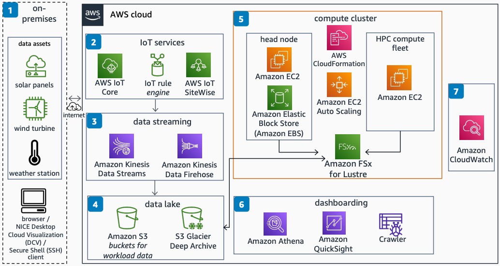

# HPC Simulation Workload for Renewable Energy Data

Publication date: **September 28, 2022 ([Diagram history](#hpc-re-history "#hpc-re-history"))**

With this architecture, you can ingest data from on-premises renewable energy assets such
as weather stations, wind turbines, and solar panels. You can also run high performance
computing (HPC) and artificial intelligence/machine learning (AI/ML) workloads on that data.
The solution uses [AWS IoT Core](../../../iot/latest/developerguide.md "../../../iot/latest/developerguide.md") for device connectivity, [AWS ParallelCluster](../../../parallelcluster/latest/ug.md "../../../parallelcluster/latest/ug.md") for HPC
infrastructure, and [Amazon Quick Sight](../../../quicksight/latest/developerguide/welcome.md "../../../quicksight/latest/developerguide/welcome.md") for dashboarding.

## HPC simulation workload diagram

The following steps describe the data ingestion, compute, and visualization pipeline for
this architecture:

1. Connect on-premises assets such as solar panels, wind turbines, or weather
   stations.
2. Use AWS IoT Core to connect IoT devices and route messages to AWS services. Use [AWS IoT SiteWise](../../../iot-sitewise/latest/userguide.md "../../../iot-sitewise/latest/userguide.md") to
   simplify collecting, organizing, and analyzing industry equipment data.
3. Collect and process large streams of data records in real time by using [Amazon Kinesis Data Streams](../../../streams/latest/dev.md "../../../streams/latest/dev.md"). Deliver
   near-real-time data streams from your source destination by using [Amazon Data Firehose](../../../firehose/latest/dev.md "../../../firehose/latest/dev.md").
4. Store processed data in [Amazon Simple Storage Service](../../../AmazonS3/latest/userguide.md "../../../AmazonS3/latest/userguide.md")-based central data lake
   repositories.
5. Use AWS ParallelCluster with [AWS CloudFormation](../../../AWSCloudFormation/latest/UserGuide.md "../../../AWSCloudFormation/latest/UserGuide.md") templates to create HPC
   infrastructure. Interface directly with the cluster through NICE DCV or
   Secure Shell (SSH). Use [FSx for Lustre](../../../fsx/latest/LustreGuide.md "../../../fsx/latest/LustreGuide.md") as a high-performance parallel file
   system for shared storage between the HPC cluster nodes. Integrate FSx for Lustre with Amazon S3
   buckets for accessing simulation input and output data.
6. Use [Amazon Athena](../../../athena/latest/ug.md "../../../athena/latest/ug.md") for data
   preparation and task building views of report data.
7. Use Amazon Quick Sight to query and build visualizations to discover insights into your data.
   Use an [AWS Glue](../../../glue/latest/dg.md "../../../glue/latest/dg.md") Crawler to
   discover schemas and store them in the AWS Glue Data Catalog. Classify schemas for common
   file formats such as JSON and CSV.

## Further reading

For additional information, see the following resources:

- [AWS Architecture Icons](https://aws.amazon.com/architecture/icons "https://aws.amazon.com/architecture/icons")
- [AWS Architecture Center](https://aws.amazon.com/architecture/ "https://aws.amazon.com/architecture/")
- [AWS
  Well-Architected](https://aws.amazon.com/architecture/well-architected "https://aws.amazon.com/architecture/well-architected")

## Diagram history

To receive updates about this reference architecture diagram, subscribe to the RSS
feed.

| Change              | Description                                     | Date               |
| ------------------- | ----------------------------------------------- | ------------------ |
| Initial publication | Reference architecture diagram first published. | September 28, 2022 |

###### RSS subscription requirement

To subscribe to RSS updates, you must have an RSS plugin enabled for the browser you are
using.
