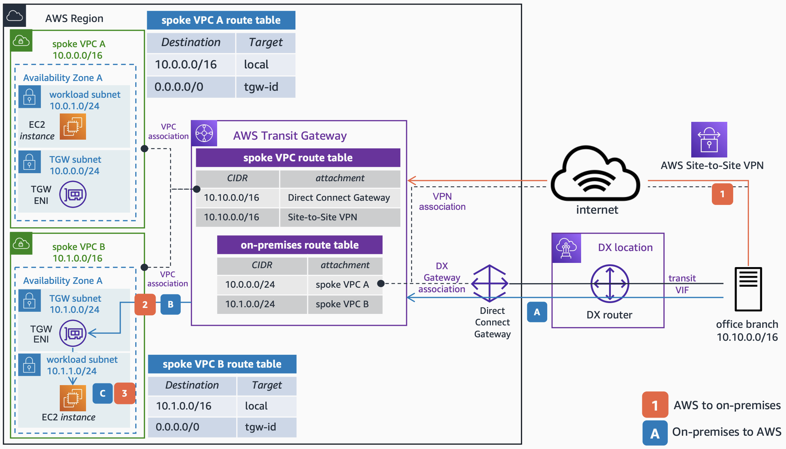

# AWS Direct Connect as Primary and AWS Site-to-Site VPN as Backup

Publication date: **August 17, 2022 ([Diagram history](#hc4-diagram-history "#hc4-diagram-history"))**

You can use a Transit VIF and a [Direct Connect](../../../directconnect/latest/UserGuide/Welcome.md "../../../directconnect/latest/UserGuide/Welcome.md") gateway to connect your on-premises environments to AWS. With this, you can benefit from the connectivity to multiple VPCs without the need of several Direct Connect connections. Having a VPN connection as backup line allows you to achieve high availability in the hybrid setup.

## AWS Direct Connect primary and VPN backup architecture

The following steps describe the on-premises to AWS traffic flow:

1. Traffic from the office branch destined to the **Spoke VPC B** is forwarded to the Transit Gateway through the AWS Direct Connect link. This behavior can be achieved by configuring the office branch devices with higher BGP local preference pointing to the DX peer. The Transit Gateway is connected to Direct Connect by using a Transit VIF and a Direct Connect Gateway.
2. As per the **Transit Gateway on-premises route table**, the traffic is forwarded to the **spoke VPC B** attachment.
3. The TGW ENI of the **spoke VPC B** forwards the traffic to the destination.

In the event of an AWS Direct Connect failure:

1. Traffic from the office branch destined to the **spoke VPC B** is forwarded to the Transit Gateway through the AWS Site-to-Site VPN connection.
2. As per the **Transit Gateway on-premises route table**, the traffic is forwarded to the **spoke VPC B** attachment.
3. The TGW ENI of the **spoke VPC B** forwards the traffic to the destination.

For more information about how to configure AWS Direct Connect with AWS Site-to-Site VPN as a backup, see [Using a VPN connection as a backup to Direct Connect](../../../whitepapers/latest/hybrid-connectivity/vpn-connection-as-a-backup-to-aws-dx-connection-example.md "../../../whitepapers/latest/hybrid-connectivity/vpn-connection-as-a-backup-to-aws-dx-connection-example.md").

For more information about asymmetric routing, see [Resolve asymmetric routing issues](https://aws.amazon.com/premiumsupport/knowledge-center/direct-connect-asymmetric-routing/?nc1=h_ls "https://aws.amazon.com/premiumsupport/knowledge-center/direct-connect-asymmetric-routing/?nc1=h_ls") on AWS re:Post.

## Further reading

For additional information, see the following resources:

- [AWS Architecture Icons](https://aws.amazon.com/architecture/icons "https://aws.amazon.com/architecture/icons")
- [AWS Architecture Center](https://aws.amazon.com/architecture "https://aws.amazon.com/architecture")
- [AWS Well-Architected](https://aws.amazon.com/architecture/well-architected "https://aws.amazon.com/architecture/well-architected")

## Diagram history

To be notified about updates to this reference architecture diagram, subscribe to the RSS feed.

| Change                                                                                                                     | Description                                     | Date            |
| -------------------------------------------------------------------------------------------------------------------------- | ----------------------------------------------- | --------------- |
| [Initial publication](hybrid-vpn.md#hc1-diagram-history "hybrid-vpn.md#hc1-diagram-history")                               | Reference architecture diagram first published. | August 17, 2022 |
| [Initial publication](hybrid-dx.md#hc2-diagram-history "hybrid-dx.md#hc2-diagram-history")                                 | Reference architecture diagram first published. | August 17, 2022 |
| [Initial publication](hybrid-vpn-primary-backup.md#hc3-diagram-history "hybrid-vpn-primary-backup.md#hc3-diagram-history") | Reference architecture diagram first published. | August 17, 2022 |
| Initial publication                                                                                                        | Reference architecture diagram first published. | August 17, 2022 |
| [Initial publication](hybrid-dx-active-passive.md#hc5-diagram-history "hybrid-dx-active-passive.md#hc5-diagram-history")   | Reference architecture diagram first published. | August 17, 2022 |
| [Initial publication](hybrid-vpn-over-dx.md#hc6-diagram-history "hybrid-vpn-over-dx.md#hc6-diagram-history")               | Reference architecture diagram first published. | August 17, 2022 |
| [Initial publication](hybrid-dx-tgw-connect.md#hc7-diagram-history "hybrid-dx-tgw-connect.md#hc7-diagram-history")         | Reference architecture diagram first published. | August 17, 2022 |
| [Initial publication](hybrid-dx-private-vif.md#hc8-diagram-history "hybrid-dx-private-vif.md#hc8-diagram-history")         | Reference architecture diagram first published. | August 17, 2022 |

###### Note

To subscribe to RSS updates, you must have an RSS plugin enabled for the browser you are using.
