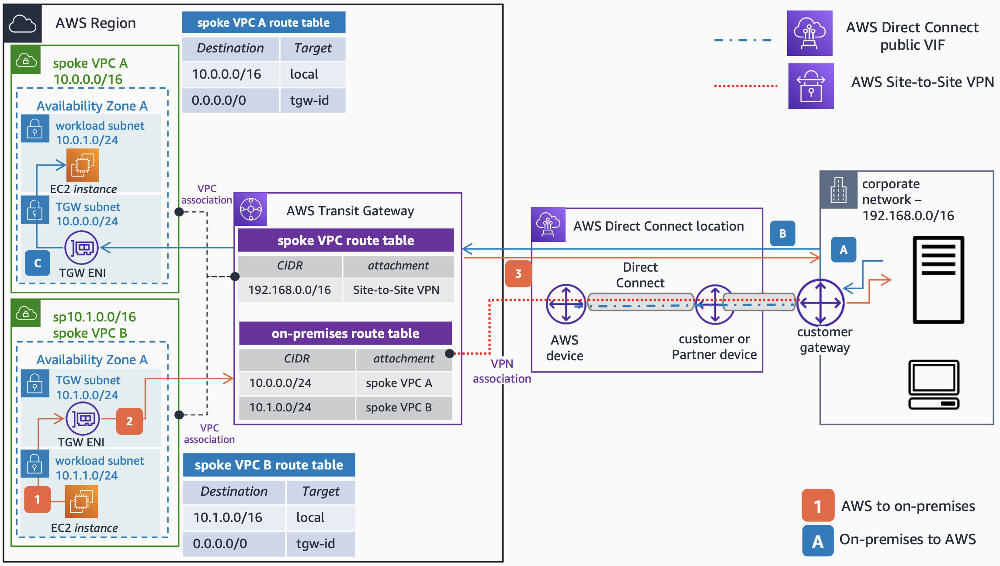

# AWS Site-to-Site VPN on Top of AWS Direct Connect for Traffic Encryption

Publication date: **August 17, 2022 ([Diagram history](#hc6-diagram-history "#hc6-diagram-history"))**

If you require traffic encryption in your [AWS Direct Connect](../../../directconnect/latest/UserGuide/Welcome.md "../../../directconnect/latest/UserGuide/Welcome.md") connection, one of the options to achieve this is to create an AWS Site-to-Site VPN on top of the Direct Connect connection. You have two options: either by using a Public VIF to connect to the VPN public endpoint, or by creating a Private IP VPN on top of a Transit VIF to use private IPs.

## AWS Site-to-Site VPN on top of AWS Direct Connect architecture

The following steps describe the on-premises to AWS traffic flow:

1. You can create an AWS Site-to-Site VPN on top of an AWS Direct Connect link by using a public VIF. You will need to configure your customer gateway to bring up the VIF and create the VPN connection. Traffic from the corporate data center destined to the spoke Amazon VPC A will be routed through the Site-to-Site VPN connection.
2. Traffic is sent to the AWS Transit Gateway through the Site-to-Site VPN connection, which is created over the Direct Connect link.
3. As per the **on-premises route table** in the Transit Gateway, traffic is forwarded to the **spoke VPC A** attachment. The TGW ENI of the **spoke VPC A** forwards the traffic to the destination.

The following steps describe the AWS to on-premises traffic flow:

1. Traffic initiated from an Amazon Elastic Compute Cloud instance in the **spoke VPC B** and destined to the corporate data center is routed to the Transit Gateway ENI as per the **spoke VPC B** route table.
2. As per the **Transit Gateway spoke VPC route table**, the traffic is forwarded to the AWS Site-to-Site VPN attachment.
3. The traffic is sent to the corporate data center through the Site-to-Site VPN connection on top of the Direct Connect link.

For more information about options to encrypt traffic in AWS Direct Connect, see [Traffic encryption in AWS Direct Connect](../../../directconnect/latest/UserGuide/encryption-in-transit.md "../../../directconnect/latest/UserGuide/encryption-in-transit.md").

## Further reading

For additional information, see the following resources:

- [AWS Architecture Icons](https://aws.amazon.com/architecture/icons "https://aws.amazon.com/architecture/icons")
- [AWS Architecture Center](https://aws.amazon.com/architecture "https://aws.amazon.com/architecture")
- [AWS Well-Architected](https://aws.amazon.com/architecture/well-architected "https://aws.amazon.com/architecture/well-architected")

## Diagram history

To be notified about updates to this reference architecture diagram, subscribe to the RSS feed.

| Change                                                                                                                           | Description                                     | Date            |
| -------------------------------------------------------------------------------------------------------------------------------- | ----------------------------------------------- | --------------- |
| [Initial publication](hybrid-vpn.md#hc1-diagram-history "hybrid-vpn.md#hc1-diagram-history")                                     | Reference architecture diagram first published. | August 17, 2022 |
| [Initial publication](hybrid-dx.md#hc2-diagram-history "hybrid-dx.md#hc2-diagram-history")                                       | Reference architecture diagram first published. | August 17, 2022 |
| [Initial publication](hybrid-vpn-primary-backup.md#hc3-diagram-history "hybrid-vpn-primary-backup.md#hc3-diagram-history")       | Reference architecture diagram first published. | August 17, 2022 |
| [Initial publication](hybrid-dx-primary-vpn-backup.md#hc4-diagram-history "hybrid-dx-primary-vpn-backup.md#hc4-diagram-history") | Reference architecture diagram first published. | August 17, 2022 |
| [Initial publication](hybrid-dx-active-passive.md#hc5-diagram-history "hybrid-dx-active-passive.md#hc5-diagram-history")         | Reference architecture diagram first published. | August 17, 2022 |
| Initial publication                                                                                                              | Reference architecture diagram first published. | August 17, 2022 |
| [Initial publication](hybrid-dx-tgw-connect.md#hc7-diagram-history "hybrid-dx-tgw-connect.md#hc7-diagram-history")               | Reference architecture diagram first published. | August 17, 2022 |
| [Initial publication](hybrid-dx-private-vif.md#hc8-diagram-history "hybrid-dx-private-vif.md#hc8-diagram-history")               | Reference architecture diagram first published. | August 17, 2022 |

###### Note

To subscribe to RSS updates, you must have an RSS plugin enabled for the browser you are using.
