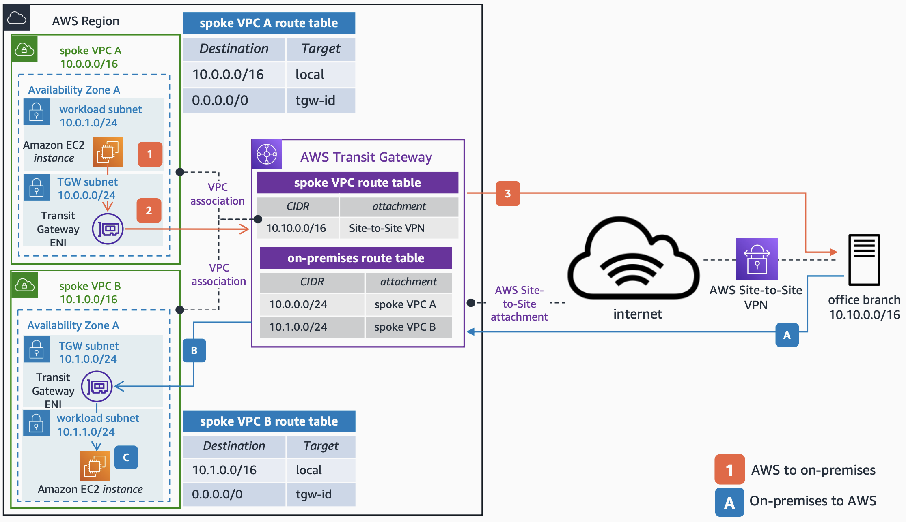

# Hybrid Connectivity to AWS Transit Gateway with AWS Site-to-Site VPN

Publication date: **August 17, 2022 ([Diagram history](#hc1-diagram-history "#hc1-diagram-history"))**

You can create a [Site-to-Site VPN](../../../vpn/latest/s2svpn/SetUpVPNConnections.md "../../../vpn/latest/s2svpn/SetUpVPNConnections.md") connection directly to a [Transit Gateway](../../../vpc/latest/tgw/what-is-transit-gateway.md "../../../vpc/latest/tgw/what-is-transit-gateway.md"). With this, you can take advantage of the benefits of a managed VPN solution, while connecting to several VPCs without having to add a new connection. It is recommended to use a second VPN connection for high availability.

## Hybrid connectivity with AWS Site-to-Site VPN architecture

The following steps describe the AWS to on-premises traffic flow:

1. Traffic initiated from an Amazon Elastic Compute Cloud instance in the **spoke VPC A** and destined to the office branch is routed to the Transit Gateway elastic network interface (ENI) as per the **spoke VPC A** route table.
2. Traffic is forwarded to AWS Transit Gateway (AWS TGW). As per the **spoke VPC route table**, the traffic is routed to the office branch through the AWS Site-to-Site VPN attachment.
3. The traffic is routed to the destination through the Site-to-Site VPN connection over the internet.

The following steps describe the on-premises to AWS traffic flow:

1. Traffic from the office branch destined to the **spoke VPC B** is forwarded to the Transit Gateway through the Site-to-Site VPN connection.
2. As per the **Transit Gateway on-premises route table**, the traffic is forwarded to the **spoke VPC B** attachment.
3. The Transit Gateway ENI of the **spoke VPC B** forwards the traffic to the destination.

For more information about how to configure AWS Site-to-Site VPN, see [Getting started with AWS Site-to-Site VPN](../../../vpn/latest/s2svpn/SetUpVPNConnections.md "../../../vpn/latest/s2svpn/SetUpVPNConnections.md").

## Further reading

For additional information, see the following resources:

- [AWS Architecture Icons](https://aws.amazon.com/architecture/icons "https://aws.amazon.com/architecture/icons")
- [AWS Architecture Center](https://aws.amazon.com/architecture "https://aws.amazon.com/architecture")
- [AWS Well-Architected](https://aws.amazon.com/architecture/well-architected "https://aws.amazon.com/architecture/well-architected")

## Diagram history

To be notified about updates to this reference architecture diagram, subscribe to the RSS feed.

| Change                                                                                                                           | Description                                     | Date            |
| -------------------------------------------------------------------------------------------------------------------------------- | ----------------------------------------------- | --------------- |
| Initial publication                                                                                                              | Reference architecture diagram first published. | August 17, 2022 |
| [Initial publication](hybrid-dx.md#hc2-diagram-history "hybrid-dx.md#hc2-diagram-history")                                       | Reference architecture diagram first published. | August 17, 2022 |
| [Initial publication](hybrid-vpn-primary-backup.md#hc3-diagram-history "hybrid-vpn-primary-backup.md#hc3-diagram-history")       | Reference architecture diagram first published. | August 17, 2022 |
| [Initial publication](hybrid-dx-primary-vpn-backup.md#hc4-diagram-history "hybrid-dx-primary-vpn-backup.md#hc4-diagram-history") | Reference architecture diagram first published. | August 17, 2022 |
| [Initial publication](hybrid-dx-active-passive.md#hc5-diagram-history "hybrid-dx-active-passive.md#hc5-diagram-history")         | Reference architecture diagram first published. | August 17, 2022 |
| [Initial publication](hybrid-vpn-over-dx.md#hc6-diagram-history "hybrid-vpn-over-dx.md#hc6-diagram-history")                     | Reference architecture diagram first published. | August 17, 2022 |
| [Initial publication](hybrid-dx-tgw-connect.md#hc7-diagram-history "hybrid-dx-tgw-connect.md#hc7-diagram-history")               | Reference architecture diagram first published. | August 17, 2022 |
| [Initial publication](hybrid-dx-private-vif.md#hc8-diagram-history "hybrid-dx-private-vif.md#hc8-diagram-history")               | Reference architecture diagram first published. | August 17, 2022 |

###### Note

To subscribe to RSS updates, you must have an RSS plugin enabled for the browser you are using.
