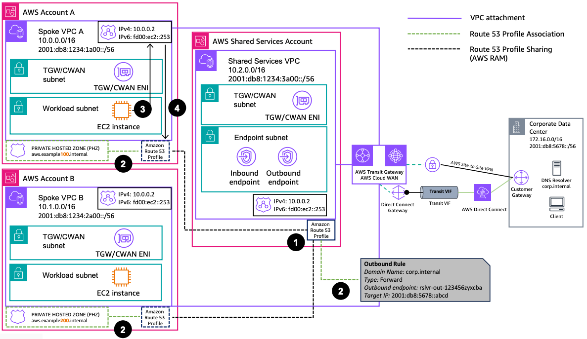

# Multi-Account and Multi-VPC Hybrid DNS Resolution Using Amazon Route 53 Profiles

Publication date: **January 17, 2025 ([Diagram history](#hdnsp-diagram-history "#hdnsp-diagram-history"))**

This architecture shows how to use [Amazon Route 53](../../../Route53/latest/DeveloperGuide/Welcome.md "../../../Route53/latest/DeveloperGuide/Welcome.md") Profiles to simplify hybrid DNS resolution across multiple AWS accounts and [Amazon VPCs](../../../vpc/latest/userguide/what-is-amazon-vpc.md "../../../vpc/latest/userguide/what-is-amazon-vpc.md"). A Route 53 Profile is created in a shared services account and shared through AWS Resource Access Manager (RAM) to spoke accounts, enabling consistent DNS configuration across the environment.

For more information about IPv6 and dual-stack architectures, see the [Dual Stack and IPv6-only Amazon VPC Reference Architectures](../ipv6-vpc-architectures/index.md "../ipv6-vpc-architectures/index.md") guide in this series.

For hybrid environments, see [IPv6 requirements for AWS Site-to-Site VPN](../../../vpn/latest/s2svpn/ipv4-ipv6.md "../../../vpn/latest/s2svpn/ipv4-ipv6.md") and [AWS Direct Connect virtual interfaces](../../../directconnect/latest/UserGuide/WorkingWithVirtualInterfaces.md "../../../directconnect/latest/UserGuide/WorkingWithVirtualInterfaces.md").

###### Note

You can also share private hosted zones and resolver rules without the use of Route 53 Profiles. For more information, see [Associating an Amazon VPC and a private hosted zone that you created with different accounts](../../../Route53/latest/DeveloperGuide/hosted-zone-private-associate-vpcs-different-accounts.md "../../../Route53/latest/DeveloperGuide/hosted-zone-private-associate-vpcs-different-accounts.md") and [Sharing forwarding rules with other AWS accounts and using shared rules](../../../Route53/latest/DeveloperGuide/resolver-rules-managing-sharing.md "../../../Route53/latest/DeveloperGuide/resolver-rules-managing-sharing.md").

## Multi-account hybrid DNS resolution with Route 53 Profiles architecture

The following steps describe the data flow in this architecture:

1. An Amazon Route 53 Profile is created in the shared services account and shared through AWS Resource Access Manager (RAM) to Accounts A and B. When sharing a Route 53 Profile, it can be done with read-only or admin permissions. In this case, it was done with admin permissions, so Accounts A and B can also associate resources.
2. The Route 53 Profile is associated with VPCs A, B, and the shared services VPC, so these VPCs can consume the configured DNS resolution. In addition, Accounts A and B associate a private hosted zone (PHZ), and the shared services account shares a forwarding rule.
3. An [Amazon Elastic Compute Cloud](../../../AWSEC2/latest/UserGuide/concepts.md "../../../AWSEC2/latest/UserGuide/concepts.md") (Amazon EC2) instance queries the Route 53 Resolver in the VPC for domain name resolution.
4. Because the Route 53 Profile is associated to the VPC, any domain name within the **aws.example100.internal** and **aws.example200.internal** domain names will be resolved by the Route 53 Resolver. DNS queries within the **corp.internal** domain name will be forwarded through the Route 53 Resolver outbound endpoint.

## Further reading

For additional information, see the following resources:

- [AWS Architecture Icons](https://aws.amazon.com/architecture/icons "https://aws.amazon.com/architecture/icons")
- [AWS Architecture Center](https://aws.amazon.com/architecture "https://aws.amazon.com/architecture")
- [AWS Well-Architected](https://aws.amazon.com/architecture/well-architected "https://aws.amazon.com/architecture/well-architected")

## Diagram history

To be notified about updates to this reference architecture diagram, subscribe to the RSS feed.

| Change                                                                                                               | Description                                     | Date             |
| -------------------------------------------------------------------------------------------------------------------- | ----------------------------------------------- | ---------------- |
| [Initial publication](hybrid-dns-ipv4.md#hdns4-diagram-history "hybrid-dns-ipv4.md#hdns4-diagram-history")           | Reference architecture diagram first published. | January 17, 2025 |
| [Initial publication](hybrid-dns-dualstack.md#hdnsd-diagram-history "hybrid-dns-dualstack.md#hdnsd-diagram-history") | Reference architecture diagram first published. | January 17, 2025 |
| [Initial publication](hybrid-dns-ipv6.md#hdns6-diagram-history "hybrid-dns-ipv6.md#hdns6-diagram-history")           | Reference architecture diagram first published. | January 17, 2025 |
| Initial publication                                                                                                  | Reference architecture diagram first published. | January 17, 2025 |

###### Note

To subscribe to RSS updates, you must have an RSS plugin enabled for the browser you are using.
