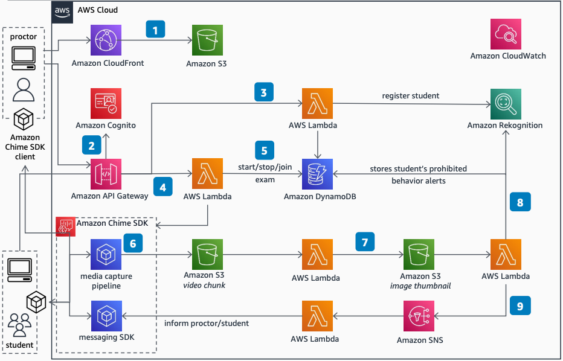

# Hybrid Remote Proctoring Solution

Publication date: **March 30, 2023 ([Diagram history](#proctoring-history "#proctoring-history"))**

Hybrid remote proctoring supports education use cases where you can monitor students live
with AI assistance to highlight prohibited objects and behaviors. This solution uses Amazon
Rekognition for image analysis and the Amazon Chime SDK for video session management. You can
apply this solution to in-person exams as well as remote exams.

###### Privacy considerations

This is a technical diagram only and does not account for possible privacy implications,
laws, and regulations that might apply to this scenario, such as just-in-time privacy notices,
user consent, and data usage, retention, processing, and deletion of personally identifiable
information, including biometric data.

## Hybrid Remote Proctoring Solution diagram

The following steps describe the architecture:

1. The architecture hosts static web app code in an [Amazon Simple Storage Service](../../../AmazonS3/latest/userguide.md "../../../AmazonS3/latest/userguide.md") bucket. [Amazon CloudFront](../../../AmazonCloudFront/latest/DeveloperGuide.md "../../../AmazonCloudFront/latest/DeveloperGuide.md") serves this content with
   low-latency access from edge locations. You can secure content in the Amazon S3 bucket against
   unintended access by using CloudFront Origin Access Control.
2. [Amazon API Gateway](../../../apigateway/latest/developerguide.md "../../../apigateway/latest/developerguide.md") serves the REST APIs, and
   serverless [AWS Lambda](../../../lambda/latest/dg.md "../../../lambda/latest/dg.md") functions
   handle requests. [Amazon Cognito](../../../cognito/latest/developerguide.md "../../../cognito/latest/developerguide.md") provides secure authenticated
   access to these APIs and manages identities for proctors and students.
3. For the registration flow, an API request registers each student. The request passes
   the student's photo to a Lambda function. The function calls an [Amazon Rekognition](../../../rekognition/latest/dg.md "../../../rekognition/latest/dg.md") API to retrieve a unique
   **FaceId** based on extracted facial feature vectors. The student's
   **FaceId** is stored in an [Amazon DynamoDB](../../../amazondynamodb/latest/developerguide.md "../../../amazondynamodb/latest/developerguide.md") serverless database for
   future matching needs.
4. The proctor starts the exam by calling an Amazon Chime SDK Messaging API. This starts
   an Amazon Chime SDK session and an Amazon Chime SDK Messaging Channel for chat-based
   communication between the proctor and each student. The exam workflow captures student
   consent at the start of the exam with relevant policies.
5. The exam workflow stores exam information in DynamoDB. To stop the exam, a similar request
   updates the exam status within the database.
6. After the exam starts, the student's web app connects with a separate Amazon Chime SDK
   session. The web app captures the camera video stream and screen, using media capture
   pipelines with user consent. It saves these to an Amazon S3 bucket in up to five-second file
   chunks for internal audit and archiving.
7. For every new video chunk saved, an Amazon S3 PutEvent calls a Lambda function. The function
   pulls one image frame from the video chunk and stores that image frame in another Amazon S3
   bucket as a .jpeg file. This optimizes cost while still allowing use of the full video
   chunk as needed.
8. Another Lambda function validates the .jpeg file by using Amazon Rekognition with API calls for
   verifying the student's face, checking how many faces are in the frame, and detecting when
   no face is present. The Lambda function saves these response alerts in DynamoDB for internal
   audit purposes.
9. If Amazon Rekognition detects prohibited actions, it sends an alert to the proctor by using [Amazon Simple Notification Service](../../../sns/latest/dg.md "../../../sns/latest/dg.md"). A Lambda function sends an
   alert to the proctor (and student, if needed) by using the Amazon Chime SDK messaging
   channel.

## Further reading

For additional information, see the following resources:

- [AWS Architecture Icons](https://aws.amazon.com/architecture/icons "https://aws.amazon.com/architecture/icons")
- [AWS Architecture Center](https://aws.amazon.com/architecture/ "https://aws.amazon.com/architecture/")
- [AWS
  Well-Architected](https://aws.amazon.com/architecture/well-architected "https://aws.amazon.com/architecture/well-architected")

## Diagram history

To be notified about updates to this reference architecture diagram, subscribe to the RSS
feed.

| Change              | Description                                     | Date           |
| ------------------- | ----------------------------------------------- | -------------- |
| Initial publication | Reference architecture diagram first published. | March 30, 2023 |

###### RSS subscription requirement

To subscribe to RSS updates, you must have an RSS plugin enabled for the browser you are
using.
