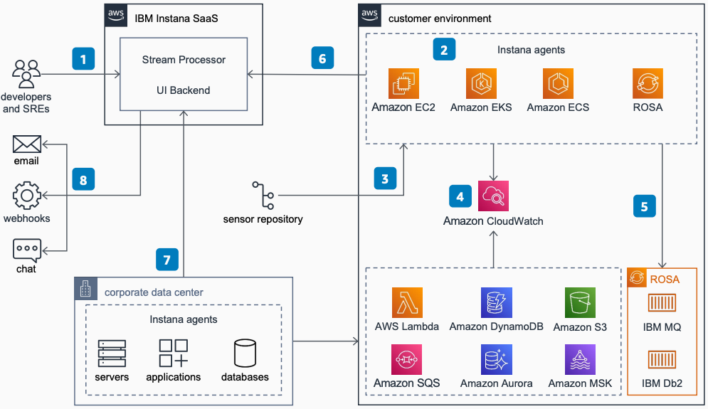

# IBM Instana Observability on AWS

Publication date: **February 28, 2023 ([Diagram history](#diagram-history "#diagram-history"))**

This architecture shows how to use IBM Instana on AWS for automated observability of your entire technology stack.

## IBM Instana Observability on AWS

1. Site reliability engineers (SREs) and developers access IBM Instana dashboards to troubleshoot and identify optimization opportunities.
2. IBM Instana collects data from monitored systems by using a single host agent on each host. You can deploy these agents on [Amazon EC2](../../../AWSEC2/latest/UserGuide/concepts.md "../../../AWSEC2/latest/UserGuide/concepts.md"), [Amazon EKS](../../../eks/latest/userguide/what-is-eks.md "../../../eks/latest/userguide/what-is-eks.md"), Amazon ECS, and Red Hat OpenShift Service on AWS (ROSA).
3. Host agents dynamically deploy sensors from sensor repositories for over 300 different technologies.
4. IBM Instana sensors collect traces and metrics data from [Amazon CloudWatch](../../../AmazonCloudWatch/latest/monitoring/WhatIsCloudWatch.md "../../../AmazonCloudWatch/latest/monitoring/WhatIsCloudWatch.md") of AWS services like [Amazon SQS](../../../AWSSimpleQueueService/latest/SQSDeveloperGuide/welcome.md "../../../AWSSimpleQueueService/latest/SQSDeveloperGuide/welcome.md"), Amazon MSK, [Amazon S3](../../../AmazonS3/latest/userguide/Welcome.md "../../../AmazonS3/latest/userguide/Welcome.md"), Amazon Aurora, DynamoDB, and [Lambda](../../../lambda/latest/dg/welcome.md "../../../lambda/latest/dg/welcome.md").
5. IBM Instana sensors also collect traces and metrics from workloads deployed on AWS, like ROSA, IBM Db2, IBM MQ, and others.
6. Host agents collect and aggregate data from various IBM Instana sensors before sending the data to the IBM Instana backend.
7. You can also deploy IBM Instana agents on hosts in your corporate data center to collect and send data to the IBM Instana backend service.
8. The IBM Instana backend service sends alerts and events to users through methods such as APIs, webhooks, email, and instant messaging.

## Further reading

For additional information, refer to

- [AWS Architecture Icons](https://aws.amazon.com/architecture/icons "https://aws.amazon.com/architecture/icons")
- [AWS Architecture Center](https://aws.amazon.com/architecture "https://aws.amazon.com/architecture")
- [AWS Well-Architected](https://aws.amazon.com/architecture/well-architected "https://aws.amazon.com/architecture/well-architected")
- [Amazon CloudWatch product page](https://aws.amazon.com/cloudwatch/ "https://aws.amazon.com/cloudwatch/")
- [product page](https://aws.amazon.com/opensearch-service/ "https://aws.amazon.com/opensearch-service/")

## Diagram history

To be notified about updates to this reference architecture diagram, subscribe to the RSS feed.

| Change              | Description                                     | Date              |
| ------------------- | ----------------------------------------------- | ----------------- |
| Initial publication | Reference architecture diagram first published. | February 28, 2023 |

###### Note

To subscribe to RSS updates, you must have an RSS plugin enabled for the browser you are using.
