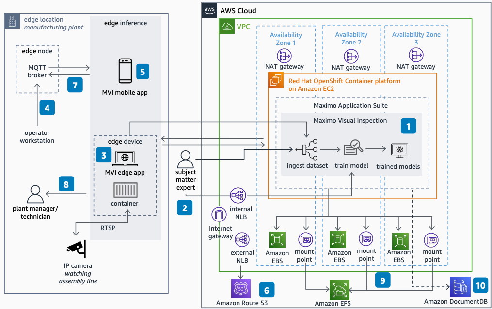

# Computer Vision for Quality Insights with IBM Maximo on AWS

Publication date: **April 11, 2023 ([Diagram history](#imq-diagram-history "#imq-diagram-history"))**

With this architecture, you can use IBM Maximo Visual Inspection (MVI) in a
modernized AWS environment to detect and classify defects in manufacturing.
Red Hat OpenShift on AWS, [Amazon DocumentDB (with MongoDB compatibility)](../../../documentdb/latest/developerguide.md "../../../documentdb/latest/developerguide.md"), and AWS storage services
provide a scalable, highly available environment. This architecture uses [Amazon Route 53](../../../Route53/latest/DeveloperGuide.md "../../../Route53/latest/DeveloperGuide.md"), [Amazon Elastic File System](../../../efs/latest/ug.md "../../../efs/latest/ug.md"), and [Amazon Elastic Block Store](../../../AWSEC2/latest/UserGuide.md "../../../AWSEC2/latest/UserGuide.md").

## IBM Maximo quality insights architecture diagram

The following steps describe the architecture:

1. Ingest training datasets into the MVI training server on Red Hat
   OpenShift in your VPC. Use the MVI mobile app, MVI edge, or subject matter
   experts through a web app.
2. Subject matter experts annotate images and train models in the MVI training
   server.
3. Use MVI edge or the mobile app to create inspections and deploy models. Use Real
   Time Streaming Protocol (RTSP) for video data.
4. Operator workstations send messages to Message Queuing Telemetry Transport (MQTT)
   topics. MVI edge and mobile subscribe to and receive messages.
5. Take a photo and perform inference at the edge. Send images with inference results
   to MVI.
6. Route 53 provides DNS services. Network Load Balancers provide traffic to the
   OpenShift cluster.
7. Send alerts and inference results to an MQTT topic.
8. Plant managers and technicians review inference results in MVI edge UI, the mobile
   app, or the training server.
9. Red Hat OpenShift connects Amazon EFS as a network file system and uses
   Amazon EBS as block storage.
10. Maximo Application Suite (MAS) uses Amazon DocumentDB for the data dictionary
    and local user management.

## Further reading

For additional information, see the following resources:

- [AWS Architecture Icons](https://aws.amazon.com/architecture/icons "https://aws.amazon.com/architecture/icons")
- [AWS Architecture Center](https://aws.amazon.com/architecture "https://aws.amazon.com/architecture")
- [AWS Well-Architected](https://aws.amazon.com/architecture/well-architected "https://aws.amazon.com/architecture/well-architected")

## Diagram history

To be notified about updates to this reference architecture diagram, subscribe to the RSS feed.

| Change              | Description                                     | Date           |
| ------------------- | ----------------------------------------------- | -------------- |
| Initial publication | Reference architecture diagram first published. | April 11, 2023 |

###### RSS subscription

To subscribe to RSS updates, you must have an RSS plugin enabled for the browser that you are using.
