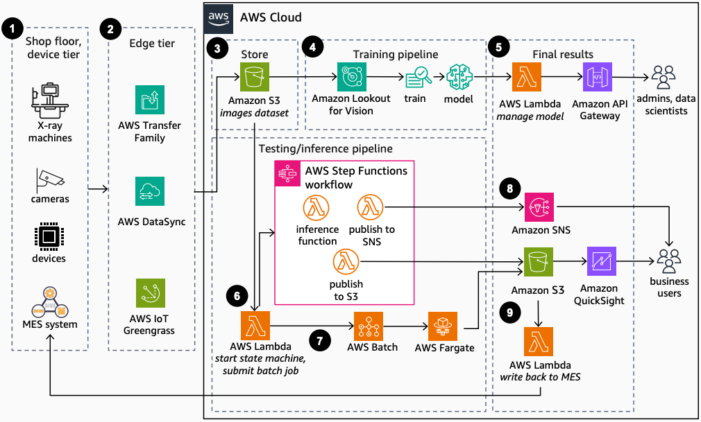

# Identify Product Defects using Industrial Computer Vision

Publication date: **October 10, 2024 ([Diagram history](#ipd-diagram-history "#ipd-diagram-history"))**

With this architecture, you can detect anomalies such as casting metal defects, damage,
and irregularities in X-ray images. You use [Amazon Lookout for Vision](https://aws.amazon.com/blogs/machine-learning/exploring-alternatives-and-seamlessly-migrating-data-from-amazon-lookout-for-vision/ "https://aws.amazon.com/blogs/machine-learning/exploring-alternatives-and-seamlessly-migrating-data-from-amazon-lookout-for-vision/"),
[Amazon Simple Storage Service](../../../AmazonS3/latest/userguide.md "../../../AmazonS3/latest/userguide.md") (Amazon S3), and
[AWS Lambda](../../../lambda/latest/dg.md "../../../lambda/latest/dg.md") for quality inspection
in manufacturing.

## Product defects computer vision architecture diagram

The following steps describe the architecture:

1. Capture images under consistent conditions with X-ray machines, cameras, and other
   devices.
2. Transfer product images to AWS with [AWS Transfer Family](../../../transfer/latest/userguide.md "../../../transfer/latest/userguide.md"), [AWS DataSync](../../../datasync/latest/userguide.md "../../../datasync/latest/userguide.md"), or [AWS IoT Greengrass](../../../greengrass/v2/developerguide.md "../../../greengrass/v2/developerguide.md") for edge devices.
3. Store product images in Amazon S3 separated into train and test datasets.
4. Use Amazon Lookout for Vision on the training dataset to label, train, tune, and deploy the defect
   detection model.
5. Expose the model through [Amazon API Gateway](../../../apigateway/latest/developerguide.md "../../../apigateway/latest/developerguide.md") and Lambda for admins and data
   scientists to manage.
6. For runtime inference, use Lambda to start the model. Use [AWS Step Functions](../../../step-functions/latest/dg.md "../../../step-functions/latest/dg.md") with Lambda to orchestrate a serverless
   workflow.
7. For batch anomaly detection, submit a batch job to [AWS Batch](../../../batch/latest/userguide.md "../../../batch/latest/userguide.md") with [AWS Fargate](../../../AmazonECS/latest/developerguide.md "../../../AmazonECS/latest/developerguide.md") for compute.
8. Notify users on confidence level through [Amazon Simple Notification Service](../../../sns/latest/dg.md "../../../sns/latest/dg.md") (Amazon SNS). If the minimum confidence threshold is
   not met, the user provides input to label undetected data.
9. Store final results in Amazon S3 for [Quick](../../../quicksight/latest/user/welcome.md "../../../quicksight/latest/user/welcome.md") visualization. Write results back
   to the manufacturing execution system (MES) on the shop floor.

## Further reading

For additional information, see the following resources:

- [AWS Architecture Icons](https://aws.amazon.com/architecture/icons "https://aws.amazon.com/architecture/icons")
- [AWS Architecture Center](https://aws.amazon.com/architecture "https://aws.amazon.com/architecture")
- [AWS Well-Architected](https://aws.amazon.com/architecture/well-architected "https://aws.amazon.com/architecture/well-architected")

## Diagram history

To be notified about updates to this reference architecture diagram, subscribe to the RSS feed.

| Change              | Description                                     | Date             |
| ------------------- | ----------------------------------------------- | ---------------- |
| Initial publication | Reference architecture diagram first published. | October 10, 2024 |

###### RSS subscription

To subscribe to RSS updates, you must have an RSS plugin enabled for the browser that you are using.
