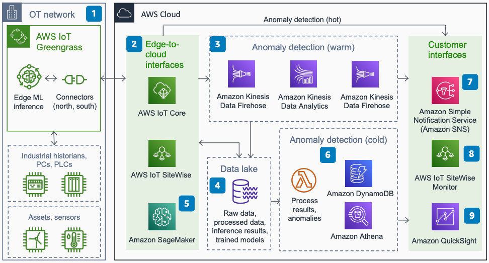

# AWS Industrial Anomaly Detection Using AWS IoT

Publication date: **October 12, 2021 ([Diagram history](#iad-diagram-history "#iad-diagram-history"))**

With this architecture, you can detect performance anomalies through hot, warm, and cold
analysis paths. You can use AWS IoT, analytics, and ML services to inform operational
technology (OT) teams of equipment issues. This architecture uses [AWS IoT Greengrass](../../../greengrass/v2/developerguide.md "../../../greengrass/v2/developerguide.md"), [AWS IoT Core](../../../iot/latest/developerguide.md "../../../iot/latest/developerguide.md"), [AWS IoT SiteWise](../../../iot-sitewise/latest/userguide.md "../../../iot-sitewise/latest/userguide.md"), [Amazon SageMaker AI](../../../sagemaker/latest/dg.md "../../../sagemaker/latest/dg.md"), and [Amazon Lookout for Equipment](../../../lookout-for-equipment/latest/ug.md "../../../lookout-for-equipment/latest/ug.md").

## Industrial anomaly detection architecture diagram

The following steps describe the architecture:

1. Ingest telemetry from industrial assets through AWS IoT Greengrass edge connectors. Run hot
   anomaly detection at the edge with stream analytics and ML inference.
2. Edge-to-cloud interfaces AWS IoT Core and AWS IoT SiteWise ingest telemetry data.
3. Amazon Managed Service for Apache Flink runs queries for warm-path anomaly
   detection.
4. [Amazon S3](../../../AmazonS3/latest/userguide.md "../../../AmazonS3/latest/userguide.md") data lake
   stores raw and processed telemetry, trained ML models, and inference results.
5. Train ML models for cold-path batch inference with Amazon SageMaker AI or Amazon Lookout for Equipment.
6. [AWS Lambda](../../../lambda/latest/dg.md "../../../lambda/latest/dg.md") functions
   analyze batch inference results.
7. OT teams consume alerts from [Amazon Simple Notification Service](../../../sns/latest/dg.md "../../../sns/latest/dg.md") (Amazon SNS) as emails, texts, or ticketing
   integrations.
8. No-code dashboards through AWS IoT SiteWise Monitor assess real-time and historical
   performance.
9. [Amazon Quick Sight](../../../quicksight/latest/user/welcome.md "../../../quicksight/latest/user/welcome.md") evaluates history of
   anomalies and fleet performance.

## Further reading

For additional information, see the following resources:

- [AWS Architecture Icons](https://aws.amazon.com/architecture/icons "https://aws.amazon.com/architecture/icons")
- [AWS Architecture Center](https://aws.amazon.com/architecture "https://aws.amazon.com/architecture")
- [AWS Well-Architected](https://aws.amazon.com/architecture/well-architected "https://aws.amazon.com/architecture/well-architected")
- [Industrial Data Platform on AWS](../industrial-data-platform/industrial-data-platform.md "../industrial-data-platform/industrial-data-platform.md")

## Diagram history

To be notified about updates to this reference architecture diagram, subscribe to the RSS feed.

| Change              | Description                                     | Date             |
| ------------------- | ----------------------------------------------- | ---------------- |
| Initial publication | Reference architecture diagram first published. | October 12, 2021 |

###### RSS subscription

To subscribe to RSS updates, you must have an RSS plugin enabled for the browser that you are using.
