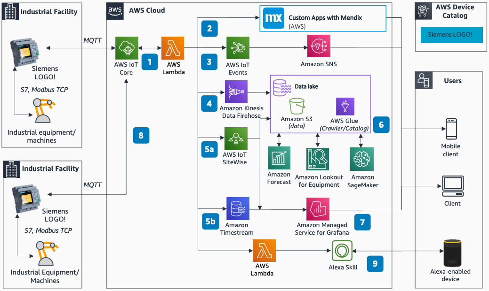

# AWS Industrial Applications with Siemens LOGO!

Publication date: **September 27, 2021 ([Diagram history](#slogo-diagram-history "#slogo-diagram-history"))**

With this architecture, you can ingest near real-time data from Siemens LOGO!
controllers to [AWS IoT Core](../../../iot/latest/developerguide.md "../../../iot/latest/developerguide.md").
You can build modern applications including dashboards, event detection, alerting, predictive
maintenance, and Alexa integration. Use analytics and ML on a data lake for
predictive models and forecasts. This architecture uses AWS IoT Core, [AWS Lambda](../../../lambda/latest/dg.md "../../../lambda/latest/dg.md"), [Amazon Data Firehose](../../../firehose/latest/dev.md "../../../firehose/latest/dev.md"), [AWS IoT SiteWise](../../../iot-sitewise/latest/userguide.md "../../../iot-sitewise/latest/userguide.md"), and [Amazon SageMaker AI](../../../sagemaker/latest/dg.md "../../../sagemaker/latest/dg.md").

## Siemens LOGO! industrial applications architecture diagram

The following steps describe the architecture:

1. Siemens LOGO! controls automation equipment and ingests data to
   AWS IoT Core. Lambda transforms incoming data before ingestion.
2. Build custom low-code web and mobile applications with Mendix to
   monitor and control IoT devices.
3. [AWS
   IoT Events](../../../whitepapers/latest/aws-overview/internet-of-things-services.md#aws-iot-events "../../../whitepapers/latest/aws-overview/internet-of-things-services.md#aws-iot-events") detects changes and anomalies. It triggers notifications through
   [Amazon Simple Notification Service](../../../sns/latest/dg.md "../../../sns/latest/dg.md") (Amazon SNS).
4. Use Amazon Data Firehose to ingest data into a data lake on [Amazon S3](../../../AmazonS3/latest/userguide.md "../../../AmazonS3/latest/userguide.md"). [AWS Glue](../../../glue/latest/dg.md "../../../glue/latest/dg.md") performs extract, transform, and load (ETL) jobs and
   builds the data catalog.
5. AWS IoT SiteWise models and stores data from equipment for large-scale deployments.

Use [Amazon Managed Grafana](../../../grafana/latest/userguide.md "../../../grafana/latest/userguide.md") to visualize data on near real-time
dashboards. 6. Use curated data from the data lake with AI and ML services. Use Amazon SageMaker AI, [Amazon Forecast](../../../forecast/latest/dg.md "../../../forecast/latest/dg.md"), and [Amazon Lookout for Equipment](../../../lookout-for-equipment/latest/ug.md "../../../lookout-for-equipment/latest/ug.md") for
predictive health analysis. 7. [Amazon Timestream](../../../timestream/latest/developerguide.md "../../../timestream/latest/developerguide.md") stores time series data
optimized for fast analytical queries. 8. Configure global data exchange between LOGO! devices through
AWS IoT Core. 9. Custom Alexa skills let users control input and output variables in
LOGO! with voice commands.

## Further reading

For additional information, see the following resources:

- [AWS Architecture Icons](https://aws.amazon.com/architecture/icons "https://aws.amazon.com/architecture/icons")
- [AWS Architecture Center](https://aws.amazon.com/architecture "https://aws.amazon.com/architecture")
- [AWS Well-Architected](https://aws.amazon.com/architecture/well-architected "https://aws.amazon.com/architecture/well-architected")
- [Industrial Data Platform on AWS](../industrial-data-platform/industrial-data-platform.md "../industrial-data-platform/industrial-data-platform.md")

## Diagram history

To be notified about updates to this reference architecture diagram, subscribe to the RSS feed.

| Change              | Description                                     | Date               |
| ------------------- | ----------------------------------------------- | ------------------ |
| Initial publication | Reference architecture diagram first published. | September 27, 2021 |

###### RSS subscription

To subscribe to RSS updates, you must have an RSS plugin enabled for the browser that you are using.
