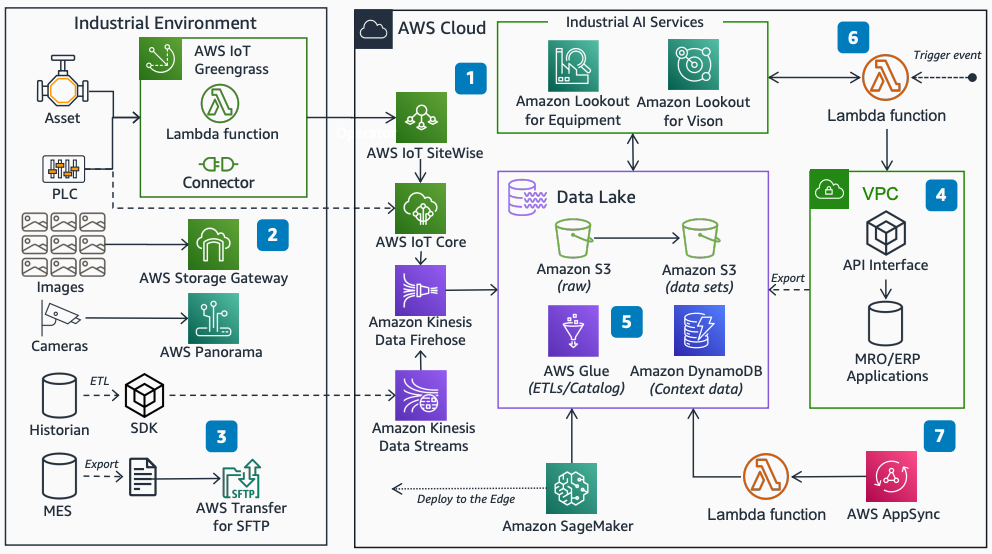

# Industrial Data Platform on AWS

Publication date: **May 21, 2021 ([Diagram history](#idp-diagram-history "#idp-diagram-history"))**

With this architecture, you can ingest and store data from industrial equipment and
enterprise applications, contextualize data, and build datasets. You can integrate machine
learning (ML) predictions with industrial systems of record. This architecture uses [AWS IoT SiteWise](../../../iot-sitewise/latest/userguide.md "../../../iot-sitewise/latest/userguide.md"), [AWS IoT Core](../../../iot/latest/developerguide.md "../../../iot/latest/developerguide.md"), [AWS IoT Greengrass](../../../greengrass/v2/developerguide.md "../../../greengrass/v2/developerguide.md"), [Amazon Data Firehose](../../../firehose/latest/dev.md "../../../firehose/latest/dev.md"), [AWS Glue](../../../glue/latest/dg.md "../../../glue/latest/dg.md"), and [Amazon SageMaker AI](../../../sagemaker/latest/dg.md "../../../sagemaker/latest/dg.md").

## Industrial data platform architecture diagram

The following steps describe the architecture:

1. Ingest and transform asset, machine, and programmable logic controller (PLC) data
   with AWS IoT Greengrass connectors and [AWS Lambda](../../../lambda/latest/dg.md "../../../lambda/latest/dg.md") functions at the edge. Stream Industrial
   Internet of Things (IIoT) data into the data lake from AWS IoT SiteWise through AWS IoT Core and
   Amazon Data Firehose.
2. Synchronize images to the data lake with AWS Storage Gateway. For IP cameras, use
   AWS Panorama to transfer images.
3. Stream manufacturing application data with [Amazon Kinesis](../../../kinesis/latest/dev.md "../../../kinesis/latest/dev.md") Data Streams or transfer with [AWS Transfer Family](../../../transfer/latest/userguide.md "../../../transfer/latest/userguide.md").
4. Export industrial enterprise application data to the data lake. Store historical
   records in [Amazon S3](../../../AmazonS3/latest/userguide.md "../../../AmazonS3/latest/userguide.md")
   and reference data in [Amazon DynamoDB](../../../amazondynamodb/latest/developerguide.md "../../../amazondynamodb/latest/developerguide.md").
5. Use AWS Glue for data engineering and cataloging data sets.
6. Build ML models with Amazon SageMaker AI, or use AWS Industrial AI services like [Amazon Lookout for Equipment](../../../lookout-for-equipment/latest/ug.md "../../../lookout-for-equipment/latest/ug.md") to detect
   anomalies. Initiate ML inference from Lambda and send results to enterprise
   applications.
7. Access data sets and results through dashboards and applications by using
   AWS AppSync.

## Further reading

For additional information, see the following resources:

- [AWS Architecture Icons](https://aws.amazon.com/architecture/icons "https://aws.amazon.com/architecture/icons")
- [AWS Architecture Center](https://aws.amazon.com/architecture "https://aws.amazon.com/architecture")
- [AWS Well-Architected](https://aws.amazon.com/architecture/well-architected "https://aws.amazon.com/architecture/well-architected")
- [Manufacturing on AWS](../manufacturing-on-aws/manufacturing-on-aws.md "../manufacturing-on-aws/manufacturing-on-aws.md")

## Diagram history

To be notified about updates to this reference architecture diagram, subscribe to the RSS feed.

| Change              | Description                                     | Date         |
| ------------------- | ----------------------------------------------- | ------------ |
| Initial publication | Reference architecture diagram first published. | May 21, 2021 |

###### RSS subscription

To subscribe to RSS updates, you must have an RSS plugin enabled for the browser that you are using.
