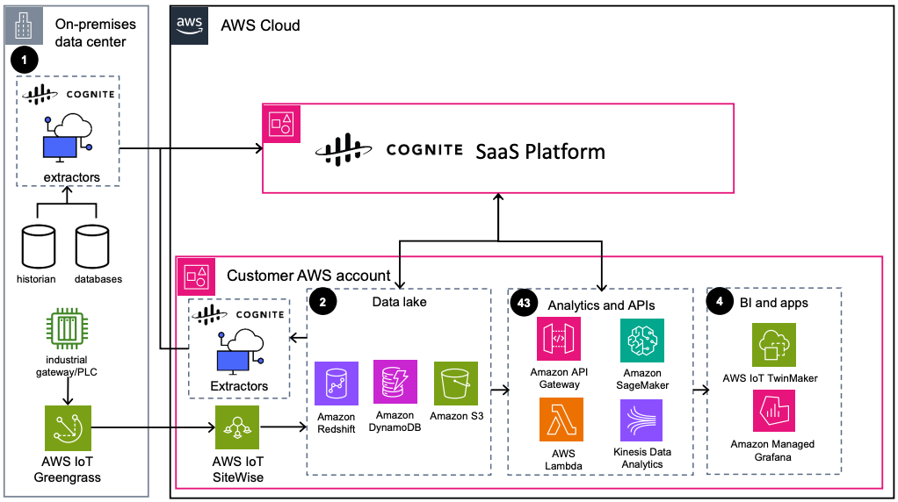

# Industrial DataOps on AWS using Cognite Data Fusion

Publication date: **November 2024 ([Diagram history](#idcdf-diagram-history "#idcdf-diagram-history"))**

With this architecture, you can use AWS Cloud and [Cognite
Data Fusion](https://www.cognite.com/en/product/cognite_data_fusion_industrial_dataops_platform "https://www.cognite.com/en/product/cognite_data_fusion_industrial_dataops_platform") (CDF) to build an industrial DataOps platform. CDF contextualizes
diverse industrial data sources and builds knowledge graphs for your operations. You can
collect operational technology (OT), information technology (IT), and engineering technology
(ET) data. This architecture uses [AWS IoT Greengrass](../../../greengrass/v2/developerguide.md "../../../greengrass/v2/developerguide.md"), [AWS IoT SiteWise](../../../iot-sitewise/latest/userguide.md "../../../iot-sitewise/latest/userguide.md"), [Amazon S3](../../../AmazonS3/latest/userguide.md "../../../AmazonS3/latest/userguide.md"), [AWS Lambda](../../../lambda/latest/dg.md "../../../lambda/latest/dg.md"), and [Amazon SageMaker AI](../../../sagemaker/latest/dg.md "../../../sagemaker/latest/dg.md").

## Industrial DataOps architecture diagram

The following steps describe the architecture:

1. Purpose-built extractors ingest industrial data sources such as IT, OT, and
   engineering data. You can also use AWS IoT Greengrass (an open source IoT edge runtime) to bring
   data from edge gateways or programmable logic controllers (PLCs) to AWS Cloud.
2. Data from industrial historians and other devices flows through AWS IoT Greengrass into
   AWS IoT SiteWise. Cognite Native Extractors ingest pre-aggregated industrial data from a
   customer data lake in Amazon S3, [Amazon Redshift](../../../redshift/latest/dg.md "../../../redshift/latest/dg.md"), and [Amazon DynamoDB](../../../amazondynamodb/latest/developerguide.md "../../../amazondynamodb/latest/developerguide.md").
3. Use Lambda and [Amazon API Gateway](../../../apigateway/latest/developerguide.md "../../../apigateway/latest/developerguide.md") together to ingest data
   from CDF. Transform data by using [AWS Glue](../../../glue/latest/dg.md "../../../glue/latest/dg.md") and write data back into CDF through the Cognite
   SDK. [Amazon Managed Service for Apache Flink](../../../managed-flink/latest/java/what-is.md "../../../managed-flink/latest/java/what-is.md")
   and Amazon SageMaker AI provide additional analytics and machine learning (ML)
   capabilities.
4. End users create custom applications depending on data type by using
   AWS IoT TwinMaker and [Amazon Managed Grafana](../../../grafana/latest/userguide.md "../../../grafana/latest/userguide.md").

## Further reading

For additional information, see the following resources:

- [AWS Architecture Icons](https://aws.amazon.com/architecture/icons "https://aws.amazon.com/architecture/icons")
- [AWS Architecture Center](https://aws.amazon.com/architecture "https://aws.amazon.com/architecture")
- [AWS Well-Architected](https://aws.amazon.com/architecture/well-architected "https://aws.amazon.com/architecture/well-architected")

## Diagram history

To be notified about updates to this reference architecture diagram, subscribe to the RSS feed.

| Change              | Description                                     | Date             |
| ------------------- | ----------------------------------------------- | ---------------- |
| Initial publication | Reference architecture diagram first published. | November 1, 2024 |

###### RSS subscription

To subscribe to RSS updates, you must have an RSS plugin enabled for the browser that you are using.
