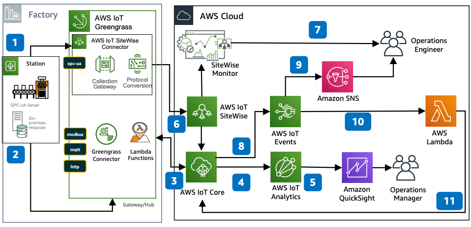

# AWS Industrial IoT Asset Condition Monitoring

Publication date: **August 20, 2020 ([Diagram history](#acm-diagram-history "#acm-diagram-history"))**

With this architecture, you can monitor the health of factory equipment, detect fault
conditions, and respond to events. This solution uses [AWS IoT SiteWise](../../../iot-sitewise/latest/userguide.md "../../../iot-sitewise/latest/userguide.md"), [AWS IoT Greengrass](../../../greengrass/v2/developerguide.md "../../../greengrass/v2/developerguide.md"), [AWS IoT Core](../../../iot/latest/developerguide.md "../../../iot/latest/developerguide.md"), and [AWS IoT Events](../../../whitepapers/latest/aws-overview/internet-of-things-services.md#aws-iot-events "../../../whitepapers/latest/aws-overview/internet-of-things-services.md#aws-iot-events").

## Asset condition monitoring architecture diagram

The following steps describe the architecture:

1. Configure the AWS IoT SiteWise Connector on AWS IoT Greengrass to connect and collect data from factory
   machines by using OPC Unified Architecture (OPC-UA).
2. Configure the AWS IoT Greengrass Connector for [AWS Lambda](../../../lambda/latest/dg.md "../../../lambda/latest/dg.md") functions to interface with local Modbus,
   MQTT, or HTTP traffic.
3. Configure rules in AWS IoT Core to trigger events that send messages to AWS IoT Events and
   [AWS IoT Analytics](../../../whitepapers/latest/aws-overview/internet-of-things-services.md#aws-iot-analytics "../../../whitepapers/latest/aws-overview/internet-of-things-services.md#aws-iot-analytics").
4. In AWS IoT Analytics, set up a channel, pipeline, and data store to collect and process
   device telemetry.
5. Derive insights with [Amazon Quick Sight](../../../quicksight/latest/user/welcome.md "../../../quicksight/latest/user/welcome.md") on AWS IoT Analytics.
6. Use AWS IoT SiteWise to model assets that represent on-premises devices, equipment, and
   processes.
7. Create a web portal with AWS IoT SiteWise Monitor to visualize equipment data and health
   metrics in near real time.
8. Use AWS IoT Events to detect complex events across multiple data sources and trigger
   response messages.
9. Publish [Amazon SNS](../../../sns/latest/dg.md "../../../sns/latest/dg.md") messages on
   events to notify operators of fault conditions.
10. Create a Lambda function to send mitigation commands back to assets through
    AWS IoT Core.
11. Use AWS IoT Core to forward commands to AWS IoT Greengrass for mitigation actions on the
    factory floor equipment.

## Further reading

For additional information, see the following resources:

- [AWS Architecture Icons](https://aws.amazon.com/architecture/icons "https://aws.amazon.com/architecture/icons")
- [AWS Architecture Center](https://aws.amazon.com/architecture "https://aws.amazon.com/architecture")
- [AWS Well-Architected](https://aws.amazon.com/architecture/well-architected "https://aws.amazon.com/architecture/well-architected")
- [Manufacturing on AWS](../manufacturing-on-aws/manufacturing-on-aws.md "../manufacturing-on-aws/manufacturing-on-aws.md")

## Diagram history

To be notified about updates to this reference architecture diagram, subscribe to the RSS feed.

| Change              | Description                                     | Date            |
| ------------------- | ----------------------------------------------- | --------------- |
| Initial publication | Reference architecture diagram first published. | August 20, 2020 |

###### RSS subscription

To subscribe to RSS updates, you must have an RSS plugin enabled for the browser that you are using.
