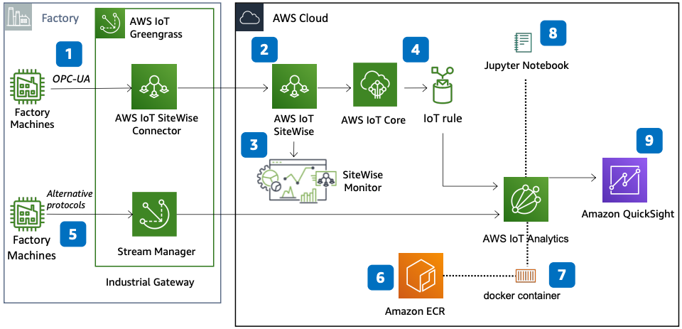

# AWS Industrial IoT Predictive Maintenance ML Model

Publication date: **July 8, 2020 ([Diagram history](#pdm-diagram-history "#pdm-diagram-history"))**

With this architecture, you can create a Predictive Maintenance (PdM) machine learning (ML)
model by using [AWS IoT SiteWise](../../../iot-sitewise/latest/userguide.md "../../../iot-sitewise/latest/userguide.md")
and [AWS IoT Analytics](../../../whitepapers/latest/aws-overview/internet-of-things-services.md#aws-iot-analytics "../../../whitepapers/latest/aws-overview/internet-of-things-services.md#aws-iot-analytics").
AWS IoT SiteWise collects, organizes, and stores data from factory equipment. This makes clean,
contextual, and structured data sets available for data scientists to train ML models.

## Predictive maintenance ML model architecture diagram

The following steps describe the architecture:

1. Configure the AWS IoT SiteWise Connector on [AWS IoT Greengrass](../../../greengrass/v2/developerguide.md "../../../greengrass/v2/developerguide.md") to connect and collect data from
   factory machines by using OPC Unified Architecture (OPC-UA).
2. Use AWS IoT SiteWise to model assets that represent on-premises devices, equipment, and
   processes.
3. Create a custom web portal with AWS IoT SiteWise Monitor to visualize factory data in near
   real time. IAM Identity Center provides user authentication for the portal.
4. Use the [AWS IoT Core](../../../iot/latest/developerguide.md "../../../iot/latest/developerguide.md")
   Rules Engine to route data to AWS IoT Analytics.
5. For other industrial data, use AWS IoT Greengrass stream manager to publish data to AWS IoT Core.
6. Build a Docker image and add it to [Amazon Elastic Container Registry](../../../AmazonECR/latest/userguide.md "../../../AmazonECR/latest/userguide.md") (Amazon ECR).
7. In AWS IoT Analytics, create a Container Data set from the AWS IoT SiteWise Data store. Link it to
   the Docker container in Amazon ECR.
8. Create a Jupyter Notebook for the data set to build a PdM ML model.
   Use [Amazon SageMaker AI](../../../sagemaker/latest/dg.md "../../../sagemaker/latest/dg.md") for
   model training and deployment.
9. Visualize analysis with [Amazon Quick Sight](../../../quicksight/latest/user/welcome.md "../../../quicksight/latest/user/welcome.md") on the AWS IoT Analytics data source.

## Further reading

For additional information, see the following resources:

- [AWS Architecture Icons](https://aws.amazon.com/architecture/icons "https://aws.amazon.com/architecture/icons")
- [AWS Architecture Center](https://aws.amazon.com/architecture "https://aws.amazon.com/architecture")
- [AWS Well-Architected](https://aws.amazon.com/architecture/well-architected "https://aws.amazon.com/architecture/well-architected")
- [Manufacturing on AWS](../manufacturing-on-aws/manufacturing-on-aws.md "../manufacturing-on-aws/manufacturing-on-aws.md")

## Diagram history

To be notified about updates to this reference architecture diagram, subscribe to the RSS feed.

| Change              | Description                                     | Date         |
| ------------------- | ----------------------------------------------- | ------------ |
| Initial publication | Reference architecture diagram first published. | July 8, 2020 |

###### RSS subscription

To subscribe to RSS updates, you must have an RSS plugin enabled for the browser that you are using.
