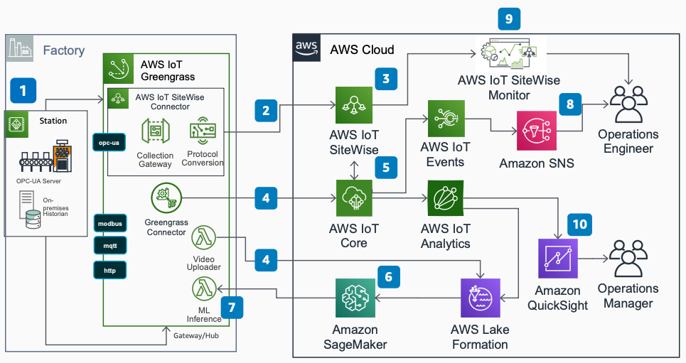

# AWS Industrial IoT Predictive Quality

Publication date: **July 16, 2020 ([Diagram history](#pq-diagram-history "#pq-diagram-history"))**

With this architecture, you can create a computer vision predictive quality ML model by using
[Amazon SageMaker AI](../../../sagemaker/latest/dg.md "../../../sagemaker/latest/dg.md") with [AWS IoT Core](../../../iot/latest/developerguide.md "../../../iot/latest/developerguide.md"), [AWS IoT SiteWise](../../../iot-sitewise/latest/userguide.md "../../../iot-sitewise/latest/userguide.md"), [AWS IoT Greengrass](../../../greengrass/v2/developerguide.md "../../../greengrass/v2/developerguide.md"), and [AWS Lake Formation](../../../lake-formation/latest/dg.md "../../../lake-formation/latest/dg.md"). You can detect product
defects in near real time and alert operations teams.

## Predictive quality architecture diagram

The following steps describe the architecture:

1. Configure AWS IoT Greengrass to communicate with industrial equipment to capture data and video
   from factory floor cameras and sensors.
2. Configure the AWS IoT SiteWise Connector on AWS IoT Greengrass to connect by using OPC Unified
   Architecture (OPC-UA).
3. Use AWS IoT SiteWise to model assets that represent on-premises devices, equipment, and
   processes.
4. Use AWS IoT Greengrass to exchange messages with AWS IoT Core and send processed images to
   [Amazon S3](../../../AmazonS3/latest/userguide.md "../../../AmazonS3/latest/userguide.md") in Lake Formation.
5. Configure rules in AWS IoT Core to trigger events and send data to [AWS IoT Events](../../../whitepapers/latest/aws-overview/internet-of-things-services.md#aws-iot-events "../../../whitepapers/latest/aws-overview/internet-of-things-services.md#aws-iot-events") and [AWS IoT Analytics](../../../whitepapers/latest/aws-overview/internet-of-things-services.md#aws-iot-analytics "../../../whitepapers/latest/aws-overview/internet-of-things-services.md#aws-iot-analytics").
6. Build a predictive quality ML model with Amazon SageMaker AI based on images stored in Lake Formation.
7. Deploy the ML model onto the AWS IoT Greengrass Edge Gateway for local inference at the
   factory.
8. Create a topic for quality alerts in [Amazon Simple Notification Service](../../../sns/latest/dg.md "../../../sns/latest/dg.md") (Amazon SNS) to notify the Operations Engineer
   when defects are detected.
9. Create a web portal with AWS IoT SiteWise Monitor to visualize factory data in near real
   time.
10. Derive insights with [Amazon Quick Sight](../../../quicksight/latest/user/welcome.md "../../../quicksight/latest/user/welcome.md") on AWS IoT Analytics.

## Further reading

For additional information, see the following resources:

- [AWS Architecture Icons](https://aws.amazon.com/architecture/icons "https://aws.amazon.com/architecture/icons")
- [AWS Architecture Center](https://aws.amazon.com/architecture "https://aws.amazon.com/architecture")
- [AWS Well-Architected](https://aws.amazon.com/architecture/well-architected "https://aws.amazon.com/architecture/well-architected")
- [Manufacturing on AWS](../manufacturing-on-aws/manufacturing-on-aws.md "../manufacturing-on-aws/manufacturing-on-aws.md")

## Diagram history

To be notified about updates to this reference architecture diagram, subscribe to the RSS feed.

| Change              | Description                                     | Date          |
| ------------------- | ----------------------------------------------- | ------------- |
| Initial publication | Reference architecture diagram first published. | July 16, 2020 |

###### RSS subscription

To subscribe to RSS updates, you must have an RSS plugin enabled for the browser that you are using.
