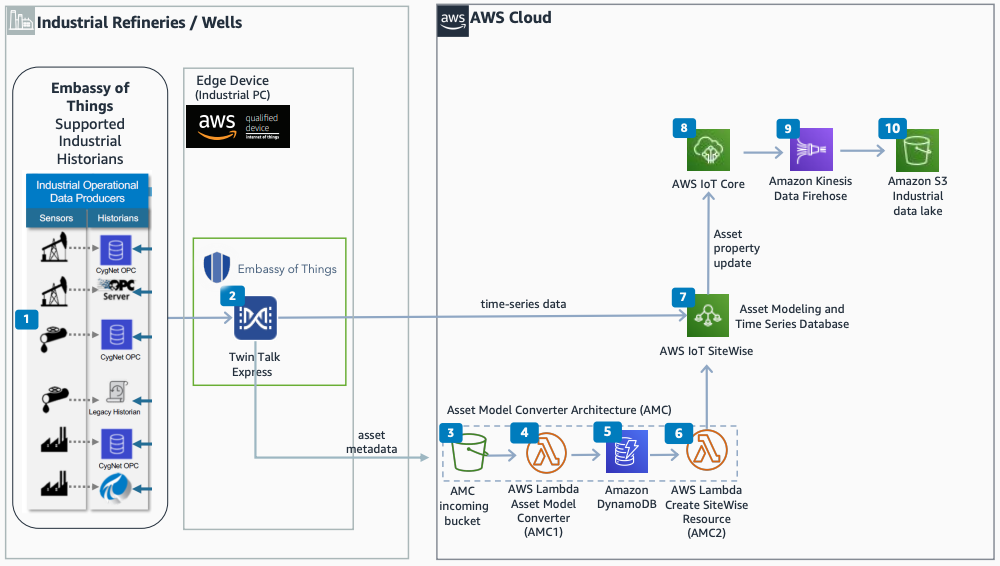

# Accelerate Industrial Machine Connectivity on AWS

Publication date: **April 22, 2021 ([Diagram history](#eot-diagram-history "#eot-diagram-history"))**

With this architecture, you can provision asset models and ingest real-time sensor data from
industrial historians, OPC servers, and Supervisory Control and Data Acquisition (SCADA)
platforms into [AWS IoT SiteWise](../../../iot-sitewise/latest/userguide.md "../../../iot-sitewise/latest/userguide.md"). You use the Embassy of
Things (EOT) Twin Talk Express data sharing platform to
connect to OSIsoft PI and CygNet SCADA systems. For more
information about Twin Talk, see [Twin Talk platform](https://embassyofthings.com/twintalk/ "https://embassyofthings.com/twintalk/") on the
Embassy of Things website.

## Industrial machine connectivity architecture diagram

The following steps describe the architecture:

1. The OSIsoft PI system, legacy historians, and CygNet
   SCADA platform collect real-time data from industrial devices and sensors.
2. The EOT Twin Talk data management platform on an
   AWS Certified industrial PC ingests real-time sensor data and the asset model from
   supported historians.
3. Enriched data from Twin Talk goes to [Amazon S3](../../../AmazonS3/latest/userguide.md "../../../AmazonS3/latest/userguide.md"), which triggers a [AWS Lambda](../../../lambda/latest/dg.md "../../../lambda/latest/dg.md") function.
4. The Lambda function normalizes incoming files to an AWS IoT SiteWise compatible format.
5. Store asset model and definitions in [Amazon DynamoDB](../../../amazondynamodb/latest/developerguide.md "../../../amazondynamodb/latest/developerguide.md").
6. DynamoDB Streams triggers a Lambda function to create and update assets in
   AWS IoT SiteWise.
7. AWS IoT SiteWise filters, transforms, and processes incoming data. It publishes an MQTT
   message to [AWS IoT Core](../../../iot/latest/developerguide.md "../../../iot/latest/developerguide.md") on each property update.
8. An AWS IoT Core rule publishes asset property update messages to [Amazon Data Firehose](../../../firehose/latest/dev.md "../../../firehose/latest/dev.md").
9. Amazon Data Firehose captures data from AWS IoT Core, transforms it, and delivers the data to
   Amazon S3.
10. Once data is in Amazon S3, ML and third-party applications can consume the data for
    reporting, analytics, and model training.

## Further reading

For additional information, see the following resources:

- [AWS Architecture Icons](https://aws.amazon.com/architecture/icons "https://aws.amazon.com/architecture/icons")
- [AWS Architecture Center](https://aws.amazon.com/architecture "https://aws.amazon.com/architecture")
- [AWS Well-Architected](https://aws.amazon.com/architecture/well-architected "https://aws.amazon.com/architecture/well-architected")
- [Industrial
  Machine Connectivity Quick Start](https://aws.amazon.com/quickstart/architecture/industrial-machine-connectivity/ "https://aws.amazon.com/quickstart/architecture/industrial-machine-connectivity/") on the AWS website
- [Manufacturing on AWS](../manufacturing-on-aws/manufacturing-on-aws.md "../manufacturing-on-aws/manufacturing-on-aws.md")

## Diagram history

To be notified about updates to this reference architecture diagram, subscribe to the RSS feed.

| Change              | Description                                     | Date           |
| ------------------- | ----------------------------------------------- | -------------- |
| Initial publication | Reference architecture diagram first published. | April 22, 2021 |

###### RSS subscription

To subscribe to RSS updates, you must have an RSS plugin enabled for the browser that you are using.
