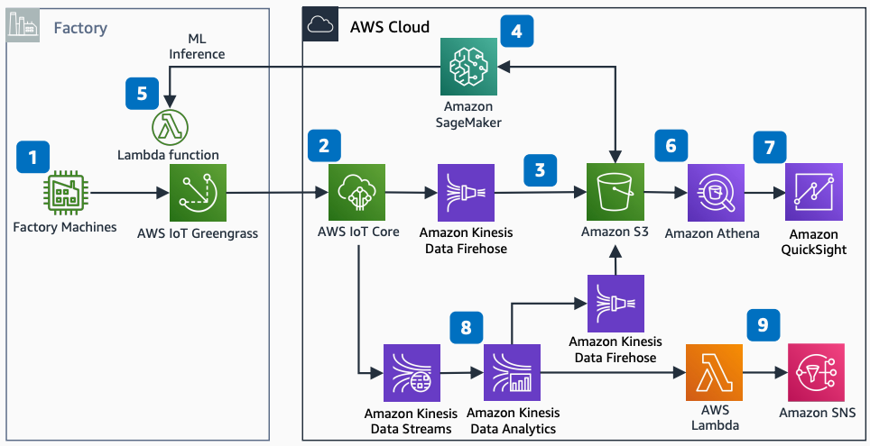

# AWS Industrial PdM ML Model and Anomaly Detection

Publication date: **March 4, 2024 ([Diagram history](#ipa-diagram-history "#ipa-diagram-history"))**

With this architecture, you can create a predictive maintenance (PdM) ML model by using
[Amazon SageMaker AI](../../../sagemaker/latest/dg.md "../../../sagemaker/latest/dg.md") with [AWS IoT Core](../../../iot/latest/developerguide.md "../../../iot/latest/developerguide.md") and an anomaly
detection application by using Amazon Managed Service for Apache Flink. This
solution uses [AWS IoT Greengrass](../../../greengrass/v2/developerguide.md "../../../greengrass/v2/developerguide.md"), [Amazon Data Firehose](../../../firehose/latest/dev.md "../../../firehose/latest/dev.md"), [Amazon Simple Storage Service](../../../AmazonS3/latest/userguide.md "../../../AmazonS3/latest/userguide.md"), and [Amazon Simple Notification Service](../../../sns/latest/dg.md "../../../sns/latest/dg.md").

## Industrial PdM ML anomaly detection architecture diagram

The following steps describe the architecture:

1. Configure AWS IoT Greengrass with connectors to communicate with factory machines.
2. Configure rules in AWS IoT Core to trigger events based on Message Queuing Telemetry
   Transport (MQTT) topics.
3. Create an Amazon Data Firehose delivery stream to store factory data in an Amazon S3 data lake.
4. Build a PdM ML model with SageMaker AI.
5. Deploy the ML model onto the AWS IoT Greengrass Edge Gateway.
6. Build data queries in [Amazon Athena](../../../athena/latest/ug.md "../../../athena/latest/ug.md") against the [AWS Glue](../../../glue/latest/dg.md "../../../glue/latest/dg.md") Data Catalog.
7. Visualize analysis with [Amazon Quick Sight](../../../quicksight/latest/user/welcome.md "../../../quicksight/latest/user/welcome.md") on the Athena data
   source.
8. Create an anomaly detection application in Amazon Managed Service for
   Apache Flink.
9. Configure [AWS Lambda](../../../lambda/latest/dg.md "../../../lambda/latest/dg.md") as
   output to send anomaly notifications to Amazon SNS.

For related reference architectures, see [AWS Industrial PdM ML
Model with Modbus Communication](../industrial-pdm-ml-modbus/industrial-pdm-ml-modbus.md "../industrial-pdm-ml-modbus/industrial-pdm-ml-modbus.md") and [AWS
Industrial IoT Predictive Maintenance ML Model](../industrial-iot-predictive-maintenance-ml/industrial-iot-predictive-maintenance-ml.md "../industrial-iot-predictive-maintenance-ml/industrial-iot-predictive-maintenance-ml.md").

## Further reading

For additional information, see the following resources:

- [AWS Architecture Icons](https://aws.amazon.com/architecture/icons "https://aws.amazon.com/architecture/icons")
- [AWS Architecture Center](https://aws.amazon.com/architecture "https://aws.amazon.com/architecture")
- [AWS Well-Architected](https://aws.amazon.com/architecture/well-architected "https://aws.amazon.com/architecture/well-architected")
- [AWS
  Industrial PdM ML Model with Modbus Communication](../industrial-pdm-ml-modbus/industrial-pdm-ml-modbus.md "../industrial-pdm-ml-modbus/industrial-pdm-ml-modbus.md")

## Diagram history

To be notified about updates to this reference architecture diagram, subscribe to the RSS feed.

| Change              | Description                                     | Date          |
| ------------------- | ----------------------------------------------- | ------------- |
| Initial publication | Reference architecture diagram first published. | March 4, 2024 |

###### RSS subscription

To subscribe to RSS updates, you must have an RSS plugin enabled for the browser that you are using.
