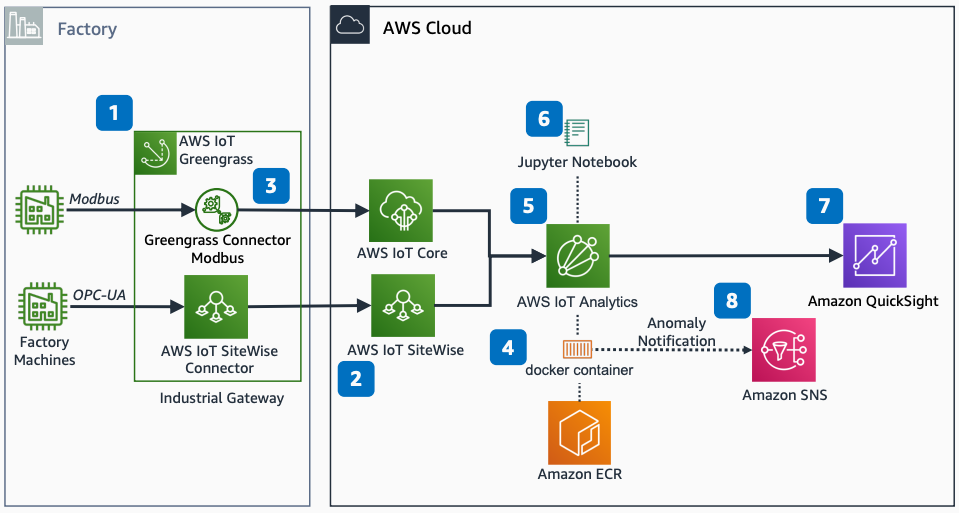

# AWS Industrial PdM ML Model with Modbus Communication

Publication date: **March 4, 2024 ([Diagram history](#ipm-diagram-history "#ipm-diagram-history"))**

With this architecture, you can create a predictive maintenance (PdM) ML model by using
[AWS IoT SiteWise](../../../iot-sitewise/latest/userguide.md "../../../iot-sitewise/latest/userguide.md") and
[AWS IoT Analytics](../../../whitepapers/latest/aws-overview/internet-of-things-services.md#aws-iot-analytics "../../../whitepapers/latest/aws-overview/internet-of-things-services.md#aws-iot-analytics")
with [Amazon Simple Notification Service](../../../sns/latest/dg.md "../../../sns/latest/dg.md") (Amazon SNS) anomaly
detection notifications. This solution uses [AWS IoT Greengrass](../../../greengrass/v2/developerguide.md "../../../greengrass/v2/developerguide.md"), [AWS IoT Core](../../../iot/latest/developerguide.md "../../../iot/latest/developerguide.md"), [Amazon Elastic Container Registry](../../../AmazonECR/latest/userguide.md "../../../AmazonECR/latest/userguide.md"), and [Amazon Quick Sight](../../../quicksight/latest/user/welcome.md "../../../quicksight/latest/user/welcome.md").

## Industrial PdM ML Modbus architecture diagram

The following steps describe the architecture:

1. Deploy an AWS IoT SiteWise Gateway to connect to factory machines' OPC Unified Architecture
   (OPC-UA) Servers.
2. Create a view in AWS IoT SiteWise and define factory machines as assets with metrics to
   monitor.
3. Configure a Modbus Greengrass Connector on AWS IoT Greengrass to send Modbus data
   to AWS IoT Analytics through an AWS IoT Core rule.
4. Build a Docker image and add it to Amazon ECR.
5. In AWS IoT Analytics, create a container data set from the AWS IoT SiteWise data store linked to your
   Docker container.
6. Create a Jupyter Notebook for the data set to build a PdM ML model.
7. Visualize analysis with Quick on the AWS IoT Analytics data source.
8. Create a topic for anomaly detection notifications in Amazon SNS and configure the
   trigger.

For a related reference architecture, see [AWS
Industrial IoT Predictive Maintenance ML Model](../industrial-iot-predictive-maintenance-ml/industrial-iot-predictive-maintenance-ml.md "../industrial-iot-predictive-maintenance-ml/industrial-iot-predictive-maintenance-ml.md").

## Further reading

For additional information, see the following resources:

- [AWS Architecture Icons](https://aws.amazon.com/architecture/icons "https://aws.amazon.com/architecture/icons")
- [AWS Architecture Center](https://aws.amazon.com/architecture "https://aws.amazon.com/architecture")
- [AWS Well-Architected](https://aws.amazon.com/architecture/well-architected "https://aws.amazon.com/architecture/well-architected")
- [AWS
  Industrial PdM ML Model and Anomaly Detection](../industrial-pdm-ml-anomaly-detection/industrial-pdm-ml-anomaly-detection.md "../industrial-pdm-ml-anomaly-detection/industrial-pdm-ml-anomaly-detection.md")

## Diagram history

To be notified about updates to this reference architecture diagram, subscribe to the RSS feed.

| Change              | Description                                     | Date          |
| ------------------- | ----------------------------------------------- | ------------- |
| Initial publication | Reference architecture diagram first published. | March 4, 2024 |

###### RSS subscription

To subscribe to RSS updates, you must have an RSS plugin enabled for the browser that you are using.
