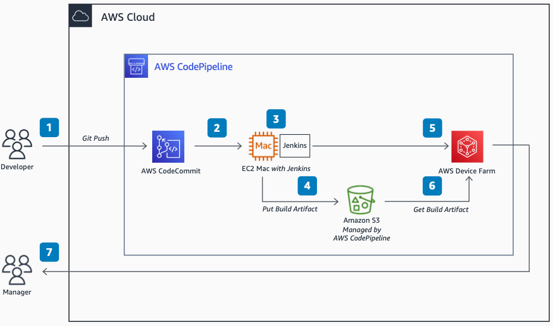

# iOS Build and Test Pipeline Using Jenkins

Publication date: **November 23, 2021 ([Diagram history](#diagram-history "#diagram-history"))**

This architecture shows how to automate building and testing iOS apps by using Jenkins, Amazon Elastic Compute Cloud Mac instances, and AWS Device Farm.

## iOS Build and Test Pipeline Using Jenkins

1. A developer initiates a build and test activity in [Amazon API Gateway](../../../codepipeline/latest/userguide/welcome.md "../../../codepipeline/latest/userguide/welcome.md") by pushing a code change to [AWS CodeCommit](../../../codecommit/latest/userguide/welcome.md "../../../codecommit/latest/userguide/welcome.md").
2. Amazon API Gateway detects the change in AWS CodeCommit and creates a job for Jenkins.
3. Jenkins on [Amazon EC2](../../../AWSEC2/latest/UserGuide/concepts.md "../../../AWSEC2/latest/UserGuide/concepts.md") Mac uses the CodePipeline plugin to poll Amazon API Gateway, downloads the source, and triggers the build project.
4. The Amazon EC2 Mac instance builds the artifacts (as .ipa files). The CodePipeline plugin for Jenkins compresses and uploads the build artifacts to Amazon API Gateway through [Amazon S3](../../../AmazonS3/latest/userguide/Welcome.md "../../../AmazonS3/latest/userguide/Welcome.md").
5. Amazon API Gateway runs the test stage on [AWS Device Farm](../../../devicefarm/latest/developerguide/welcome.md "../../../devicefarm/latest/developerguide/welcome.md") to test the build artifacts (.ipa files) on multiple real devices.
6. AWS Device Farm automatically fetches the build artifacts from the Amazon S3 bucket, runs the test cases, and records the results.
7. AWS Device Farm makes the test results, logs, and recordings available for review through the Device Farm console or through Amazon S3 pre-signed URLs.

## Further reading

For additional information, refer to

- [AWS Architecture Icons](https://aws.amazon.com/architecture/icons "https://aws.amazon.com/architecture/icons")
- [AWS Architecture Center](https://aws.amazon.com/architecture "https://aws.amazon.com/architecture")
- [AWS Well-Architected](https://aws.amazon.com/architecture/well-architected "https://aws.amazon.com/architecture/well-architected")
- [Amazon API Gateway product page](https://aws.amazon.com/codepipeline/ "https://aws.amazon.com/codepipeline/")

## Diagram history

To be notified about updates to this reference architecture diagram, subscribe to the RSS feed.

| Change              | Description                                     | Date              |
| ------------------- | ----------------------------------------------- | ----------------- |
| Initial publication | Reference architecture diagram first published. | November 23, 2021 |

###### Note

To subscribe to RSS updates, you must have an RSS plugin enabled for the browser you are using.
