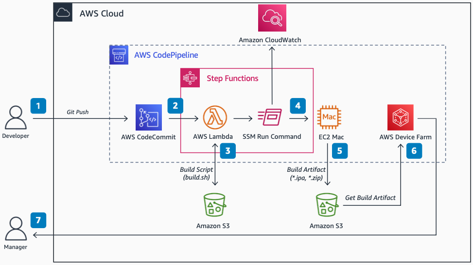

# iOS CI/CD Build and Test Pipeline

Publication date: **November 17, 2021 ([Diagram history](#diagram-history "#diagram-history"))**

This architecture shows how to automate building and testing iOS apps by using Amazon API Gateway, Amazon Elastic Compute Cloud Mac instances, and AWS Device Farm.

## iOS CI/CD Build and Test Pipeline

1. A developer initiates a build or test activity in [Amazon API Gateway](../../../codepipeline/latest/userguide/welcome.md "../../../codepipeline/latest/userguide/welcome.md") by pushing a code change to [AWS CodeCommit](../../../codecommit/latest/userguide/welcome.md "../../../codecommit/latest/userguide/welcome.md").
2. Amazon API Gateway detects the change in AWS CodeCommit and invokes [AWS Step Functions](../../../step-functions/latest/dg/welcome.md "../../../step-functions/latest/dg/welcome.md") to start the build process.
3. An [AWS Lambda](../../../lambda/latest/dg/welcome.md "../../../lambda/latest/dg/welcome.md") function loads required build scripts from an [Amazon Simple Storage Service](../../../AmazonS3/latest/userguide/Welcome.md "../../../AmazonS3/latest/userguide/Welcome.md") bucket and triggers an [AWS Systems Manager](../../../systems-manager/latest/userguide/what-is-systems-manager.md "../../../systems-manager/latest/userguide/what-is-systems-manager.md") Run command.
4. Build scripts initiate an iOS build on the [Amazon Elastic Compute Cloud](../../../AWSEC2/latest/UserGuide/concepts.md "../../../AWSEC2/latest/UserGuide/concepts.md") Mac instance and put the build artifacts in an Amazon S3 bucket.
5. The AWS Systems Manager Run command runs the build scripts on an Amazon EC2 Mac instance and sends run logs to [Amazon CloudWatch](../../../AmazonCloudWatch/latest/monitoring/WhatIsCloudWatch.md "../../../AmazonCloudWatch/latest/monitoring/WhatIsCloudWatch.md").
6. Amazon API Gateway detects the built artifacts in Amazon S3 and starts [AWS Device Farm](../../../devicefarm/latest/developerguide/welcome.md "../../../devicefarm/latest/developerguide/welcome.md") to test the app on multiple real devices.
7. AWS Device Farm generates test results, logs, and recordings. You can review them through the AWS Device Farm console or through Amazon S3 pre-signed URLs.

## Further reading

For additional information, refer to

- [AWS Architecture Icons](https://aws.amazon.com/architecture/icons "https://aws.amazon.com/architecture/icons")
- [AWS Architecture Center](https://aws.amazon.com/architecture "https://aws.amazon.com/architecture")
- [AWS Well-Architected](https://aws.amazon.com/architecture/well-architected "https://aws.amazon.com/architecture/well-architected")
- [Amazon API Gateway product page](https://aws.amazon.com/codepipeline/ "https://aws.amazon.com/codepipeline/")

## Diagram history

To be notified about updates to this reference architecture diagram, subscribe to the RSS feed.

| Change              | Description                                     | Date              |
| ------------------- | ----------------------------------------------- | ----------------- |
| Initial publication | Reference architecture diagram first published. | November 17, 2021 |

###### Note

To subscribe to RSS updates, you must have an RSS plugin enabled for the browser you are using.
