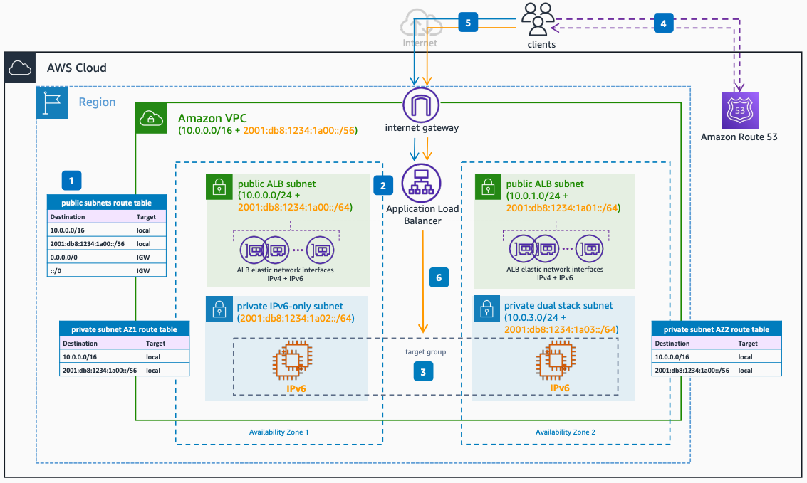

# IPv6 Targets for Dual Stack Internet-facing Application Load Balancer

Publication date: **June 23, 2022 ([Diagram history](#ipv6-5-diagram-history "#ipv6-5-diagram-history"))**

This architecture shows how to enable IPv4 and IPv6 internet connectivity to your application using ALBs with IPv6 targets. Your application stack can run natively on IPv6, as the [ALB](../../../elasticloadbalancing/latest/userguide/what-is-load-balancing.md "../../../elasticloadbalancing/latest/userguide/what-is-load-balancing.md") supports IPv6 targets. IPv6 target groups only support IP type targets.

## IPv6 Targets for Dual Stack Internet-facing Application Load Balancer architecture

The following numbered items describe the key components in this architecture:

1. Configure your [Amazon VPC](../../../vpc/latest/userguide/what-is-amazon-vpc.md "../../../vpc/latest/userguide/what-is-amazon-vpc.md") ALB subnets for dual stack internet connectivity by adding the default routes for IPv4 and IPv6.
2. Deploy your dual stack internet-facing ALB, and select the dual stack ALB subnets in the Amazon VPC.
3. Your application stack can run natively on IPv6, as the ALB supports IPv6 targets. IPv6 target groups only support IP type targets.
4. The application clients query for the application name and receive the IPv4 or IPv6 address of the endpoint, based on their capabilities. For single stack customers, their stack determines the protocol to be used. For dual stack enabled clients, the operating system configuration determines the use of IPv4 or IPv6 for communication.
5. The clients open connections to the application endpoint, using either IPv4 or IPv6.
6. The ALB distributes traffic to the healthy targets in the target groups using IPv6 connections.

## Further reading

For additional information, see the following resources:

- [AWS Architecture Icons](https://aws.amazon.com/architecture/icons "https://aws.amazon.com/architecture/icons")
- [AWS Well-Architected](https://aws.amazon.com/architecture/well-architected "https://aws.amazon.com/architecture/well-architected")

## Diagram history

To be notified about updates to this reference architecture diagram, subscribe to the RSS feed.

| Change                                                                                                                                     | Description                                     | Date          |
| ------------------------------------------------------------------------------------------------------------------------------------------ | ----------------------------------------------- | ------------- |
| [Initial publication](ipv6-dual-stack-internet.md#ipv6-1-diagram-history "ipv6-dual-stack-internet.md#ipv6-1-diagram-history")             | Reference architecture diagram first published. | June 23, 2022 |
| [Initial publication](ipv6-only-subnets.md#ipv6-2-diagram-history "ipv6-only-subnets.md#ipv6-2-diagram-history")                           | Reference architecture diagram first published. | June 23, 2022 |
| [Initial publication](ipv6-only-internet.md#ipv6-3-diagram-history "ipv6-only-internet.md#ipv6-3-diagram-history")                         | Reference architecture diagram first published. | June 23, 2022 |
| [Initial publication](ipv6-alb-ipv4-targets.md#ipv6-4-diagram-history "ipv6-alb-ipv4-targets.md#ipv6-4-diagram-history")                   | Reference architecture diagram first published. | June 23, 2022 |
| Initial publication                                                                                                                        | Reference architecture diagram first published. | June 23, 2022 |
| [Initial publication](ipv6-nlb-ipv4-targets.md#ipv6-6-diagram-history "ipv6-nlb-ipv4-targets.md#ipv6-6-diagram-history")                   | Reference architecture diagram first published. | June 23, 2022 |
| [Initial publication](ipv6-nlb-ipv6-targets.md#ipv6-7-diagram-history "ipv6-nlb-ipv6-targets.md#ipv6-7-diagram-history")                   | Reference architecture diagram first published. | June 23, 2022 |
| [Initial publication](ipv6-internal-elb.md#ipv6-8-diagram-history "ipv6-internal-elb.md#ipv6-8-diagram-history")                           | Reference architecture diagram first published. | June 23, 2022 |
| [Initial publication](ipv6-dns64.md#ipv6-9-diagram-history "ipv6-dns64.md#ipv6-9-diagram-history")                                         | Reference architecture diagram first published. | June 23, 2022 |
| [Initial publication](ipv6-nat64.md#ipv6-10-diagram-history "ipv6-nat64.md#ipv6-10-diagram-history")                                       | Reference architecture diagram first published. | June 23, 2022 |
| [Initial publication](ipv6-centralized-egress-nat64.md#ipv6-11-diagram-history "ipv6-centralized-egress-nat64.md#ipv6-11-diagram-history") | Reference architecture diagram first published. | June 23, 2022 |
| [Initial publication](ipv6-vpc-peering.md#ipv6-12-diagram-history "ipv6-vpc-peering.md#ipv6-12-diagram-history")                           | Reference architecture diagram first published. | June 23, 2022 |
| [Initial publication](ipv6-transit-gateway.md#ipv6-13-diagram-history "ipv6-transit-gateway.md#ipv6-13-diagram-history")                   | Reference architecture diagram first published. | June 23, 2022 |
| [Initial publication](ipv6-privatelink.md#ipv6-14-diagram-history "ipv6-privatelink.md#ipv6-14-diagram-history")                           | Reference architecture diagram first published. | June 23, 2022 |
| [Initial publication](ipv6-direct-connect.md#ipv6-15-diagram-history "ipv6-direct-connect.md#ipv6-15-diagram-history")                     | Reference architecture diagram first published. | June 23, 2022 |
| [Initial publication](ipv6-vpn-tgw.md#ipv6-16-diagram-history "ipv6-vpn-tgw.md#ipv6-16-diagram-history")                                   | Reference architecture diagram first published. | June 23, 2022 |
| [Initial publication](ipv6-tgw-connect.md#ipv6-17-diagram-history "ipv6-tgw-connect.md#ipv6-17-diagram-history")                           | Reference architecture diagram first published. | June 23, 2022 |

###### Note

To subscribe to RSS updates, you must have an RSS plugin enabled for the browser you are using.
