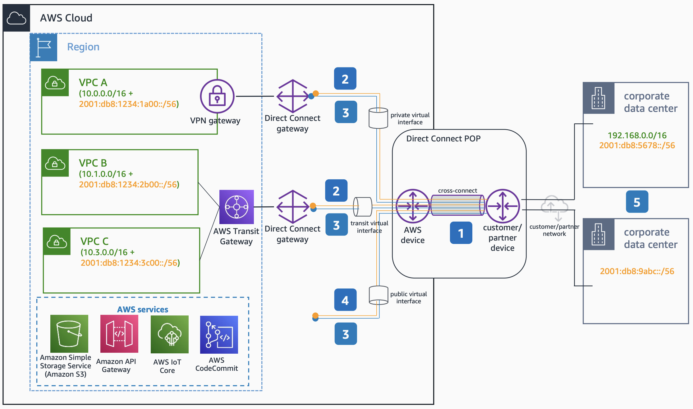

# Dual Stack Hybrid Connectivity with AWS Direct Connect

Publication date: **June 23, 2022 ([Diagram history](#ipv6-15-diagram-history "#ipv6-15-diagram-history"))**

This architecture shows how to build hybrid dual stack connectivity with AWS Direct Connect public, private, and transit virtual interfaces. AWS Direct Connect VIFs support both IPv4 and IPv6 BGP sessions for dual stack operation.

## Dual Stack Hybrid Connectivity with AWS Direct Connect architecture

The following numbered items describe the key components in this architecture:

1. AWS Direct Connect virtual interfaces (VIFs) support both IPv4 and IPv6 Border Gateway Protocol (BGP) sessions for dual stack operation.
2. For all types of VIFs IPv6 BGP peering, Amazon assigns a **/125** CIDR which is not configurable.
3. Private and transit VIFs IPv4 configuration make use of either Amazon-generated private IPv4 addresses, or addresses that you configure. If you specify your own, ensure that you specify private CIDRs for your router interface and the AWS Direct Connect interface only.
4. For public VIFs IPv4 BGP peering, you must specify unique public **/31** IPv4 CIDR that you own, or submit a request to have a CIDR block assigned.
5. You can maintain both IPv6-only and dual stack on-premises environments and use AWS Direct Connect for dedicated and private connectivity to your dual stack or IPv6-only workload footprint in AWS.

## Further reading

For additional information, see the following resources:

- [AWS Architecture Icons](https://aws.amazon.com/architecture/icons "https://aws.amazon.com/architecture/icons")
- [AWS Well-Architected](https://aws.amazon.com/architecture/well-architected "https://aws.amazon.com/architecture/well-architected")

## Diagram history

To be notified about updates to this reference architecture diagram, subscribe to the RSS feed.

| Change                                                                                                                                     | Description                                     | Date          |
| ------------------------------------------------------------------------------------------------------------------------------------------ | ----------------------------------------------- | ------------- |
| [Initial publication](ipv6-dual-stack-internet.md#ipv6-1-diagram-history "ipv6-dual-stack-internet.md#ipv6-1-diagram-history")             | Reference architecture diagram first published. | June 23, 2022 |
| [Initial publication](ipv6-only-subnets.md#ipv6-2-diagram-history "ipv6-only-subnets.md#ipv6-2-diagram-history")                           | Reference architecture diagram first published. | June 23, 2022 |
| [Initial publication](ipv6-only-internet.md#ipv6-3-diagram-history "ipv6-only-internet.md#ipv6-3-diagram-history")                         | Reference architecture diagram first published. | June 23, 2022 |
| [Initial publication](ipv6-alb-ipv4-targets.md#ipv6-4-diagram-history "ipv6-alb-ipv4-targets.md#ipv6-4-diagram-history")                   | Reference architecture diagram first published. | June 23, 2022 |
| [Initial publication](ipv6-alb-ipv6-targets.md#ipv6-5-diagram-history "ipv6-alb-ipv6-targets.md#ipv6-5-diagram-history")                   | Reference architecture diagram first published. | June 23, 2022 |
| [Initial publication](ipv6-nlb-ipv4-targets.md#ipv6-6-diagram-history "ipv6-nlb-ipv4-targets.md#ipv6-6-diagram-history")                   | Reference architecture diagram first published. | June 23, 2022 |
| [Initial publication](ipv6-nlb-ipv6-targets.md#ipv6-7-diagram-history "ipv6-nlb-ipv6-targets.md#ipv6-7-diagram-history")                   | Reference architecture diagram first published. | June 23, 2022 |
| [Initial publication](ipv6-internal-elb.md#ipv6-8-diagram-history "ipv6-internal-elb.md#ipv6-8-diagram-history")                           | Reference architecture diagram first published. | June 23, 2022 |
| [Initial publication](ipv6-dns64.md#ipv6-9-diagram-history "ipv6-dns64.md#ipv6-9-diagram-history")                                         | Reference architecture diagram first published. | June 23, 2022 |
| [Initial publication](ipv6-nat64.md#ipv6-10-diagram-history "ipv6-nat64.md#ipv6-10-diagram-history")                                       | Reference architecture diagram first published. | June 23, 2022 |
| [Initial publication](ipv6-centralized-egress-nat64.md#ipv6-11-diagram-history "ipv6-centralized-egress-nat64.md#ipv6-11-diagram-history") | Reference architecture diagram first published. | June 23, 2022 |
| [Initial publication](ipv6-vpc-peering.md#ipv6-12-diagram-history "ipv6-vpc-peering.md#ipv6-12-diagram-history")                           | Reference architecture diagram first published. | June 23, 2022 |
| [Initial publication](ipv6-transit-gateway.md#ipv6-13-diagram-history "ipv6-transit-gateway.md#ipv6-13-diagram-history")                   | Reference architecture diagram first published. | June 23, 2022 |
| [Initial publication](ipv6-privatelink.md#ipv6-14-diagram-history "ipv6-privatelink.md#ipv6-14-diagram-history")                           | Reference architecture diagram first published. | June 23, 2022 |
| Initial publication                                                                                                                        | Reference architecture diagram first published. | June 23, 2022 |
| [Initial publication](ipv6-vpn-tgw.md#ipv6-16-diagram-history "ipv6-vpn-tgw.md#ipv6-16-diagram-history")                                   | Reference architecture diagram first published. | June 23, 2022 |
| [Initial publication](ipv6-tgw-connect.md#ipv6-17-diagram-history "ipv6-tgw-connect.md#ipv6-17-diagram-history")                           | Reference architecture diagram first published. | June 23, 2022 |

###### Note

To subscribe to RSS updates, you must have an RSS plugin enabled for the browser you are using.
