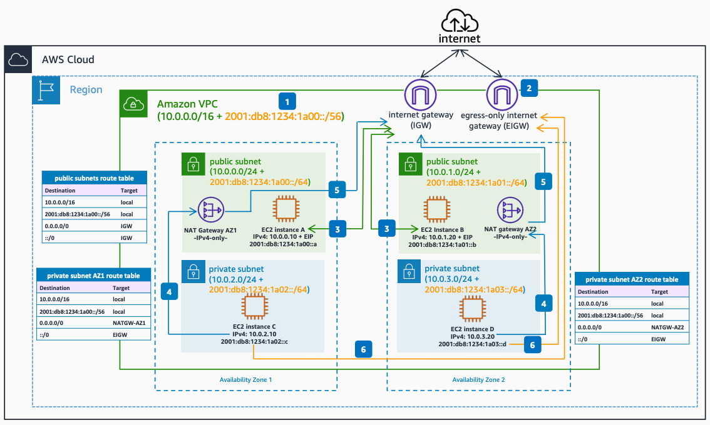

# Dual Stack Amazon Amazon VPC Internet Connectivity

Publication date: **June 23, 2022 ([Diagram history](#ipv6-1-diagram-history "#ipv6-1-diagram-history"))**

This architecture shows how to enable IPv4 and IPv6 internet connectivity for your [Amazon Amazon VPC](../../../vpc/latest/userguide/what-is-amazon-vpc.md "../../../vpc/latest/userguide/what-is-amazon-vpc.md"). It demonstrates how to configure public and private subnets with dual stack addressing, using an internet gateway for public connectivity and an egress-only internet gateway for private IPv6 outbound access.

## Dual stack Amazon Amazon VPC internet connectivity architecture

The following numbered items describe the key components in this architecture:

1. Associate an IPv6 Classless Inter-Domain Routing (CIDR) block to your Amazon Amazon VPC. This can be an AWS-assigned CIDR, or part of a Bring Your Own IPv6 Addresses (BYOIPv6) pool.
2. Associate an egress-only internet gateway (EIGW) to the Amazon VPC. This is the target for the IPv6 default route of private dual stack subnets.
3. Compute resources in public dual stack subnets use the internet gateway for dual-stack IPv4 and IPv6 internet connectivity. They can directly initiate outbound internet connections and accept inbound internet connections, to and from IPv4 and IPv6 hosts in the internet, using their associated Elastic IPv4 address or IPv6 addresses from the subnet CIDR. Note that security groups must allow both IPv4 and IPv6 traffic.
4. Resources in private dual stack subnets use the public NAT gateway in each Availability Zone for outbound IPv4 internet connectivity. The NAT gateway allows only outbound IPv4 connections to be opened from private Amazon Elastic Compute Cloud instances to internet IPv4 destinations, and the associated return traffic.
5. The NAT gateways send the translated IPv4 packets to the internet gateway, which sends the traffic out to the internet, to the respective IPv4 destinations.
6. Resources in private dual stack subnets use the egress-only internet gateway for outbound IPv6 internet connectivity. The egress-only internet gateway allows only outbound IPv6 connections to be opened from private Amazon EC2 instances to internet IPv6 destinations, and the associated return traffic.

## Further reading

For additional information, see the following resources:

- [AWS Architecture Icons](https://aws.amazon.com/architecture/icons "https://aws.amazon.com/architecture/icons")
- [AWS Well-Architected](https://aws.amazon.com/architecture/well-architected "https://aws.amazon.com/architecture/well-architected")

## Diagram history

To be notified about updates to this reference architecture diagram, subscribe to the RSS feed.

| Change                                                                                                                                     | Description                                     | Date          |
| ------------------------------------------------------------------------------------------------------------------------------------------ | ----------------------------------------------- | ------------- |
| Initial publication                                                                                                                        | Reference architecture diagram first published. | June 23, 2022 |
| [Initial publication](ipv6-only-subnets.md#ipv6-2-diagram-history "ipv6-only-subnets.md#ipv6-2-diagram-history")                           | Reference architecture diagram first published. | June 23, 2022 |
| [Initial publication](ipv6-only-internet.md#ipv6-3-diagram-history "ipv6-only-internet.md#ipv6-3-diagram-history")                         | Reference architecture diagram first published. | June 23, 2022 |
| [Initial publication](ipv6-alb-ipv4-targets.md#ipv6-4-diagram-history "ipv6-alb-ipv4-targets.md#ipv6-4-diagram-history")                   | Reference architecture diagram first published. | June 23, 2022 |
| [Initial publication](ipv6-alb-ipv6-targets.md#ipv6-5-diagram-history "ipv6-alb-ipv6-targets.md#ipv6-5-diagram-history")                   | Reference architecture diagram first published. | June 23, 2022 |
| [Initial publication](ipv6-nlb-ipv4-targets.md#ipv6-6-diagram-history "ipv6-nlb-ipv4-targets.md#ipv6-6-diagram-history")                   | Reference architecture diagram first published. | June 23, 2022 |
| [Initial publication](ipv6-nlb-ipv6-targets.md#ipv6-7-diagram-history "ipv6-nlb-ipv6-targets.md#ipv6-7-diagram-history")                   | Reference architecture diagram first published. | June 23, 2022 |
| [Initial publication](ipv6-internal-elb.md#ipv6-8-diagram-history "ipv6-internal-elb.md#ipv6-8-diagram-history")                           | Reference architecture diagram first published. | June 23, 2022 |
| [Initial publication](ipv6-dns64.md#ipv6-9-diagram-history "ipv6-dns64.md#ipv6-9-diagram-history")                                         | Reference architecture diagram first published. | June 23, 2022 |
| [Initial publication](ipv6-nat64.md#ipv6-10-diagram-history "ipv6-nat64.md#ipv6-10-diagram-history")                                       | Reference architecture diagram first published. | June 23, 2022 |
| [Initial publication](ipv6-centralized-egress-nat64.md#ipv6-11-diagram-history "ipv6-centralized-egress-nat64.md#ipv6-11-diagram-history") | Reference architecture diagram first published. | June 23, 2022 |
| [Initial publication](ipv6-vpc-peering.md#ipv6-12-diagram-history "ipv6-vpc-peering.md#ipv6-12-diagram-history")                           | Reference architecture diagram first published. | June 23, 2022 |
| [Initial publication](ipv6-transit-gateway.md#ipv6-13-diagram-history "ipv6-transit-gateway.md#ipv6-13-diagram-history")                   | Reference architecture diagram first published. | June 23, 2022 |
| [Initial publication](ipv6-privatelink.md#ipv6-14-diagram-history "ipv6-privatelink.md#ipv6-14-diagram-history")                           | Reference architecture diagram first published. | June 23, 2022 |
| [Initial publication](ipv6-direct-connect.md#ipv6-15-diagram-history "ipv6-direct-connect.md#ipv6-15-diagram-history")                     | Reference architecture diagram first published. | June 23, 2022 |
| [Initial publication](ipv6-vpn-tgw.md#ipv6-16-diagram-history "ipv6-vpn-tgw.md#ipv6-16-diagram-history")                                   | Reference architecture diagram first published. | June 23, 2022 |
| [Initial publication](ipv6-tgw-connect.md#ipv6-17-diagram-history "ipv6-tgw-connect.md#ipv6-17-diagram-history")                           | Reference architecture diagram first published. | June 23, 2022 |

###### Note

To subscribe to RSS updates, you must have an RSS plugin enabled for the browser you are using.
