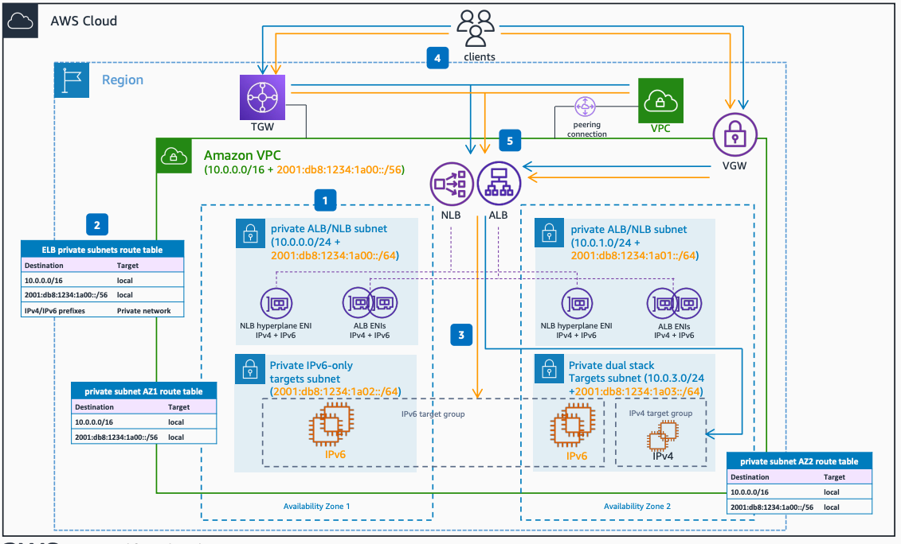

# Dual Stack Internal Application and Network Load Balancers

Publication date: **June 23, 2022 ([Diagram history](#ipv6-8-diagram-history "#ipv6-8-diagram-history"))**

This architecture shows how to enable IPv4 and IPv6 private connectivity to your application using internal Application and Network Load Balancers with dual stack support.

## Dual Stack Internal Application and Network Load Balancers architecture

The following numbered items describe the key components in this architecture:

1. Configure your [Amazon VPC](../../../vpc/latest/userguide/what-is-amazon-vpc.md "../../../vpc/latest/userguide/what-is-amazon-vpc.md") NLB or Application Load Balancer (ALB) subnets as dual stack, to accommodate for the internal [Elastic Load Balancing](../../../elasticloadbalancing/latest/userguide/what-is-load-balancing.md "../../../elasticloadbalancing/latest/userguide/what-is-load-balancing.md") (ELB) instances.
2. Depending on the private connectivity method you have in place for your Amazon VPC (such as Amazon VPC peering, AWS Transit Gateway, Virtual Private Gateway, VPN, or [AWS Direct Connect](../../../directconnect/latest/UserGuide/Welcome.md "../../../directconnect/latest/UserGuide/Welcome.md")), the ALB/NLB private subnets must be configured with the appropriate routes, for both IPv4 and IPv6 stacks.
3. Target groups for both ALBs and NLBs can contain either only IPv6 targets or only IPv4 targets. You cannot register an IPv4 target with an IPv6 target group.
4. Clients reaching out to the private ELB endpoints can be both IPv4 and IPv6 and can have connectivity over any private connectivity method supported by the Amazon Amazon VPC, such as Amazon VPC peering, AWS Transit Gateway, Virtual Private Gateway, VPN, or AWS Direct Connect.
5. For internal ALBs and NLBs, the attribute flag ipv6.deny-all-igw-traffic blocks internet gateway (IGW) access to the load balancer, preventing unintended access to your internal load balancer through an internet gateway. It is set to false for internet-facing load balancers and true for internal load balancers.

## Further reading

For additional information, see the following resources:

- [AWS Architecture Icons](https://aws.amazon.com/architecture/icons "https://aws.amazon.com/architecture/icons")
- [AWS Well-Architected](https://aws.amazon.com/architecture/well-architected "https://aws.amazon.com/architecture/well-architected")

## Diagram history

To be notified about updates to this reference architecture diagram, subscribe to the RSS feed.

| Change                                                                                                                                     | Description                                     | Date          |
| ------------------------------------------------------------------------------------------------------------------------------------------ | ----------------------------------------------- | ------------- |
| [Initial publication](ipv6-dual-stack-internet.md#ipv6-1-diagram-history "ipv6-dual-stack-internet.md#ipv6-1-diagram-history")             | Reference architecture diagram first published. | June 23, 2022 |
| [Initial publication](ipv6-only-subnets.md#ipv6-2-diagram-history "ipv6-only-subnets.md#ipv6-2-diagram-history")                           | Reference architecture diagram first published. | June 23, 2022 |
| [Initial publication](ipv6-only-internet.md#ipv6-3-diagram-history "ipv6-only-internet.md#ipv6-3-diagram-history")                         | Reference architecture diagram first published. | June 23, 2022 |
| [Initial publication](ipv6-alb-ipv4-targets.md#ipv6-4-diagram-history "ipv6-alb-ipv4-targets.md#ipv6-4-diagram-history")                   | Reference architecture diagram first published. | June 23, 2022 |
| [Initial publication](ipv6-alb-ipv6-targets.md#ipv6-5-diagram-history "ipv6-alb-ipv6-targets.md#ipv6-5-diagram-history")                   | Reference architecture diagram first published. | June 23, 2022 |
| [Initial publication](ipv6-nlb-ipv4-targets.md#ipv6-6-diagram-history "ipv6-nlb-ipv4-targets.md#ipv6-6-diagram-history")                   | Reference architecture diagram first published. | June 23, 2022 |
| [Initial publication](ipv6-nlb-ipv6-targets.md#ipv6-7-diagram-history "ipv6-nlb-ipv6-targets.md#ipv6-7-diagram-history")                   | Reference architecture diagram first published. | June 23, 2022 |
| Initial publication                                                                                                                        | Reference architecture diagram first published. | June 23, 2022 |
| [Initial publication](ipv6-dns64.md#ipv6-9-diagram-history "ipv6-dns64.md#ipv6-9-diagram-history")                                         | Reference architecture diagram first published. | June 23, 2022 |
| [Initial publication](ipv6-nat64.md#ipv6-10-diagram-history "ipv6-nat64.md#ipv6-10-diagram-history")                                       | Reference architecture diagram first published. | June 23, 2022 |
| [Initial publication](ipv6-centralized-egress-nat64.md#ipv6-11-diagram-history "ipv6-centralized-egress-nat64.md#ipv6-11-diagram-history") | Reference architecture diagram first published. | June 23, 2022 |
| [Initial publication](ipv6-vpc-peering.md#ipv6-12-diagram-history "ipv6-vpc-peering.md#ipv6-12-diagram-history")                           | Reference architecture diagram first published. | June 23, 2022 |
| [Initial publication](ipv6-transit-gateway.md#ipv6-13-diagram-history "ipv6-transit-gateway.md#ipv6-13-diagram-history")                   | Reference architecture diagram first published. | June 23, 2022 |
| [Initial publication](ipv6-privatelink.md#ipv6-14-diagram-history "ipv6-privatelink.md#ipv6-14-diagram-history")                           | Reference architecture diagram first published. | June 23, 2022 |
| [Initial publication](ipv6-direct-connect.md#ipv6-15-diagram-history "ipv6-direct-connect.md#ipv6-15-diagram-history")                     | Reference architecture diagram first published. | June 23, 2022 |
| [Initial publication](ipv6-vpn-tgw.md#ipv6-16-diagram-history "ipv6-vpn-tgw.md#ipv6-16-diagram-history")                                   | Reference architecture diagram first published. | June 23, 2022 |
| [Initial publication](ipv6-tgw-connect.md#ipv6-17-diagram-history "ipv6-tgw-connect.md#ipv6-17-diagram-history")                           | Reference architecture diagram first published. | June 23, 2022 |

###### Note

To subscribe to RSS updates, you must have an RSS plugin enabled for the browser you are using.
