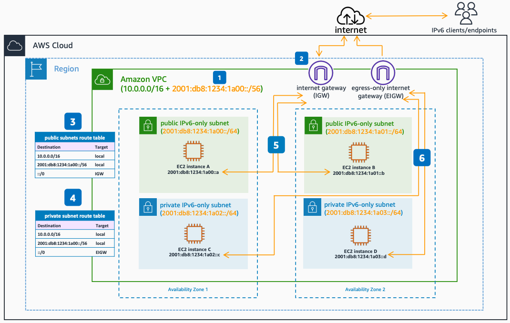

# Internet Connectivity for IPv6-only Subnets in a Dual Stack Amazon VPC

Publication date: **June 23, 2022 ([Diagram history](#ipv6-3-diagram-history "#ipv6-3-diagram-history"))**

This architecture shows how to enable IPv6 internet connectivity for your IPv6-only subnets in your Amazon VPC, using an internet gateway for public subnets and an egress-only internet gateway for private subnets.

## Internet connectivity for IPv6-only subnets architecture

The following numbered items describe the key components in this architecture:

1. Starting from your dual stack [Amazon Amazon VPC](../../../vpc/latest/userguide/what-is-amazon-vpc.md "../../../vpc/latest/userguide/what-is-amazon-vpc.md"), the primary CIDR is an IPv4 one, and the secondary IPv6 CIDR is used to create the IPv6-only subnets.
2. The internet gateway (IGW) and the egress-only internet gateway (EIGW) are attached to the dual stack Amazon VPC. Although the IPv6 addresses are Global Unicast Addresses (GUA), you can still create public and private subnets, controlling the IGW and EIGW routing and security group configuration.
3. The public IPv6-only subnets route tables have the default IPv6 route, **::/0**, with the internet gateway as the target.
4. The private IPv6-only subnets route tables have the default IPv6 route, **::/0**, with the EIGW as target.
5. Compute resources in public IPv6-only subnets use the internet gateway for IPv6 internet connectivity. They can directly initiate outbound internet connections and accept inbound internet connections from IPv6 endpoints in the internet, using their IPv6 addresses from the subnet CIDR. Note that security groups must allow IPv6 traffic.
6. Resources in private IPv6-only subnets use the EIGW for outbound IPv6 internet connectivity. The egress-only internet gateway allows only outbound IPv6 connections to be opened from private Amazon EC2 instances to internet IPv6 destinations, and the associated return traffic.

## Further reading

For additional information, see the following resources:

- [AWS Architecture Icons](https://aws.amazon.com/architecture/icons "https://aws.amazon.com/architecture/icons")
- [AWS Well-Architected](https://aws.amazon.com/architecture/well-architected "https://aws.amazon.com/architecture/well-architected")

## Diagram history

To be notified about updates to this reference architecture diagram, subscribe to the RSS feed.

| Change                                                                                                                                     | Description                                     | Date          |
| ------------------------------------------------------------------------------------------------------------------------------------------ | ----------------------------------------------- | ------------- |
| [Initial publication](ipv6-dual-stack-internet.md#ipv6-1-diagram-history "ipv6-dual-stack-internet.md#ipv6-1-diagram-history")             | Reference architecture diagram first published. | June 23, 2022 |
| [Initial publication](ipv6-only-subnets.md#ipv6-2-diagram-history "ipv6-only-subnets.md#ipv6-2-diagram-history")                           | Reference architecture diagram first published. | June 23, 2022 |
| Initial publication                                                                                                                        | Reference architecture diagram first published. | June 23, 2022 |
| [Initial publication](ipv6-alb-ipv4-targets.md#ipv6-4-diagram-history "ipv6-alb-ipv4-targets.md#ipv6-4-diagram-history")                   | Reference architecture diagram first published. | June 23, 2022 |
| [Initial publication](ipv6-alb-ipv6-targets.md#ipv6-5-diagram-history "ipv6-alb-ipv6-targets.md#ipv6-5-diagram-history")                   | Reference architecture diagram first published. | June 23, 2022 |
| [Initial publication](ipv6-nlb-ipv4-targets.md#ipv6-6-diagram-history "ipv6-nlb-ipv4-targets.md#ipv6-6-diagram-history")                   | Reference architecture diagram first published. | June 23, 2022 |
| [Initial publication](ipv6-nlb-ipv6-targets.md#ipv6-7-diagram-history "ipv6-nlb-ipv6-targets.md#ipv6-7-diagram-history")                   | Reference architecture diagram first published. | June 23, 2022 |
| [Initial publication](ipv6-internal-elb.md#ipv6-8-diagram-history "ipv6-internal-elb.md#ipv6-8-diagram-history")                           | Reference architecture diagram first published. | June 23, 2022 |
| [Initial publication](ipv6-dns64.md#ipv6-9-diagram-history "ipv6-dns64.md#ipv6-9-diagram-history")                                         | Reference architecture diagram first published. | June 23, 2022 |
| [Initial publication](ipv6-nat64.md#ipv6-10-diagram-history "ipv6-nat64.md#ipv6-10-diagram-history")                                       | Reference architecture diagram first published. | June 23, 2022 |
| [Initial publication](ipv6-centralized-egress-nat64.md#ipv6-11-diagram-history "ipv6-centralized-egress-nat64.md#ipv6-11-diagram-history") | Reference architecture diagram first published. | June 23, 2022 |
| [Initial publication](ipv6-vpc-peering.md#ipv6-12-diagram-history "ipv6-vpc-peering.md#ipv6-12-diagram-history")                           | Reference architecture diagram first published. | June 23, 2022 |
| [Initial publication](ipv6-transit-gateway.md#ipv6-13-diagram-history "ipv6-transit-gateway.md#ipv6-13-diagram-history")                   | Reference architecture diagram first published. | June 23, 2022 |
| [Initial publication](ipv6-privatelink.md#ipv6-14-diagram-history "ipv6-privatelink.md#ipv6-14-diagram-history")                           | Reference architecture diagram first published. | June 23, 2022 |
| [Initial publication](ipv6-direct-connect.md#ipv6-15-diagram-history "ipv6-direct-connect.md#ipv6-15-diagram-history")                     | Reference architecture diagram first published. | June 23, 2022 |
| [Initial publication](ipv6-vpn-tgw.md#ipv6-16-diagram-history "ipv6-vpn-tgw.md#ipv6-16-diagram-history")                                   | Reference architecture diagram first published. | June 23, 2022 |
| [Initial publication](ipv6-tgw-connect.md#ipv6-17-diagram-history "ipv6-tgw-connect.md#ipv6-17-diagram-history")                           | Reference architecture diagram first published. | June 23, 2022 |

###### Note

To subscribe to RSS updates, you must have an RSS plugin enabled for the browser you are using.
