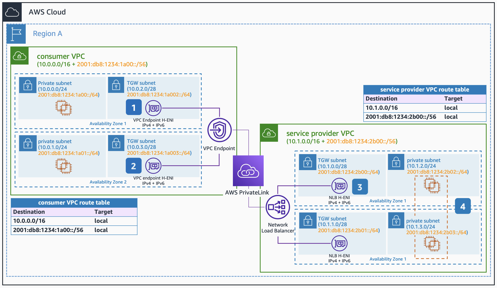

# Dual Stack Amazon VPC Connectivity with AWS PrivateLink

Publication date: **June 23, 2022 ([Diagram history](#ipv6-14-diagram-history "#ipv6-14-diagram-history"))**

This architecture shows IPv6 support for AWS PrivateLink services and endpoints, allowing service providers to implement dual stack at the network border. Service consumers and providers alike can adopt IPv6 at their own pace.

## Dual Stack Amazon VPC Connectivity with AWS PrivateLink architecture

The following numbered items describe the key components in this architecture:

1. When you create AWS PrivateLink endpoints in the Consumer [Amazon VPC](../../../vpc/latest/userguide/what-is-amazon-vpc.md "../../../vpc/latest/userguide/what-is-amazon-vpc.md"), you need to specify the subnets to place them. For high availability, select at least two subnets in different Availability Zones. Those subnets can be IPv4-only, IPv6-only, or dual stack, and you can edit existing endpoints with IPv4 addresses to be dual stack.
2. PrivateLink endpoint ENIs with IPv6 addresses always have denyAllIGWTraffic set on creation, making them unable to receive traffic from IGW regardless of routing tables, and therefore private.
3. When you create the Network Load Balancer in the service provider Amazon VPC, its ENIs should be placed in dual stack subnets to enable the NLB to receive both IPv4 and IPv6 addresses. You should also create the PrivateLink endpoint service and share it with the consumers.
4. When placing your backend targets in the service provider Amazon VPC, you can use IPv4-only, IPv6-only, or dual stack subnets. If you want to use IPv6 targets, the target type of the NLB target group can only be IP.

## Further reading

For additional information, see the following resources:

- [AWS Architecture Icons](https://aws.amazon.com/architecture/icons "https://aws.amazon.com/architecture/icons")
- [AWS Well-Architected](https://aws.amazon.com/architecture/well-architected "https://aws.amazon.com/architecture/well-architected")

## Diagram history

To be notified about updates to this reference architecture diagram, subscribe to the RSS feed.

| Change                                                                                                                                     | Description                                     | Date          |
| ------------------------------------------------------------------------------------------------------------------------------------------ | ----------------------------------------------- | ------------- |
| [Initial publication](ipv6-dual-stack-internet.md#ipv6-1-diagram-history "ipv6-dual-stack-internet.md#ipv6-1-diagram-history")             | Reference architecture diagram first published. | June 23, 2022 |
| [Initial publication](ipv6-only-subnets.md#ipv6-2-diagram-history "ipv6-only-subnets.md#ipv6-2-diagram-history")                           | Reference architecture diagram first published. | June 23, 2022 |
| [Initial publication](ipv6-only-internet.md#ipv6-3-diagram-history "ipv6-only-internet.md#ipv6-3-diagram-history")                         | Reference architecture diagram first published. | June 23, 2022 |
| [Initial publication](ipv6-alb-ipv4-targets.md#ipv6-4-diagram-history "ipv6-alb-ipv4-targets.md#ipv6-4-diagram-history")                   | Reference architecture diagram first published. | June 23, 2022 |
| [Initial publication](ipv6-alb-ipv6-targets.md#ipv6-5-diagram-history "ipv6-alb-ipv6-targets.md#ipv6-5-diagram-history")                   | Reference architecture diagram first published. | June 23, 2022 |
| [Initial publication](ipv6-nlb-ipv4-targets.md#ipv6-6-diagram-history "ipv6-nlb-ipv4-targets.md#ipv6-6-diagram-history")                   | Reference architecture diagram first published. | June 23, 2022 |
| [Initial publication](ipv6-nlb-ipv6-targets.md#ipv6-7-diagram-history "ipv6-nlb-ipv6-targets.md#ipv6-7-diagram-history")                   | Reference architecture diagram first published. | June 23, 2022 |
| [Initial publication](ipv6-internal-elb.md#ipv6-8-diagram-history "ipv6-internal-elb.md#ipv6-8-diagram-history")                           | Reference architecture diagram first published. | June 23, 2022 |
| [Initial publication](ipv6-dns64.md#ipv6-9-diagram-history "ipv6-dns64.md#ipv6-9-diagram-history")                                         | Reference architecture diagram first published. | June 23, 2022 |
| [Initial publication](ipv6-nat64.md#ipv6-10-diagram-history "ipv6-nat64.md#ipv6-10-diagram-history")                                       | Reference architecture diagram first published. | June 23, 2022 |
| [Initial publication](ipv6-centralized-egress-nat64.md#ipv6-11-diagram-history "ipv6-centralized-egress-nat64.md#ipv6-11-diagram-history") | Reference architecture diagram first published. | June 23, 2022 |
| [Initial publication](ipv6-vpc-peering.md#ipv6-12-diagram-history "ipv6-vpc-peering.md#ipv6-12-diagram-history")                           | Reference architecture diagram first published. | June 23, 2022 |
| [Initial publication](ipv6-transit-gateway.md#ipv6-13-diagram-history "ipv6-transit-gateway.md#ipv6-13-diagram-history")                   | Reference architecture diagram first published. | June 23, 2022 |
| Initial publication                                                                                                                        | Reference architecture diagram first published. | June 23, 2022 |
| [Initial publication](ipv6-direct-connect.md#ipv6-15-diagram-history "ipv6-direct-connect.md#ipv6-15-diagram-history")                     | Reference architecture diagram first published. | June 23, 2022 |
| [Initial publication](ipv6-vpn-tgw.md#ipv6-16-diagram-history "ipv6-vpn-tgw.md#ipv6-16-diagram-history")                                   | Reference architecture diagram first published. | June 23, 2022 |
| [Initial publication](ipv6-tgw-connect.md#ipv6-17-diagram-history "ipv6-tgw-connect.md#ipv6-17-diagram-history")                           | Reference architecture diagram first published. | June 23, 2022 |

###### Note

To subscribe to RSS updates, you must have an RSS plugin enabled for the browser you are using.
