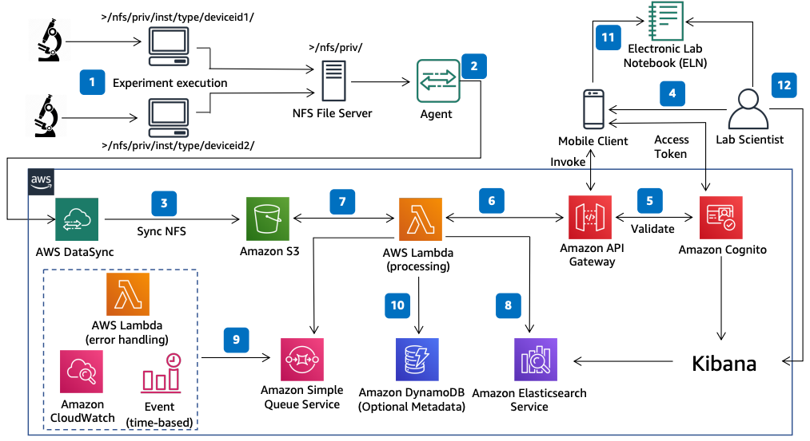

# Lab Instrument Log Acquisition and Analytics on AWS

Publication date: **October 28, 2020 ([Diagram history](#lab-diagram-history "#lab-diagram-history"))**

With this architecture, you can build a data pipeline to automate lab instrument log
ingestion, collate metadata, transform data, and send results to FDA-compliant electronic
laboratory notebooks. You can eliminate multiple manual reviews for [drug
discovery and development](https://www.fda.gov/patients/drug-development-process/step-1-discovery-and-development "https://www.fda.gov/patients/drug-development-process/step-1-discovery-and-development"). This architecture uses [AWS DataSync](../../../datasync/latest/userguide.md "../../../datasync/latest/userguide.md"), [Amazon Simple Storage Service](../../../AmazonS3/latest/userguide.md "../../../AmazonS3/latest/userguide.md") (Amazon S3), [AWS Lambda](../../../lambda/latest/dg.md "../../../lambda/latest/dg.md"), [Amazon API Gateway](../../../apigateway/latest/developerguide.md "../../../apigateway/latest/developerguide.md"), and [Amazon OpenSearch Service](../../../opensearch-service/latest/developerguide.md "../../../opensearch-service/latest/developerguide.md").

## Lab instrument log analytics architecture diagram

The following steps describe the architecture:

1. Lab instruments create output log files in Network File System (NFS) shares on
   premises.
2. Deploy an agent on a virtual machine (VM) to read data from NFS storage.
3. Use AWS DataSync to sync data from the NFS share to Amazon S3.
4. A lab scientist invokes the client application to find the experiment output log
   file.
5. The client application gets a token from [Amazon Cognito](../../../cognito/latest/developerguide.md "../../../cognito/latest/developerguide.md") and invokes the API with the
   experiment ID and Amazon S3 path.
6. Amazon API Gateway validates the Amazon Cognito token and calls the processing Lambda function.
7. The Lambda function reads the file from Amazon S3 and adds the experiment ID as a
   tag.
8. The Lambda function transforms the file, applies business rules, converts data to
   JSON, and pushes it to Amazon OpenSearch Service.
9. If the Lambda function fails, it writes the Amazon S3 file information to an error
   queue. A timed Lambda function reads from the queue to reprocess failed items.
10. (Optional) A Lambda function maintains Amazon S3 file information with metadata in
    [Amazon DynamoDB](../../../amazondynamodb/latest/developerguide.md "../../../amazondynamodb/latest/developerguide.md").
11. The Lambda function sends a JSON response through API Gateway to the electronic lab
    notebook through the mobile client.
12. The lab scientist accesses data in the electronic lab notebook and discovers or
    queries data through OpenSearch Dashboards.

## Further reading

For additional information, see the following resources:

- [AWS Architecture Icons](https://aws.amazon.com/architecture/icons "https://aws.amazon.com/architecture/icons")
- [AWS Architecture Center](https://aws.amazon.com/architecture "https://aws.amazon.com/architecture")
- [AWS Well-Architected](https://aws.amazon.com/architecture/well-architected "https://aws.amazon.com/architecture/well-architected")
- [Manufacturing on AWS](../manufacturing-on-aws/manufacturing-on-aws.md "../manufacturing-on-aws/manufacturing-on-aws.md")

## Diagram history

To be notified about updates to this reference architecture diagram, subscribe to the RSS feed.

| Change              | Description                                     | Date             |
| ------------------- | ----------------------------------------------- | ---------------- |
| Initial publication | Reference architecture diagram first published. | October 28, 2020 |

###### RSS subscription

To subscribe to RSS updates, you must have an RSS plugin enabled for the browser that you are using.
